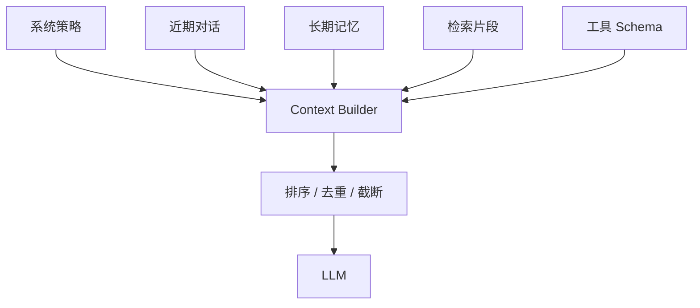

# Context Builder

Context Builder 决定模型在本轮“看见什么”。它把系统规则、任务状态、对话、记忆、检索片段和工具说明压入有限 token 窗口。

## 预算策略

先保留不可丢失的策略和当前任务，再为工具 schema、最新对话、检索与历史摘要划分预算。截断应以消息或语义块为单位，避免把 JSON 切成半截。

## 常见失败

- 上下文越长噪声越多，模型忽略关键约束。
- 摘要反复压缩后事实漂移。
- 检索片段没有来源、时间与权限标签。
