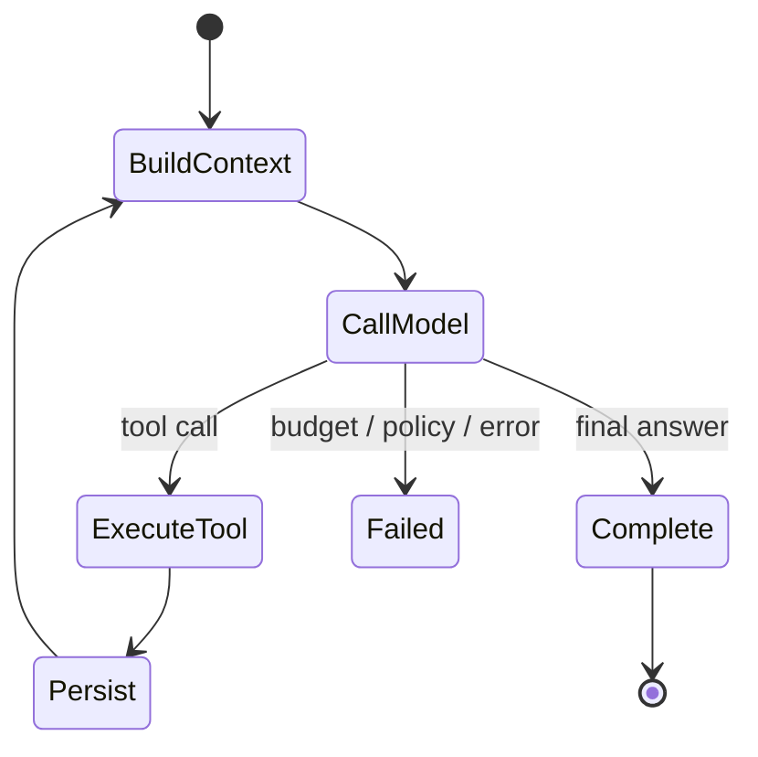

# Agent Runtime

Agent 不是一次模型调用，而是一个受控循环：构建上下文、请求模型、解析决策、执行工具、记录结果，再决定继续或结束。

```mermaid
stateDiagram-v2
  [*] --> BuildContext
  BuildContext --> CallModel
  CallModel --> ExecuteTool: tool call
  ExecuteTool --> Persist
  Persist --> BuildContext
  CallModel --> Complete: final answer
  Complete --> [*]
  CallModel --> Failed: budget / policy / error
```

生产实现必须给这个循环加上步数、时间、token、成本、权限和取消信号等边界。
