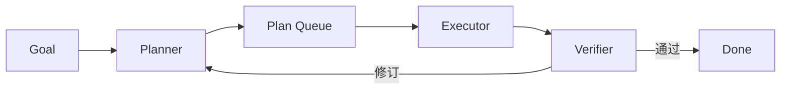

# Planner / Executor

Planner 负责把目标拆成步骤，Executor 负责执行并反馈。分离有助于审计和并行，但并非所有任务都需要复杂规划。

```mermaid
flowchart LR
  G[Goal] --> P[Planner]
  P --> Q[Plan Queue]
  Q --> E[Executor]
  E --> V[Verifier]
  V -->|通过| D[Done]
  V -->|修订| P
```

## 何时规划

- 任务跨多个系统或持续较久。
- 有依赖关系、审批点或昂贵工具。
- 需要向用户展示进度与可恢复状态。

简单问答应走短路径。过度规划会增加 token、延迟和错误表面积。
