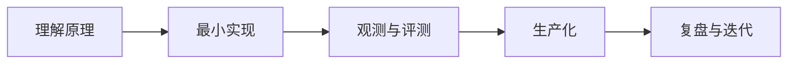

# 手册导读

这本手册适合有后端、平台或基础设施经验，希望进入 LLM / Agent 工程的人。学习目标不是“调通一次模型 API”，而是独立解释、设计和运维一套 Agent 系统。

## 推荐学习方法

1. **先画数据流**：每章先回答输入、状态、输出分别是什么。
2. **再写最小实现**：不依赖大型框架完成一次闭环。
3. **最后替换生产组件**：引入模型网关、向量库、队列、追踪和权限系统。

## 如何使用手册

- PC 端用左侧课程树与右侧页内目录定位。
- 手机端点顶部菜单展开课程树。
- 点导航栏搜索按钮进行中文全文搜索。
- 部署后可在 Safari / Chrome 中“添加到主屏幕”，已访问页面可离线打开。

## 完成标准

学完后，你应能从零搭建一个具备工具调用、RAG、长期任务恢复、权限隔离、追踪和评测能力的 Agent Runtime，并说清每个组件的取舍。
