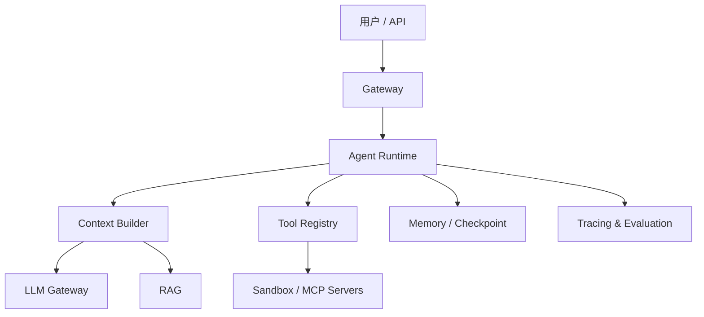

# AI 工程全景

AI 应用不是“模型 + Prompt”两个盒子。生产系统至少包含模型服务、上下文构建、执行循环、工具、知识、状态、安全与可观测性。

## 三条主线

| 主线 | 核心问题 | 关键指标 |
|---|---|---|
| 智能 | 模型是否理解并完成任务 | 成功率、正确性、幻觉率 |
| 系统 | 是否稳定、快速、便宜 | TTFT、TPOT、吞吐、成本 |
| 治理 | 行为是否可控、可审计 | 越权率、隔离性、可追溯性 |

## 后端工程师的优势

Agent 本质上是一个带不确定决策器的分布式工作流系统。事务、幂等、重试、状态机、并发控制、可观测性和权限模型依然是核心能力，只是“控制流”部分由模型动态产生。
