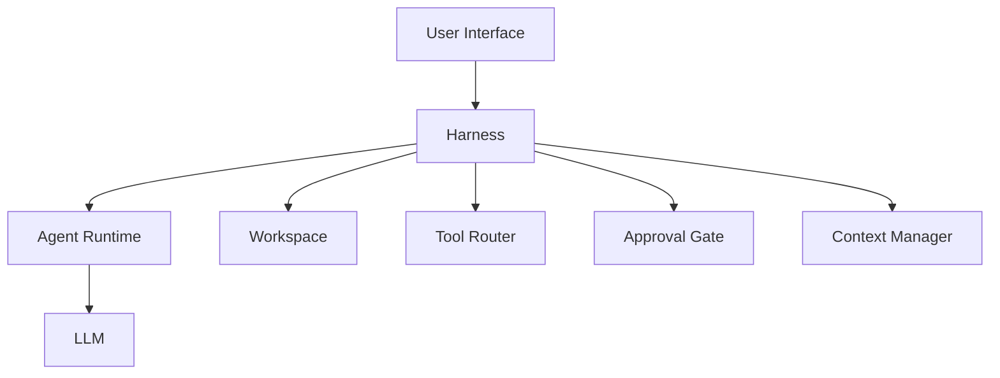

# Harness：Agent 的运行容器

Harness 是包围模型的工程外壳：提供文件、终端、浏览器、工具注册、上下文压缩、审批、任务状态与用户交互。模型能力相同，Harness 质量也会显著改变完成率。

```mermaid
flowchart TB
  UI[User Interface] --> H[Harness]
  H --> R[Agent Runtime]
  H --> FS[Workspace]
  H --> TR[Tool Router]
  H --> AP[Approval Gate]
  H --> CT[Context Manager]
  R --> L[LLM]
```

## 设计目标

环境可复现、变更可审查、动作可取消、失败可恢复、权限默认最小化。Harness 还应把工具输出压缩成模型可用的信号，而不是无限堆积日志。
