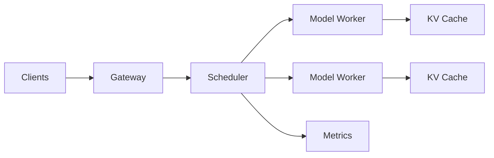

# 推理服务

模型服务把 GPU 计算变成稳定 API。核心矛盾是在延迟、吞吐、显存、成本和公平性之间取平衡。

## 关键技术

- Continuous Batching：请求动态加入和退出 batch。
- PagedAttention：分页管理 KV Cache，减少碎片。
- Prefix Cache：复用公共系统提示或文档前缀。
- Speculative Decoding：用小模型提出候选，大模型批量验证。
- Tensor / Pipeline Parallel：跨卡拆分参数或层。

选型时用真实请求分布压测，不要只比较单条短 Prompt 的 tokens/s。
