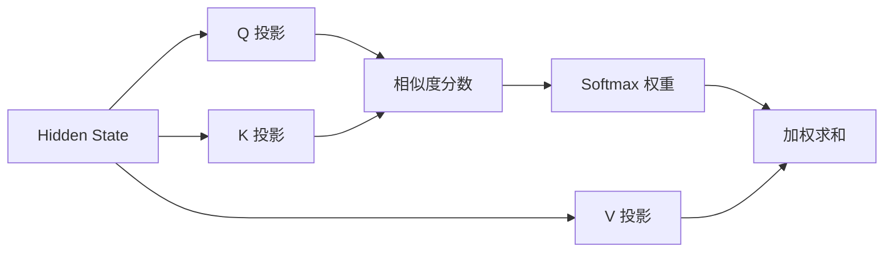

# Attention

Self-Attention 让序列中的每个位置根据内容选择其他位置的信息。

$$Attention(Q,K,V)=softmax(\frac{QK^T}{\sqrt{d_k}})V$$

## Causal Mask

生成模型不能看到未来 token，因此位置 $i$ 只能关注 $0..i$。若 mask 实现错误，训练会泄漏答案，推理时性能崩溃。

## 复杂度

标准注意力的计算和显存随序列长度近似二次增长。这解释了长上下文为何昂贵，也推动了滑动窗口、稀疏注意力和高效 kernel。
