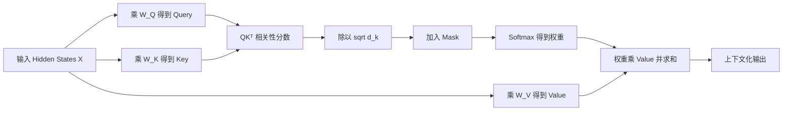

# Attention：模型如何动态选择和组合上下文

Attention 的核心不是“让模型集中注意力”这句拟人化描述，而是一套**根据当前查询，动态计算序列中各位置权重，再对信息做加权汇总**的可微分算法。

同一个 Token 的 Embedding 是固定的，但它在不同句子中需要结合不同上下文：

```text
苹果 很 甜
苹果 发布了 新 手机
```

两个“苹果”最初查询的是同一个 Token Embedding；经过 Attention 后，第一个位置更需要结合“甜”，第二个位置更需要结合“发布、新、手机”。Attention 让模型生成随上下文变化的表示。

本章将回答：

1. Query、Key、Value 分别是什么，为什么需要三套向量？
2. `QKᵀ`、缩放、Mask、Softmax 和 `×V` 每一步做了什么？
3. 一个 Token 如何从其他位置读取信息？
4. Multi-Head Attention 为什么不是简单重复计算？
5. MHA、MQA、GQA 有什么区别，为什么影响 KV Cache？
6. 训练和自回归推理时 Attention 有什么不同？
7. 标准 Attention 为什么是二次复杂度，FlashAttention 优化了什么？



## 先建立直觉：Attention 是一次“带条件的信息检索”

可以把序列暂时想象成内存中的多条记录。每条记录有三个角色：

- **Query（查询）**：当前位置正在寻找什么信息；
- **Key（键）**：每个位置提供一份用于匹配的索引描述；
- **Value（值）**：匹配后真正要读取和汇总的内容。

这与数据库或搜索系统有相似之处：Query 与 Key 决定“相关程度”，Value 决定“取回什么”。但 Attention 通常不会只命中一条记录，而是为所有允许访问的位置分配连续权重，再把多个 Value 混合成新向量。

例如处理：

```text
小王把报告发给小李，因为他需要审阅。
```

当模型更新“他”所在位置的表示时，可能需要从“小王”“小李”“报告”“审阅”等位置读取信息。它不会执行硬编码规则 `他 = 最近的人名`，而是通过训练学到的 Q/K 投影和多层 Attention 计算相关性。

需要谨慎：Attention 权重只是内部信息路由系数，不等于严格的语言学指代结论，也不能自动作为模型决策的完整解释。

## 阅读公式前：先把几个基础概念说透

如果直接看到 `QKᵀ` 和 Softmax，Attention 很容易变成一串需要死记的符号。先明确算法正在处理什么数据、解决什么问题。

### Hidden State：每个 Token 在当前层的内部工作记录

Tokenizer 先把文本转换成 Token ID，Embedding 再把每个 ID 转换成初始向量。这个向量进入 Transformer 后，每经过一层都会被更新。某个位置在某一层持有的向量通常称为 Hidden State。

例如：

```text
文本：小王 把 报告 发给 小李
```

进入第一层前，每个位置主要包含自身 Token 与位置信息：

```text
x[0]：小王的初始表示
x[1]：把的初始表示
x[2]：报告的初始表示
x[3]：发给的初始表示
x[4]：小李的初始表示
```

Attention 更新位置 3“发给”时，可以从“小王”“报告”“小李”等位置读取信息。更新后 `x[3]` 不再只表示“发给”这个词，还可能编码“谁把什么发给谁”的上下文关系。

下一层会继续以这些更新后的 Hidden States 为输入。因此后层的 Q/K/V 不再只来自原始 Token，而来自已经混合过上下文的信息。

### 线性投影：同一份数据生成三种工作视图

代码中的：

```text
Q = X @ W_Q
K = X @ W_K
V = X @ W_V
```

不是从 `X` 中截取三段，也不是复制三份完全相同的数据，而是让同一个向量分别乘三套不同的可训练矩阵。

可以类比后端系统对同一业务对象建立不同的派生视图：

```text
Order 原始对象
  ├─ RoutingView：用来决定交给哪个处理器
  ├─ IndexView：用来让其他请求找到它
  └─ PayloadView：匹配后真正交给处理器的内容
```

原始对象相同，但不同视图服务于不同计算。Q/K/V 也是如此：Query 和 Key 服务于“匹配”，Value 服务于“传递内容”。

### 点积：不是距离，而是一种可学习的匹配分数

两个等长向量的点积是对应位置相乘再求和：

```text
q = [2, 1]
k = [3, 4]

q · k = 2×3 + 1×4 = 10
```

若两个向量在许多维度方向一致，点积倾向较大；方向相反时可能为负。但 Attention 的 Q/K 是经过训练投影得到的，所以不能把点积机械翻译成自然语言的“语义相似度”。模型会学习一种对当前预测任务有用的匹配空间。

更准确地说：

> `q_i · k_j` 表示模型当前认为，更新位置 `i` 时，位置 `j` 是否值得被读取。

### Softmax：把任意分数变成可比较的读取比例

假设某个 Query 对三个 Key 的缩放后分数为：

```text
scores = [2.0, 1.0, 0.0]
```

这些数既不是概率，也不要求和为 1。Softmax 转换后近似为：

```text
weights = [0.665, 0.245, 0.090]
```

Softmax 有几个关键性质：

- 输出非负；
- 同一行权重之和为 1；
- 保留相对顺序，原分数更大的位置权重更高；
- 使用指数函数放大分数差异；
- 一个位置权重上升时，其他位置会分享更少的总权重。

所以 Softmax 可以理解为给当前 Query 分配一份总额为 100% 的“读取预算”。

### 加权求和：不是选一个答案，而是混合多份信息

假设三个位置的 Value 是：

```text
v₀ = [1, 0]
v₁ = [0, 2]
v₂ = [3, 1]
```

Attention 权重为：

```text
[0.6, 0.3, 0.1]
```

输出不是权重最大的 `v₀`，而是：

```text
output = 0.6v₀ + 0.3v₁ + 0.1v₂
       = 0.6[1,0] + 0.3[0,2] + 0.1[3,1]
       = [0.9, 0.7]
```

这就是“信息混合”的精确含义。每个输出维度都由多个 Value 按权重贡献。

### 上下文化：同一个 Token 为什么会得到不同输出

假设两个句子中“苹果”的初始向量相同：

```text
E[苹果] = 固定的一行参数
```

但它们周围的 Key 和 Value 不同：

```text
苹果 很 甜
苹果 发布 新 手机
```

“苹果”的 Query 与两组上下文计算出的 Attention 权重不同，加权得到的 Value 组合也不同。因此：

```text
hidden_食品语境[苹果] ≠ hidden_公司语境[苹果]
```

Attention 没有修改词表中的原始 `E[苹果]`，而是为这一次输入、这一层、这个位置生成新的上下文化输出。

## 后端开发者视角：它像什么，又不像什么

Attention 可以帮助理解为“每个请求对当前内存中的所有记录做一次软路由”，但它与常见后端组件存在重要区别。

| 后端概念 | 与 Attention 相似之处 | 关键差异 |
| --- | --- | --- |
| Map 按 Key 查询 | Query 决定读取对象 | Map 通常精确命中一个 Key；Attention 连续加权多个位置 |
| 搜索引擎召回 | Query 与索引描述匹配 | 搜索通常 Top-k 返回文档；Attention 通常在层内混合 Value |
| 负载均衡 | 按分数分配流量 | Attention 权重由内容和训练参数动态产生 |
| 消息路由 | 匹配规则决定消息去向 | Attention 没有人工 if/else 路由规则 |
| 数据库 Join | 两组表示根据 Key 建立关系 | Attention 的“Key”不是离散主键，而是浮点向量 |

可以使用下面的伪代码理解单个 Query：

```python
scores = []

# 第一步：当前 Query 与每条记录的 Key 打分。
for key in keys:
    scores.append(dot(query, key) / sqrt(d_k))

# 第二步：屏蔽不允许访问的位置。
scores = apply_mask(scores)

# 第三步：把分数变成总和为 1 的读取比例。
weights = softmax(scores)

# 第四步：按比例混合所有 Value。
output = zeros(d_value)
for weight, value in zip(weights, values):
    output += weight * value
```

真实实现不会使用 Python 循环，而是通过批量矩阵乘法和融合 Kernel 并行完成；但算法含义与这段伪代码一致。

## 四个生动例子：Attention 到底在解决什么

### 例子一：代词“它”应该读取谁的信息

```text
服务 A 调用了服务 B，但它超时了。
```

当模型处理“它”时，当前层某些 Head 可能对前面的实体位置分配不同权重：

```text
Query：来自“它”当前 Hidden State 的 Q

候选 Key：
服务 A → 0.20
调用   → 0.05
服务 B → 0.65
但     → 0.10
```

这些只是示意权重。加权 Value 后，“它”的新表示会吸收更多“服务 B”的信息，从而有助于后续预测“超时”的主体。

但单层单头未必能解决歧义：可能有 Head 关注语法距离，另一些关注因果关系；多层网络、MLP 和训练数据共同形成最终判断。

### 例子二：代码补全中找到变量定义

```python
user_timeout = config.get("user_timeout", 30)

def request_user():
    return client.get("/user", timeout=user_timeout)
```

模型预测 `user_timeout` 附近代码时，需要把当前位置与上文定义联系起来。某些 Attention Head 可能让使用位置的 Query 与定义位置的 Key 匹配，再读取定义位置 Value 中编码的变量名、来源和默认值信息。

对于更长代码：

```text
定义变量 → 经过许多 Token → 使用变量
```

标准全局 Attention 理论上可直接建立长距离连接，不需要像 RNN 那样让信息逐 Token 传递。但“理论可连接”不等于模型一定可靠找到它；上下文长度、训练分布、位置编码和中间干扰都会影响效果。

### 例子三：日志诊断中组合分散证据

```text
10:00:01 payment-service 请求 inventory-service
10:00:02 inventory-service connection pool exhausted
10:00:03 payment-service request timeout
```

当模型生成“支付服务超时的可能原因”时，最后位置的 Query 可能读取：

- 第一行的调用关系；
- 第二行的连接池耗尽；
- 第三行的超时结果。

输出 Hidden State 是这些 Value 的加权组合，后续层再加工为因果链表示。这比只看相邻词更强，因为关键证据可能分散在序列不同位置。

Attention 仍不等于真实的因果分析器：如果日志缺失或包含误导信息，权重再精确也不能创造不存在的证据。

### 例子四：同一个词在不同领域中的含义

```text
请求经过网关后进入后端服务。
训练请求经过反向传播后更新模型参数。
```

两个“请求”拥有相同的初始 Token Embedding，但上下文分别包含“网关、后端服务”和“训练、反向传播、参数”。Attention 让“请求”的位置读取不同 Value，因此形成偏向 HTTP Request 与训练 Sample/Batch 的不同上下文化表示。

这种能力不是某一层突然完成的。较浅层可能捕获局部搭配，较深层再结合更长范围与更抽象特征。

## 一层 Attention 实际做了什么，没有做什么

一层 Self-Attention 会为**每一个 Query 位置**分别生成一份输出，而不仅是为句子生成一个总向量。

假设序列长度 `S=4`：

```text
输入 Hidden States：x₀, x₁, x₂, x₃
输出 Context：      o₀, o₁, o₂, o₃
```

其中：

```text
o₀ = Σⱼ attention[0,j] × v_j
o₁ = Σⱼ attention[1,j] × v_j
o₂ = Σⱼ attention[2,j] × v_j
o₃ = Σⱼ attention[3,j] × v_j
```

每一行权重不同，因为每个位置拥有不同 Query。对于因果模型，位置 `i` 只能对 `j≤i` 的 Value 分配权重。

一层 Attention 本身：

- 不直接输出自然语言 Token；
- 不直接查询互联网或向量数据库；
- 不修改原始 Token ID；
- 不把序列永久存入模型参数；
- 不等于完整 Transformer Block；
- 只根据当前层已有表示，在序列允许范围内重新路由和组合信息。

Attention 输出还要经过输出投影、残差连接、归一化和 MLP，多个 Block 重复后，最终 Hidden State 才会被输出层映射为词表 Logit。

## Self-Attention 与 Cross-Attention

### Self-Attention

Self-Attention 的 Q、K、V 都来自同一组输入 Hidden States：

```text
Q = XW_Q
K = XW_K
V = XW_V
```

每个位置根据 Mask 规则读取同一序列中的其他位置。Decoder-only LLM 的核心是带 Causal Mask 的 Self-Attention。

### Cross-Attention

Cross-Attention 的 Query 与 Key/Value 来自不同序列：

```text
Q = X_decoder W_Q
K = X_encoder W_K
V = X_encoder W_V
```

常见于 Encoder-Decoder 翻译、文本条件图像生成和多模态模型。Self-Attention 解决“同一序列内部怎样交换信息”，Cross-Attention 解决“当前序列怎样读取另一组表示”。

## Scaled Dot-Product Attention 公式

标准公式是：

$$
\operatorname{Attention}(Q,K,V)
=\operatorname{softmax}\left(\frac{QK^T}{\sqrt{d_k}}+M\right)V
$$

| 符号 | 含义 |
| --- | --- |
| `Q` | Query 矩阵，描述每个位置想匹配什么 |
| `K` | Key 矩阵，描述每个位置可以如何被匹配 |
| `V` | Value 矩阵，保存匹配后真正被读取的信息 |
| `Kᵀ` | Key 的转置，使每个 Query 与每个 Key 做点积 |
| `d_k` | 单个 Head 中 Query/Key 的维度 |
| `M` | Mask；允许位置加 0，被屏蔽位置加负无穷 |
| `softmax` | 把每一行分数转换成和为 1 的权重 |

实际顺序是：

```text
Hidden States
  → 生成 Q、K、V
  → Q 与 K 做点积
  → 除以 sqrt(d_k)
  → 加 Mask
  → 对每一行做 Softmax
  → 用权重对 V 加权求和
```

## Q、K、V 是怎样产生的

假设：

```text
X.shape = [B, S, D_model]
```

- `B`：Batch Size；
- `S`：Sequence Length；
- `D_model`：模型隐藏维度。

单头情况下，三个可训练矩阵为：

```text
W_Q.shape = [D_model, d_k]
W_K.shape = [D_model, d_k]
W_V.shape = [D_model, d_v]
```

线性投影得到：

```text
Q = X @ W_Q   # [B, S, d_k]
K = X @ W_K   # [B, S, d_k]
V = X @ W_V   # [B, S, d_v]
```

`W_Q、W_K、W_V` 都是训练得到的参数。三套投影让同一个 Hidden State 承担不同角色：

- Query 强调“我需要什么”；
- Key 强调“我如何被匹配”；
- Value 保留“我应该传递什么内容”。

如果强制 `Q=K=V=X`，仍可计算，但匹配空间与内容空间绑定，表达能力受限。

## 一次完整手算：最后一个 Token 如何读取前文

使用简化文本：

```text
我 喜欢 苹果
```

只计算最后位置“苹果”的输出。假设 Q/K/V 投影后得到二维向量：

```text
q_苹果 = [1.0, 0.0]

k_我   = [0.0, 1.0]
k_喜欢 = [0.5, 0.5]
k_苹果 = [1.0, 0.0]

v_我   = [1.0, 0.0]
v_喜欢 = [0.0, 1.0]
v_苹果 = [2.0, 1.0]
```

这些数字只是便于手算的投影结果，不是词语的真实 Embedding。

### 第 1 步：Query 与每个 Key 做点积

```text
q · k = q₀k₀ + q₁k₁
```

逐个计算：

```text
score(苹果 → 我)
= [1.0,0.0] · [0.0,1.0]
= 0.0

score(苹果 → 喜欢)
= [1.0,0.0] · [0.5,0.5]
= 0.5

score(苹果 → 苹果)
= [1.0,0.0] · [1.0,0.0]
= 1.0
```

因此：

```text
scores = [0.0, 0.5, 1.0]
            我  喜欢  苹果
```

分数越大，只表示 Query 与 Key 在模型学到的匹配空间中越一致，还不是概率。

### 第 2 步：除以 `√d_k`

本例 `d_k=2`，所以 `√d_k≈1.414`：

```text
scaled_scores
= [0.0/1.414, 0.5/1.414, 1.0/1.414]
≈ [0.000, 0.354, 0.707]
```

### 第 3 步：应用 Mask

最后位置在 Causal Mask 下可读取自己和所有前文：

```text
mask = [0, 0, 0]
masked_scores = [0.000, 0.354, 0.707]
```

若某位置不允许访问，就加 `-∞`。Softmax 后 `exp(-∞)=0`，对应权重为 0。

### 第 4 步：Softmax 转成权重

```text
exp(0.000) ≈ 1.000
exp(0.354) ≈ 1.425
exp(0.707) ≈ 2.028
总和 ≈ 4.453

α_我   = 1.000 / 4.453 ≈ 0.225
α_喜欢 = 1.425 / 4.453 ≈ 0.320
α_苹果 = 2.028 / 4.453 ≈ 0.455
```

```text
attention_weights ≈ [0.225, 0.320, 0.455]
                       我    喜欢   苹果
```

权重都非负，总和约为 1。Attention 不是只能选择一个位置，而是以不同比例读取多个位置。

### 第 5 步：对 Value 加权求和

```text
output_苹果
= 0.225 × v_我 + 0.320 × v_喜欢 + 0.455 × v_苹果
```

逐维展开：

```text
第 0 维 = 0.225×1 + 0.320×0 + 0.455×2 = 1.135
第 1 维 = 0.225×0 + 0.320×1 + 0.455×1 = 0.775

output_苹果 ≈ [1.135, 0.775]
```

新向量不再只是“苹果”的 Value，而是三个位置 Value 的加权组合。后续还会经过输出投影、残差、归一化、MLP 和更多层。

| 被读取位置 | 点积分数 | 缩放分数 | Softmax 权重 | Value | 加权贡献 |
| --- | ---: | ---: | ---: | --- | --- |
| 我 | 0.0 | 0.000 | 0.225 | `[1,0]` | `[0.225,0]` |
| 喜欢 | 0.5 | 0.354 | 0.320 | `[0,1]` | `[0,0.320]` |
| 苹果 | 1.0 | 0.707 | 0.455 | `[2,1]` | `[0.910,0.455]` |
| 合计 | — | — | 1.000 | — | `[1.135,0.775]` |

## 为什么要除以 `√d_k`

若 Query 和 Key 各分量均值接近 0、方差接近 1，`d_k` 个乘积相加后，点积分数的方差随 `d_k` 增长，标准差大约按 `√d_k` 增长。

维度很大时，未经缩放的分数容易出现很大正负值，Softmax 会极端接近 one-hot。饱和后大多数位置梯度很小，训练更不稳定。除以 `√d_k` 把分数尺度拉回较稳定范围。

这不是为了让权重和为 1——Softmax 已负责归一化；缩放是为了控制进入 Softmax 的数值尺度与梯度状态。

## Attention 矩阵的行列表示什么

对长度 `S` 的序列：

```text
Scores = QKᵀ
Scores.shape = [S, S]
```

```text
Scores[i,j]
        │ │
        │ └─ Key/Value 来源位置 j：读取谁
        └─── Query 目标位置 i：更新谁
```

对“我 喜欢 苹果”：

| Query \ Key | 我 | 喜欢 | 苹果 |
| --- | ---: | ---: | ---: |
| 我 | `s₀₀` | `s₀₁` | `s₀₂` |
| 喜欢 | `s₁₀` | `s₁₁` | `s₁₂` |
| 苹果 | `s₂₀` | `s₂₁` | `s₂₂` |

第 2 行表示更新“苹果”时对三个位置的分数；第 0 列表示各 Query 对“我”这个 Key 的分数。

Softmax 沿最后一维执行，即每行独立归一化：

```text
Σⱼ AttentionWeights[i,j] = 1
```

不能对整个 `[S,S]` 矩阵做全局 Softmax，否则不同 Query 会互相争夺概率质量。

## Causal Mask：为什么生成模型不能看到未来

训练时完整序列并行进入 GPU。如果不加 Mask，位置“喜欢”能直接看到右边答案“苹果”，相当于偷看答案。

长度为 4 时：

```text
              Key 位置
             0    1    2    3
Query 0      允许 屏蔽 屏蔽 屏蔽
位置  1      允许 允许 屏蔽 屏蔽
      2      允许 允许 允许 屏蔽
      3      允许 允许 允许 允许
```

加性 Mask：

```text
M = [[0, -∞, -∞, -∞],
     [0,  0, -∞, -∞],
     [0,  0,  0, -∞],
     [0,  0,  0,  0]]
```

顺序必须是 `scores → 加 Mask → Softmax`。不能先 Softmax 再简单清零而不重新归一化。

### Causal Mask 与 Padding Mask

- **Causal Mask**：屏蔽未来，保证自回归因果性；
- **Padding Mask**：屏蔽为组成规则 Batch 而补入的 PAD。

二者可以组合。Mask 错误会导致训练泄漏答案，或错误屏蔽有效位置并产生 NaN、输出异常。

## Attention 为什么需要位置信息

没有 Position Embedding、RoPE 等机制时，Self-Attention 无法仅凭点积知道谁在前、谁在后：

```text
我 打 你
你 打 我
```

两句 Token 相同，施受关系却不同。位置信息进入 Query/Key 后，模型才能学习距离、先后和相对位置模式。RoPE 可粗略理解为按位置旋转 Q/K，使点积携带相对位置信息。详见 [RoPE 章节](/llm/rope)。

## Multi-Head Attention：为什么需要多个头

单个 Head 只在一个投影子空间中匹配和混合信息。MHA 把隐藏维度拆成多个头，让不同子空间并行学习匹配模式。

```text
D_model = 4096
H = 32
d_head = D_model / H = 128
```

形状变化：

```text
X                    [B,S,4096]
Q/K/V 投影后          [B,S,4096]
拆成 32 个头          [B,32,S,128]
每头独立 Attention    [B,32,S,128]
拼接所有头            [B,S,4096]
乘输出矩阵 W_O         [B,S,4096]
```

$$
head_h=\operatorname{Attention}(Q_h,K_h,V_h)
$$

$$
\operatorname{MHA}(X)=\operatorname{Concat}(head_1,\ldots,head_H)W_O
$$

不同头可能对局部组合、主谓关系、指代、代码括号或长距离结构敏感。但这不是人为指定的固定职责；同一头可能承载多种功能，部分头也可能冗余。

`W_O` 将各头结果重新混合并映射回模型隐藏空间，不是可有可无的装饰。

## MHA、MQA 与 GQA

现代 LLM 常减少 K/V Head 数量，以降低 KV Cache 和内存带宽成本。

| 机制 | Query Heads | KV Heads | 特点 |
| --- | ---: | ---: | --- |
| MHA | `H` | `H` | 每个 Query Head 有对应 K/V，Cache 最大 |
| MQA | `H` | `1` | 所有 Query Head 共享 K/V，Cache 最小 |
| GQA | `H` | `G` | 每组 Query Head 共享 K/V，质量与成本折中 |

例如 Query Heads 为 32、KV Heads 为 8 时，每 4 个 Query Head 共享一组 K/V；相较 32 个 KV Head 的 MHA，KV Cache 的 Head 维约缩小为四分之一。

## Attention 在 Transformer Block 中的位置

Attention 不是整个 Transformer。常见 Pre-Norm Block 可概念化为：

```text
X₁ = X + Attention(Norm(X))
Y  = X₁ + MLP(Norm(X₁))
```

- `Norm` 稳定激活尺度；
- `Attention` 负责不同 Token 位置间的信息交换；
- 残差连接保留原信息并改善深层梯度传播；
- `MLP` 对每个位置独立进行非线性特征变换。

简化地说，Attention 主要负责“横向看其他 Token”，MLP 主要负责“纵向加工当前位置特征”。

## 训练与自回归推理的区别

### 训练：并行计算整个序列

```text
输入：我 喜欢 吃 苹果
目标：   喜欢 吃 苹果 EOS
```

已知完整文本，所以所有位置可在 Causal Mask 下并行预测各自下一个 Token。

### 推理：每次新增一个 Token

```text
我 喜欢 吃 → 预测 苹果 → 追加 → 继续预测
```

未来 Token 尚不存在，生成必须逐步进行。若每步重算全部历史 K/V，会产生大量重复工作，因此使用 KV Cache。

## KV Cache：为什么缓存 Key 和 Value

历史 Token 在某层生成的 K/V 后续通常不再变化，可以缓存：

```text
K_cache.shape ≈ [B,H_kv,S_history,d_head]
V_cache.shape ≈ [B,H_kv,S_history,d_head]
```

生成新 Token 时：

1. 只为新 Token 计算 `q_new、k_new、v_new`；
2. 把 `k_new、v_new` 追加到 Cache；
3. 用 `q_new` 与全部历史 Key 比较；
4. 对全部历史 Value 加权求和。

Query 表示当前新位置想查什么，下一步会产生新 Query；历史 K/V 会持续被未来 Query 读取，所以缓存 K/V。

KV Cache 容量近似正比于：

```text
Batch × 层数 × 序列长度 × KV Head 数 × Head 维度 × 2 × 元素字节数
```

详见 [推理与 KV Cache](/llm/inference)。

## 复杂度：二次增长发生在哪里

```text
Q.shape  = [S,d_k]
Kᵀ.shape = [d_k,S]
QKᵀ      = [S,S]
```

多头计算量通常写作 `O(S²D)`。朴素实现显式保存每头矩阵时，中间激活规模约为 `O(BHS²)`。

序列长度从 4K 增至 8K，分数矩阵元素约变为 4 倍。使用 KV Cache 的增量推理中，单个新 Token 只与 `S_history` 个 Key 比较，单步对历史长度近似线性；但生成完整序列的累计工作量仍呈二次级趋势。

## FlashAttention 优化了什么

FlashAttention 不把标准全局 Attention 改成近似算法，也不消除 `QKᵀ` 的二次算术量。它通过分块、在线 Softmax 和重计算，减少大型 Attention 矩阵在 GPU 高带宽内存与片上 SRAM 间的读写，并避免完整物化 `S×S` 中间矩阵。

因此它显著降低中间显存和内存 IO，通常也加速执行；标准密集 Attention 的算术复杂度仍近似 `O(S²D)`。

其他长上下文方案包括：

- Sliding Window Attention：只看附近固定窗口；
- Sparse Attention：只计算部分连接；
- Block/Chunk Attention：按块组织局部或分层交互；
- Linear Attention：改变标准 Softmax Attention 形式以避免显式 `S×S`。

选择方案还要考虑模型质量、Kernel 支持、硬件利用率、KV Cache 与目标上下文长度。

## PyTorch：从零实现多头因果 Self-Attention

下面代码强调形状与步骤，不含全部生产优化：

```python
import math
import torch
from torch import nn


class CausalSelfAttention(nn.Module):
    def __init__(self, d_model: int, num_heads: int):
        super().__init__()
        assert d_model % num_heads == 0
        self.d_model = d_model
        self.num_heads = num_heads
        self.d_head = d_model // num_heads
        self.qkv_proj = nn.Linear(d_model, 3 * d_model, bias=False)
        self.out_proj = nn.Linear(d_model, d_model, bias=False)

    def forward(self, x: torch.Tensor) -> torch.Tensor:
        # x: [B,S,D]
        batch_size, seq_len, _ = x.shape
        q, k, v = self.qkv_proj(x).chunk(3, dim=-1)

        # [B,S,D] → [B,H,S,d_head]
        q = q.view(batch_size, seq_len, self.num_heads, self.d_head).transpose(1, 2)
        k = k.view(batch_size, seq_len, self.num_heads, self.d_head).transpose(1, 2)
        v = v.view(batch_size, seq_len, self.num_heads, self.d_head).transpose(1, 2)

        # [B,H,S,d] @ [B,H,d,S] → [B,H,S,S]
        scores = q @ k.transpose(-2, -1)
        scores = scores / math.sqrt(self.d_head)

        causal_mask = torch.tril(
            torch.ones(seq_len, seq_len, dtype=torch.bool, device=x.device)
        )
        scores = scores.masked_fill(~causal_mask, float("-inf"))
        weights = torch.softmax(scores, dim=-1)

        # [B,H,S,S] @ [B,H,S,d] → [B,H,S,d]
        context = weights @ v

        # [B,H,S,d] → [B,S,D]
        context = context.transpose(1, 2).contiguous()
        context = context.view(batch_size, seq_len, self.d_model)
        return self.out_proj(context)
```

生产代码更常使用融合接口：

```python
from torch.nn import functional as F

output = F.scaled_dot_product_attention(
    q, k, v,
    attn_mask=None,
    dropout_p=0.0,
    is_causal=True,
)
```

框架可根据设备、类型和形状选择高效实现。手写步骤便于学习，但可能物化大型分数矩阵，也更容易出现 Mask、精度和性能问题。

## 常见实现错误与排查

1. **Softmax 维度错误**：应沿 Key 维，即最后一维归一化，每行权重和接近 1。
2. **Mask 方向反了**：Decoder 应允许主对角线和左侧，屏蔽右侧未来。
3. **Softmax 后才加 Mask**：Mask 应在 Softmax 前作用于 Logit。
4. **整行都被屏蔽**：全为 `-∞` 可能产生 NaN，应检查 Padding 与 Mask 合并。
5. **忘记除以 `√d_head`**：大维度下 Softmax 更易饱和。
6. **Head 维度错位**：持续检查 `[B,S,D] ↔ [B,H,S,d_head]`；transpose 后 view 常需 `contiguous()`。
7. **把权重当完整解释**：信息还经过 V、输出投影、残差、MLP 和多层组合。
8. **混淆 Mask 与 Cache**：Mask 防止看未来，KV Cache 避免重算历史，不能互相替代。

## 本章检查表

- 能区分 Query、Key 和 Value。
- 能从 `[B,S,D]` 推导多头 Q/K/V 形状。
- 能解释 `QKᵀ → scale → mask → softmax → ×V`。
- 能说明为什么缩放因子是 `√d_k`。
- 能辨认 Attention 矩阵的行是 Query、列是 Key。
- 能区分 Causal Mask 与 Padding Mask。
- 能说明多头结果怎样拼接并经 `W_O` 投影。
- 能区分 MHA、MQA、GQA 及其 KV Cache 代价。
- 能解释训练并行 Attention 与增量推理的区别。
- 能说明 FlashAttention 优化 IO 与中间显存，而非消除全部二次算术量。

### 检查表答案与原文依据

1. **Q、K、V 有什么区别？** Q 表示当前位置需要什么，K 用于匹配，V 是实际汇总的内容。见[直觉解释](#先建立直觉-attention-是一次-带条件的信息检索)和[Q、K、V 的产生](#q、k、v-是怎样产生的)。
2. **多头形状怎样变化？** `[B,S,D]` 拆分为 `[B,H,S,d_head]`。见[Multi-Head Attention](#multi-head-attention-为什么需要多个头)。
3. **标准顺序是什么？** 点积、缩放、Mask、按行 Softmax、对 V 加权。见[公式](#scaled-dot-product-attention-公式)和[完整手算](#一次完整手算-最后一个-token-如何读取前文)。
4. **为什么除以 `√d_k`？** 用于控制点积分数尺度，减轻 Softmax 饱和。见[缩放原因](#为什么要除以-√d-k)。
5. **矩阵行列是什么？** 行是 Query 目标位置，列是 Key/Value 来源。见[Attention 矩阵](#attention-矩阵的行列表示什么)。
6. **两类 Mask 有何区别？** Causal Mask 屏蔽未来，Padding Mask 屏蔽补齐。见[Causal Mask](#causal-mask-为什么生成模型不能看到未来)。
7. **多头怎样合并？** 每头独立计算，拼接后经 `W_O` 混合。见[Multi-Head Attention](#multi-head-attention-为什么需要多个头)。
8. **MHA、MQA、GQA 如何区分？** 主要区别是 KV Head 数分别为 `H、1、G`。见[MHA、MQA 与 GQA](#mha、mqa-与-gqa)。
9. **训练与推理有何区别？** 训练可并行处理全部位置，推理逐 Token 生成并缓存历史 K/V。见[训练与推理](#训练与自回归推理的区别)和[KV Cache](#kv-cache-为什么缓存-key-和-value)。
10. **FlashAttention 改变什么？** 分块并使用在线 Softmax，降低 IO 和中间显存，不把密集 Attention 变为线性算术复杂度。见[FlashAttention](#flashattention-优化了什么)。

## 中文延伸学习资源

- [Transformer 论文逐段精读](https://www.youtube.com/watch?v=nzqlFIcCSWQ) — 作者/频道：跟李沐学 AI；平台：YouTube。以原始论文为主线讲解 Scaled Dot-Product Attention、Q/K/V、Multi-Head Attention、Mask 与复杂度。
- [Transformer 架构](https://infrasys-ai.github.io/aiinfra-docs/06AlgoData01Basic/README.html) — 来源：AIInfra 中文开源课程。除 MHA 外还覆盖 MQA、GQA、MLA，适合继续研究现代大模型如何降低 Attention 与 KV Cache 开销。
- [Happy-LLM](https://github.com/datawhalechina/happy-llm) — 来源：Datawhale 开源社区；平台：GitHub。第 2 章包含 Transformer/Attention 原理和代码实现，第 5 章进一步使用 PyTorch 搭建并训练小型 LLM。

> **版权与来源说明：** 本节只提供外部资源索引和原创导读，不复制视频、课程正文、图示或源代码。资源版权归对应作者、项目及平台所有；使用代码时请检查仓库 LICENSE。链接失效或内容更新时，以原始发布页为准。
