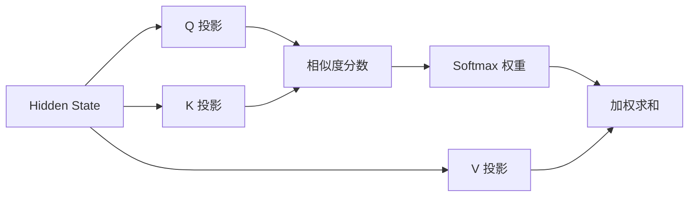

# Attention

Self-Attention 让序列中的每个位置根据内容选择其他位置的信息。

$$Attention(Q,K,V)=softmax(\frac{QK^T}{\sqrt{d_k}})V$$

## Causal Mask

生成模型不能看到未来 token，因此位置 $i$ 只能关注 $0..i$。若 mask 实现错误，训练会泄漏答案，推理时性能崩溃。

## 复杂度

标准注意力的计算和显存随序列长度近似二次增长。这解释了长上下文为何昂贵，也推动了滑动窗口、稀疏注意力和高效 kernel。

## 中文延伸学习资源

- [Transformer 论文逐段精读](https://www.youtube.com/watch?v=nzqlFIcCSWQ) — 作者/频道：跟李沐学 AI；平台：YouTube。视频以原始论文为主线讲解 Scaled Dot-Product Attention、Q/K/V、Multi-Head Attention、Mask 与复杂度。
- [Transformer 架构](https://infrasys-ai.github.io/aiinfra-docs/06AlgoData01Basic/README.html) — 来源：AIInfra 中文开源课程。除 MHA 外还覆盖 MQA、GQA、MLA，适合继续研究现代大模型如何降低 Attention 与 KV Cache 开销。
- [Happy-LLM](https://github.com/datawhalechina/happy-llm) — 来源：Datawhale 开源社区；平台：GitHub。第 2 章包含 Transformer/Attention 原理和代码实现，第 5 章进一步使用 PyTorch 搭建并训练小型 LLM。

> **版权与来源说明：** 本节只提供外部资源索引和原创导读，不复制论文精读视频、课程正文、图示或源代码。资源版权归对应作者、开源项目及发布平台所有；使用代码时还应检查项目仓库中的 LICENSE。链接失效或内容更新时，以作者和项目的原始发布页为准。
