# Embedding：从 Token ID、向量表示到下一个 Token

Tokenizer 输出的是整数 ID，例如 `[18327, 7864, 221]`。这些整数只是词表行号，数值大小没有语义：ID `100` 与 ID `101` 不一定相似，ID `100` 与 ID `50000` 也不一定无关。神经网络需要可进行加法、乘法和梯度更新的浮点数，因此首先要把每个离散 ID 转换成一个连续向量。这个过程就是 Embedding。

“Embedding 用了什么算法”需要拆成两个问题：

1. **前向计算用什么算法？** 对 Token Embedding 来说，本质是按 ID 从矩阵中取行，也就是 table lookup / gather。
2. **矩阵里的数值怎么得到？** 它们不是人工公式算出来的，而是在模型训练过程中，通过损失函数、反向传播和梯度下降学习得到。

此外，工程里常说的“文本 Embedding”是另一种产物：它使用完整神经网络把一句话压缩成一个语义向量。两者相关，但不能混为一谈。

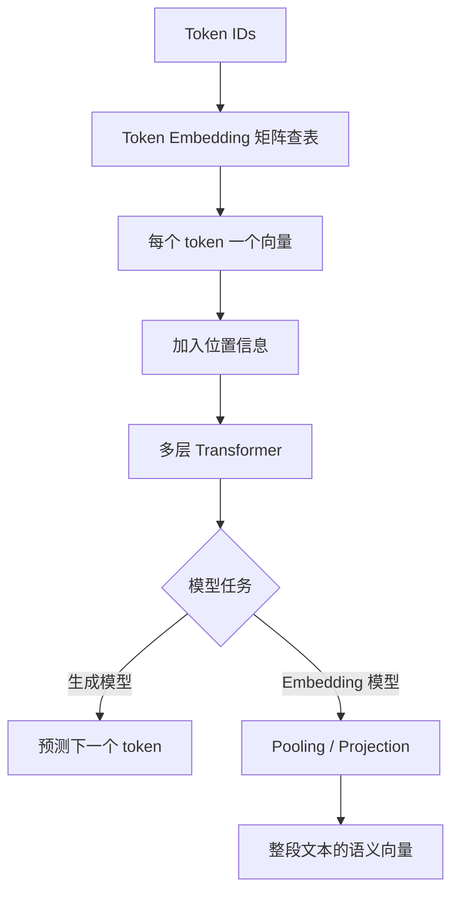

## 第一类：模型内部的 Token Embedding

### Embedding 矩阵是什么

设：

- 词表大小为 `V`，即 `vocab_size`；
- 模型隐藏维度为 `D`，即 `d_model` 或 `hidden_size`；
- Embedding 矩阵记为 `E`。

那么：

```text
E.shape = [V, D]
```

`E` 有 `V` 行，每个 token 对应一行；每行包含 `D` 个浮点数。若词表大小是 100,000，隐藏维度是 4,096，则矩阵参数量为：

```text
100,000 × 4,096 = 409,600,000 个参数
```

仅以 BF16 保存权重时，每个参数约 2 字节，这张表大约需要：

```text
409,600,000 × 2 ≈ 819 MB
```

所以 Embedding 并不是没有成本的轻量字典，它可能占据模型相当一部分参数。

### 前向计算：按 Token ID 取矩阵的一行

假设只有 5 个 token，隐藏维度为 3：

```text
词表：
0 -> "猫"
1 -> "狗"
2 -> "苹果"
3 -> "汽车"
4 -> "<EOS>"
```

为了演示，假设当前 Embedding 矩阵已经是：

```text
E = [
  [ 0.8,  0.2, -0.1],  # ID 0: 猫
  [ 0.7,  0.3, -0.2],  # ID 1: 狗
  [-0.4,  0.9,  0.1],  # ID 2: 苹果
  [ 0.1, -0.5,  0.8],  # ID 3: 汽车
  [ 0.0,  0.0,  0.0],  # ID 4: EOS，仅为演示
]
```

输入 token ID 是：

```text
ids = [0, 2, 1]
```

Embedding 的输出就是取出第 0、2、1 行：

```text
X = E[ids]

X = [
  [ 0.8,  0.2, -0.1],  # 猫
  [-0.4,  0.9,  0.1],  # 苹果
  [ 0.7,  0.3, -0.2],  # 狗
]
```

输入形状从 `[sequence_length] = [3]` 变为 `[sequence_length, hidden_size] = [3, 3]`。在批处理场景中：

```text
input_ids: [batch_size, sequence_length]
output:    [batch_size, sequence_length, hidden_size]
```

例如 `[8, 512]` 的 ID 张量经过隐藏维度为 4096 的 Embedding 后，得到 `[8, 512, 4096]` 的浮点张量。

### 为什么也可以写成 one-hot 乘矩阵

从数学上，查表等价于 one-hot 向量乘 Embedding 矩阵。

ID `2` 在大小为 5 的词表中可以表示为：

```text
one_hot(2) = [0, 0, 1, 0, 0]
```

矩阵乘法：

```text
[0, 0, 1, 0, 0] × E = E[2] = [-0.4, 0.9, 0.1]
```

公式写作：

```text
x_t = one_hot(token_id_t) · E
```

但工程实现不会真的构造 one-hot。假设词表有 100,000 个 token，一个 ID 的 one-hot 里有 99,999 个零，既浪费内存又浪费乘法。框架直接执行 `gather` 或索引操作，结果完全相同，复杂度却只与取出的向量大小有关。

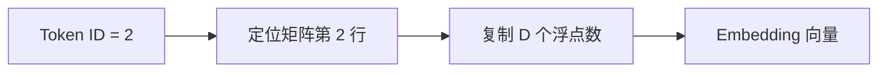

### Gather / Index Lookup 到底是什么

`index lookup`（索引查找）描述的是操作目的：**把 Token ID 当作行号，从 Embedding 矩阵中取出对应的行**。`gather`（聚集）是张量框架中实现这类操作的通用名称：它接收一个源张量和一组索引，沿指定维度收集元素。Embedding 查表可以理解为“沿矩阵第 0 维执行 gather”。

先不要急着看公式，可以把 Embedding 矩阵想象成一个仓库货架：

- Tokenizer 给每种 token 分配一个不变的货架编号，也就是 Token ID；
- Embedding 矩阵的每一行是一个货位；
- 每个货位存放一个长度固定的向量；
- gather 拿着一张“取货单”（Token ID 序列），按编号把对应向量依次取出来。

它与数据库按主键查询有一点相似，但实现上更直接：矩阵已经是连续编号的数组，不需要 B+ 树、哈希表或 SQL 查询。若 ID 是 `2`，就读取第 2 行。

#### 第一个形象例子：把“猫喜欢鱼”换成三行向量

假设为了教学，我们只有下面 5 个 token，每个 token 的向量只有 3 维：

| Token ID | Token | Embedding 矩阵中的行 |
| ---: | --- | --- |
| 0 | `<PAD>` | `[0.0, 0.0, 0.0]` |
| 1 | `猫` | `[0.8, 0.1, -0.2]` |
| 2 | `喜欢` | `[0.2, 0.7, 0.3]` |
| 3 | `鱼` | `[0.6, -0.1, 0.5]` |
| 4 | `狗` | `[0.7, 0.2, -0.3]` |

这张表对应的矩阵是：

```text
E = [[0.0,  0.0,  0.0],   # E[0]：<PAD>
     [0.8,  0.1, -0.2],   # E[1]：猫
     [0.2,  0.7,  0.3],   # E[2]：喜欢
     [0.6, -0.1,  0.5],   # E[3]：鱼
     [0.7,  0.2, -0.3]]   # E[4]：狗
```

Tokenizer 先把文本转换为 ID：

```text
"猫喜欢鱼" → [1, 2, 3]
```

Gather 随后逐个处理这张取货单：

1. 读到 ID `1`，取出 `E[1] = [0.8, 0.1, -0.2]`；
2. 读到 ID `2`，取出 `E[2] = [0.2, 0.7, 0.3]`；
3. 读到 ID `3`，取出 `E[3] = [0.6, -0.1, 0.5]`；
4. 按原来的顺序把三行堆叠起来。

最终得到：

```text
input_ids.shape = [3]

hidden = [[0.8,  0.1, -0.2],   # 来自 E[1]：猫
          [0.2,  0.7,  0.3],   # 来自 E[2]：喜欢
          [0.6, -0.1,  0.5]]   # 来自 E[3]：鱼

hidden.shape = [3, 3]
```

这里第一个 `3` 表示有 3 个 token，第二个 `3` 表示每个 token 的向量有 3 个数。真实模型可能有十几万行、每行数千维，但操作没有变化。

请特别注意：Gather **没有根据“猫”的含义现场计算** `[0.8, 0.1, -0.2]`，也没有比较“猫”与其他词谁更相似。这个向量早已存放在参数矩阵的第 1 行，Gather 只是按 ID 原样取出。向量中的数值如何通过训练形成，会在后文详细解释。

#### 一个 batch 中的句子必须一样长吗

**不必须。** 一个 batch 可以包含任意 `N` 句话，每句话的真实 Token 数完全可以不同。后面使用“两句话、每句 3 个 Token”，只是为了让第一次学习二维坐标时更容易观察，并不是模型对输入内容的限制。

真正的限制来自常规张量的存储方式：一个二维张量必须是规则的矩形，每一行需要拥有相同数量的元素。假设一个 batch 包含下面 3 句话：

```text
第 0 句话：猫 喜欢 鱼          → [1, 2, 3]       # 3 个 Token
第 1 句话：狗 喜欢 鱼 喜欢 鱼  → [4, 2, 3, 2, 3] # 5 个 Token
第 2 句话：鱼                  → [3]             # 1 个 Token
```

从业务含义看，这三条序列完全合法；但下面这种长短不一的嵌套列表不是规则的二维张量：

```text
[
  [1, 2, 3],
  [4, 2, 3, 2, 3],
  [3]
]
```

第一行有 3 个元素、第二行有 5 个、第三行只有 1 个，无法为它定义一个统一的 `[B, S]` 形状。GPU 擅长对规则、连续的矩形数据进行并行计算，因此工程中通常使用 **Padding（补齐）**。

##### 第 1 步：确定这个 batch 的统一长度

当前 batch 中最长的句子有 5 个 Token，因此令：

```text
B = 3  # 这个 batch 有 3 句话
S = 5  # 补齐后，每句话都占 5 个位置
```

这里的 `S = 5` 是**张量的统一长度**，不是说每句话真的都有 5 个有效 Token。

##### 第 2 步：使用 PAD Token 补齐短句

假设 `<PAD>` 的 Token ID 为 `0`，并采用右侧补齐：

```text
input_ids = [
  [1, 2, 3, 0, 0],   # 猫 喜欢 鱼 <PAD> <PAD>
  [4, 2, 3, 2, 3],   # 狗 喜欢 鱼 喜欢 鱼
  [3, 0, 0, 0, 0]    # 鱼 <PAD> <PAD> <PAD> <PAD>
]

input_ids.shape = [3, 5] = [B, S]
```

Padding 之后，三行都拥有 5 个整数，可以组成规则张量。需要区分两个长度：

| 句子 | 真实 Token 数 | 张量中占用的位置数 |
| --- | ---: | ---: |
| 猫喜欢鱼 | 3 | 5 |
| 狗喜欢鱼喜欢鱼 | 5 | 5 |
| 鱼 | 1 | 5 |

真实 Token 总数是 `3 + 5 + 1 = 9`，但张量中共有 `B × S = 3 × 5 = 15` 个位置，其中 6 个是为了组成矩形而添加的 PAD。

##### 第 3 步：用 attention_mask 标出真假位置

只看 `input_ids`，模型能查出 ID `0` 对应 `<PAD>`，但后续 Attention 还需要明确哪些位置是有效文本。通常会同时构造一个 `attention_mask`：

```text
attention_mask = [
  [1, 1, 1, 0, 0],
  [1, 1, 1, 1, 1],
  [1, 0, 0, 0, 0]
]
```

其中：

- `1` 表示真实 Token，应该作为有效上下文参与计算；
- `0` 表示为了补齐而加入的 PAD，后续计算应忽略其语义贡献。

把 `input_ids` 与 `attention_mask` 对齐观察：

```text
input_ids     = [1, 2, 3, 0, 0]
attention_mask= [1, 1, 1, 0, 0]
                 │  │  │  └──┴─ PAD 位置
                 └──┴──┴─────── 真实 Token 位置
```

`attention_mask` 与**因果掩码（causal mask）**不是同一个概念：Padding Mask 负责屏蔽补齐位置；因果掩码负责禁止自回归模型看到未来 Token。实际模型可能把两者组合后再交给 Attention。

##### 第 4 步：Gather 仍然会处理 PAD 的 ID

Gather 本身只认识整数 ID，不负责判断句子真实长度。因此它会对全部 15 个位置执行查表，包括 ID `0`：

```text
input_ids[0, 0] = 1 → hidden[0, 0, :] = E[1]  # 猫
input_ids[0, 3] = 0 → hidden[0, 3, :] = E[0]  # <PAD>
input_ids[2, 4] = 0 → hidden[2, 4, :] = E[0]  # <PAD>
```

若每个向量维度仍为 `D = 3`，则：

```text
input_ids.shape = [3, 5]
hidden.shape    = [3, 5, 3]
```

也就是说，PAD 位置同样会在 `hidden` 中占一个长度为 `D` 的向量位置。示例里的 `E[0] = [0, 0, 0]`，但真实模型的 PAD 处理取决于模型设计：有些 Embedding 层通过 `padding_idx` 保持 PAD 行不更新，有些模型会复用其他特殊 Token。即使 PAD 初始向量为零，加入位置编码并经过网络后，该位置的中间值也不保证永远为零，因此不能仅靠“PAD 向量是零”来代替 Mask。

##### 第 5 步：Attention 和损失函数忽略 PAD

Padding Mask 通常让真实 Token 不把 PAD 当作有效上下文。训练语言模型时，标签中的 PAD 位置也通常会设置为 `ignore_index`（常见值是 `-100`），使这些位置不计入交叉熵损失。

因此需要分别理解三个组件的职责：

```text
Padding          → 把不同长度的序列补成规则的 [B, S] 张量
Embedding/Gather → 为包括 PAD 在内的每个整数位置读取一个向量
Mask             → 告诉后续 Attention 或 Loss 哪些位置不代表真实内容
```

不能因为 Gather 为 PAD 查出了向量，就认为 PAD 应参与语义计算；也不能因为存在 Mask，就认为 Gather 阶段完全没有处理 PAD。

##### Padding 到多长：常见的三种策略

1. **动态 Padding（最常见）**：每个 batch 只补到该 batch 中最长序列。若下一个 batch 最长只有 3 个 Token，它的 `S` 就可以是 3，能够减少无效计算。
2. **固定长度 Padding**：所有 batch 都补到预设的 `max_length`，形状稳定、实现简单，但短文本较多时会浪费显存和算力；超过上限的文本还需要截断或分块。
3. **Packing / Sequence Packing**：把多条短序列紧凑排列进较长的计算块，并使用额外的边界或掩码阻止不同样本相互看到。这能减少 PAD，但位置编号、标签、因果掩码和样本边界的处理更复杂。

此外，一些框架提供 Ragged Tensor 或 Nested Tensor 表示不等长数据，但并非所有模型算子和硬件路径都支持。实际 LLM 训练和推理中，动态 Padding、长度分桶（把相近长度的句子放在同一 batch）与 Packing 更常见。

所以，更准确的结论是：

> 一个 batch 可以有任意数量的句子，句子的真实 Token 数也可以不同；`[B, S]` 中统一的 `S` 通常只是经过 Padding 后的计算长度，并不等于每句话的真实长度。

#### 从一串 ID 到 hidden：每一层括号究竟表示什么

上面的单句例子只有一层 Token 序列。真实训练为了提高并行效率，通常一次把多句话送入模型，这一组句子称为一个 **batch（批次）**。为了先把二维坐标和 Gather 对应关系讲清楚，下面继续使用同一张 5 行、每行 3 维的 Embedding 表，并特意选择两句长度相同的话；遇到不同长度时，按照上一节补齐即可：

```text
第 0 句话：猫 喜欢 鱼 → [1, 2, 3]
第 1 句话：狗 喜欢 鱼 → [4, 2, 3]
```

把两句话放到一起，得到二维整数数组 `input_ids`：

```text
input_ids = [[1, 2, 3],   # 第 0 句话
             [4, 2, 3]]   # 第 1 句话
```

这里的形状是：

```text
input_ids.shape = [2, 3]
                   │  │
                   │  └─ 每句话有 3 个 Token（S = 3）
                   └──── 一次输入 2 句话（B = 2）
```

因此 `B`（batch size）等于 `2`，`S`（sequence length）等于 `3`。`input_ids[0, 1]` 表示“第 0 句话的第 1 个位置”，其值是 `2`，也就是 token“喜欢”的 ID。

##### hidden 是什么，为什么叫这个名字

`hidden` 不是另一个词表，也不是某种看不见的 ID。它是代码中常用的变量名，表示模型内部正在传递的浮点向量，常称为 **hidden states（隐藏状态）**。

之所以叫“隐藏”，是为了区别于用户看到的原始输入和最终输出：这些向量位于神经网络内部。Embedding 层刚输出时，它们是每个 token 的**初始隐藏状态**；经过 Transformer 各层后，它们会变成包含上下文信息的隐藏状态。很多代码也会把 Embedding 层的输出命名为 `embeddings`、`inputs_embeds` 或 `hidden_states`，名称不同，当前这一步表达的是同一种数据。

##### “ID 被替换成一整行向量”不是修改原数组

“替换”是一种便于理解的说法。程序并不会把 `input_ids` 中的整数原地改掉，而是：

1. 保留原来的整数张量 `input_ids`；
2. 创建一个新的浮点张量 `hidden`；
3. 对 `input_ids` 的每个位置读取一个 ID；
4. 用该 ID 查到 `E` 的一整行；
5. 把这整行写入 `hidden` 的对应位置。

也就是说，一个整数输入会产生一个长度为 `D` 的向量输出：

```text
整数 ID 2
   │
   └─查 E[2]─→ [0.2, 0.7, 0.3]
                 └──── D = 3 ────┘
```

这里词表有 5 个 token，所以 `V = 5`；每行有 3 个浮点数，所以 `D = 3`：

```text
E.shape = [V, D] = [5, 3]
```

##### 把 6 次查表逐一展开

这里最容易混淆的是：表格第一列的 `[0, 0]` **不是 Embedding 矩阵 `E` 的坐标**。它首先是 `input_ids` 中的一个位置坐标：

```text
input_ids = [[1, 2, 3],
             [4, 2, 3]]
```

在二维数组中，读取方式是：

```text
input_ids[第几句话, 这句话中的第几个 Token]
```

所以 `input_ids[0, 0]` 表示：

```text
input_ids[0, 0]
          │  │
          │  └─ 第 0 句话中的第 0 个 Token
          └──── 第 0 句话
```

它读取到的值是整数 `1`：

```text
input_ids[0, 0] = 1
```

接下来才把这个整数 `1` 当作 Embedding 矩阵的行号，查询 `E[1]`：

```text
E[1] = [0.8, 0.1, -0.2]
```

最后，把查到的完整向量写到输出张量中对应的位置：

```text
hidden[0, 0, :] = [0.8, 0.1, -0.2]
```

整个过程可以连起来看：

```text
input_ids 中的位置      取出 Token ID      查询 E 的对应行       写入输出位置

 input_ids[0, 0]   →         1         →       E[1]       →   hidden[0, 0, :]
                                          [0.8, 0.1, -0.2]
```

因此，这里有三种用途不同的下标：

| 表达式 | 下标作用在哪个张量上 | 实际含义 |
| --- | --- | --- |
| `input_ids[0, 0]` | 输入 ID 张量 | 读取第 0 句话、第 0 个 Token 位置，结果为 ID `1` |
| `E[1, :]` | Embedding 参数矩阵 | 用 ID `1` 作为行号，取出该行的全部 3 个数 |
| `hidden[0, 0, :]` | 输出隐藏状态张量 | 保存第 0 句话、第 0 个 Token 对应的完整向量 |

`[0, 0]` 与 `1` 不能混为一谈：`[0, 0]` 回答“这个 Token 在输入的什么位置”，`1` 回答“这个 Token 对应 Embedding 矩阵的哪一行”。

可以把通用过程写成三个明确的步骤：

```text
第 1 步：id = input_ids[句子位置, Token 位置]
第 2 步：vector = E[id, :]
第 3 步：hidden[句子位置, Token 位置, :] = vector
```

现在再按这个规则处理 6 个位置：

为了方便对照，先把本例使用的原始数据放在这里。Embedding 矩阵 `E` 是：

```text
E = [[0.0,  0.0,  0.0],   # E[0]：<PAD>
     [0.8,  0.1, -0.2],   # E[1]：猫
     [0.2,  0.7,  0.3],   # E[2]：喜欢
     [0.6, -0.1,  0.5],   # E[3]：鱼
     [0.7,  0.2, -0.3]]   # E[4]：狗

E.shape = [5, 3]
```

Tokenizer 生成的输入 `input_ids` 是：

```text
input_ids = [[1, 2, 3],   # 第 0 句话：猫 喜欢 鱼
             [4, 2, 3]]   # 第 1 句话：狗 喜欢 鱼

input_ids.shape = [2, 3]
```

接下来每次都先从 `input_ids` 的某个位置读出整数 ID，再用这个 ID 选择 `E` 的一行：

<div class="embedding-lookup-table">
  <table>
    <colgroup>
      <col class="embedding-lookup-table__position">
      <col class="embedding-lookup-table__id">
      <col class="embedding-lookup-table__token">
      <col class="embedding-lookup-table__source">
      <col class="embedding-lookup-table__result">
    </colgroup>
    <thead>
      <tr>
        <th><code>input_ids</code><br>的位置</th>
        <th>读到的 ID</th>
        <th>Token</th>
        <th>执行的查表</th>
        <th>写入 <code>hidden</code> 的位置和值</th>
      </tr>
    </thead>
    <tbody>
      <tr><td><code>[0, 0]</code></td><td>1</td><td>猫</td><td><code>E[1, :]</code></td><td><code>hidden[0, 0, :] = [0.8, 0.1, -0.2]</code></td></tr>
      <tr><td><code>[0, 1]</code></td><td>2</td><td>喜欢</td><td><code>E[2, :]</code></td><td><code>hidden[0, 1, :] = [0.2, 0.7, 0.3]</code></td></tr>
      <tr><td><code>[0, 2]</code></td><td>3</td><td>鱼</td><td><code>E[3, :]</code></td><td><code>hidden[0, 2, :] = [0.6, -0.1, 0.5]</code></td></tr>
      <tr><td><code>[1, 0]</code></td><td>4</td><td>狗</td><td><code>E[4, :]</code></td><td><code>hidden[1, 0, :] = [0.7, 0.2, -0.3]</code></td></tr>
      <tr><td><code>[1, 1]</code></td><td>2</td><td>喜欢</td><td><code>E[2, :]</code></td><td><code>hidden[1, 1, :] = [0.2, 0.7, 0.3]</code></td></tr>
      <tr><td><code>[1, 2]</code></td><td>3</td><td>鱼</td><td><code>E[3, :]</code></td><td><code>hidden[1, 2, :] = [0.6, -0.1, 0.5]</code></td></tr>
    </tbody>
  </table>
</div>

把结果仍然按照“第几句话、句中第几个位置”的结构排列：

```text
hidden = [
  [                            # 第 0 句话：猫 喜欢 鱼
    [0.8,  0.1, -0.2],         # 位置 [0, 0]，来自 E[1]
    [0.2,  0.7,  0.3],         # 位置 [0, 1]，来自 E[2]
    [0.6, -0.1,  0.5]          # 位置 [0, 2]，来自 E[3]
  ],
  [                            # 第 1 句话：狗 喜欢 鱼
    [0.7,  0.2, -0.3],         # 位置 [1, 0]，来自 E[4]
    [0.2,  0.7,  0.3],         # 位置 [1, 1]，来自 E[2]
    [0.6, -0.1,  0.5]          # 位置 [1, 2]，来自 E[3]
  ]
]
```

现在 `hidden` 有三层结构：

```text
hidden.shape = [2, 3, 3] = [B, S, D]
                │  │  │
                │  │  └─ 每个 Token 用 3 个浮点数表示
                │  └──── 每句话有 3 个 Token 位置
                └─────── 一次输入 2 句话
```

这就是“输出多出最后一维 `D`”的准确含义：输入的每个位置原来只存放一个整数 ID，输出的对应位置则存放一个长度为 `D` 的浮点向量。`B` 和 `S` 没有改变，因为句子数量和每句话的 Token 位置数都没有改变。

用下标可以把整个规则压缩成一行：

```text
hidden[b, s, :] = E[input_ids[b, s], :]
```

逐个符号解释：

- `b`：第几句话，范围是 `0` 到 `B - 1`；
- `s`：句中的第几个 Token，范围是 `0` 到 `S - 1`；
- `:`：这一维全部取出，因此表示长度为 `D` 的整行；
- `input_ids[b, s]`：先取得当前位置的整数 ID；
- `E[这个 ID, :]`：再从 Embedding 矩阵取出该 ID 对应的完整一行；
- `hidden[b, s, :]`：把该行放在输出的同一个句子、同一个 Token 位置。

例如：

```text
input_ids[1, 0] = 4
hidden[1, 0, :] = E[4, :] = [0.7, 0.2, -0.3]
```

两句话中的“喜欢”都是 ID `2`，所以查表阶段得到的初始向量完全相同。它们进入 Transformer 后，会结合各自上下文继续计算；如果上下文不同，后续隐藏状态也可能变得不同。这里没有根据 ID 计算新向量，也没有在词表中搜索相似项：ID 已经是数组行号，Gather 只负责定位和读取。

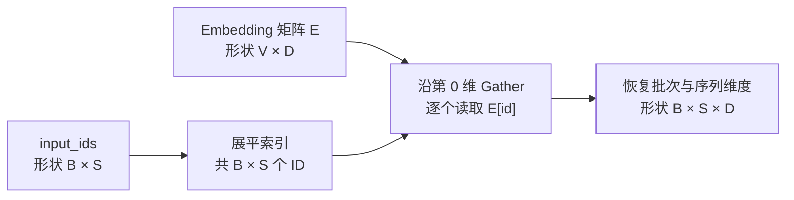

#### 与 one-hot 矩阵乘法相比，省在哪里

把 `N = B × S` 个 ID 展平后，理论上可以先创建 `[N, V]` 的 one-hot 矩阵，再与 `[V, D]` 的 `E` 相乘。但 gather 只读取最终需要的 `N` 行：

| 实现 | 中间表示 | 主要计算/读取量 |
| --- | --- | --- |
| 显式 one-hot + 矩阵乘法 | `[N, V]`，几乎全是 0 | 按稠密实现约为 `N × V × D` 次乘加 |
| gather / index lookup | 只保存 `N` 个整数 ID | 读取并输出 `N × D` 个元素 |

当 `V = 100,000` 时，为每个 Token 构造十万个位置的 one-hot 向量显然没有必要。gather 利用了“one-hot 中只有一个位置为 1”这一已知结构，直接跳到目标行。两者数学结果相同，执行路径不同。

#### 前向是 Gather，反向是 Scatter-Add

要理解反向传播为什么是 `scatter-add`，需要先明确“梯度”究竟是什么。

##### 0. 阅读梯度示例前，先认识这些概念

下面的概念经常被一句话带过，但它们在训练流程中承担不同职责。先看全局关系：

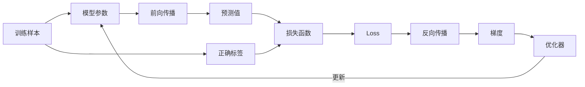

一次训练的基本循环就是：用当前参数做预测，比较预测与正确答案得到 loss，计算每个参数对 loss 的影响，再调整参数。下面逐个拆开。

###### 参数（Parameter）：模型在训练中需要学会的数值

参数是模型内部可以被训练修改的浮点数。例如：

```text
E[猫] = [0.8, 0.1, -0.2]
```

其中 `0.8`、`0.1` 和 `-0.2` 都是参数。它们在训练开始时通常是随机数，训练过程不断微调它们。Transformer 中 Attention 和 MLP 的权重也都是参数。

参数与输入不同：Token ID `1` 是本次输入数据，用完后可以换成别的 ID；`E[1]` 是模型长期保存、反复使用和更新的参数。参数也不要与**超参数（Hyperparameter）**混淆：学习率、batch size、网络层数等通常由训练者设定，不是通过同一次梯度下降直接学出来的。

###### 训练样本、标签与目标（Sample、Label、Target）

训练样本是交给模型学习的数据，标签或 target 是希望模型给出的正确结果。自回归语言模型的典型任务是“根据前文预测下一个 Token”：

```text
输入：我 喜欢 吃
标签：苹果
```

训练程序不是直接告诉 Embedding“猫应该是什么向量”，而是给模型许多输入和正确答案。Embedding 与后续网络共同产生预测；只要预测不够好，loss 就会通过梯度把调整信号传回 Embedding。

###### 预测值、Score、Logit 与概率

模型前向计算会产生预测。教学示例中的 `score` 泛指一个预测分数；真实语言模型通常为词表中的每个候选 Token 输出一个 **logit**：

```text
logits = [2.1, -0.3, 0.8, ...]
```

Logit 是尚未归一化的分数，可以为负，也不要求总和为 1。Softmax 会把一组 logits 转换为概率：

```text
probabilities = softmax(logits)
```

随后损失函数比较模型分配给正确 Token 的概率是否足够高。本节为了能够手算，把真实的“多个 logits + Softmax + 交叉熵”简化成一个 `score` 和一个目标值；它用于说明梯度流动，不代表完整 LLM 输出层。

###### 损失函数与 Loss：给预测错误程度一个可优化的分数

**损失函数（loss function）**是一条计算规则，输入预测值和正确标签，输出一个数字；这个输出数字称为 **loss**。例如平方误差：

```text
loss = ½ × (prediction - target)²
```

如果预测等于目标，loss 为 0；差距越大，loss 越大。语言模型通常使用交叉熵，而不是简单平方误差。

Loss 有三个重要特征：

1. 它通常是单个标量，方便定义统一的优化目标；
2. 它必须能够把预测质量转换成可求梯度的数值；
3. 它是训练的代理目标，不等同于所有意义上的“模型质量”。Loss 降低通常说明模型更符合训练目标，但不自动保证事实性、安全性或用户满意度都提高。

###### 标量、向量、矩阵和张量

这些名称描述数据有多少个轴：

| 名称 | 示例 | 直观理解 |
| --- | --- | --- |
| 标量 Scalar | `loss = 0.125` | 一个数 |
| 向量 Vector | `E[猫] = [0.8, 0.1]` | 一列或一行数 |
| 矩阵 Matrix | `E.shape = [V,D]` | 二维表格 |
| 张量 Tensor | `hidden.shape = [B,S,D]` | 对更高维数组的统称 |

所以“loss 是标量”表示最终只得到一个需要最小化的数；“Embedding 梯度是向量”表示一行中的每个参数都有自己的梯度。

###### 变量、函数与“依赖关系”

函数可以理解为一段确定的计算过程：输入改变，输出也可能改变。例如：

```text
y = 2x + 1
```

这里 `y` 依赖 `x`。在模型训练中，loss 经过许多层计算间接依赖所有参与预测的参数：

```text
Embedding 参数 → Hidden State → Logits → 概率 → Loss
```

反向传播能够工作，正是因为这些依赖关系在前向计算时被记录了下来。

###### 导数（Derivative）：一个输入改变时，输出在当前位置变化多快

对于只有一个变量的函数，导数描述局部斜率。若：

```text
y = 2x + 1
```

`x` 每增加 `0.01`，`y` 就增加约 `0.02`，所以导数是 `2`。导数关注的是**当前位置附近的微小变化**，不是说参数从任意位置变化很大时都保持同样效果。

可以使用地形理解导数：你站在山坡某一点，导数告诉你面前这条方向是上坡还是下坡、坡度有多陡。它描述当前位置附近，而不是整座山的完整地图。

###### 偏导数（Partial Derivative）：固定其他参数，只观察一个参数

模型有许多参数，loss 同时依赖它们。假设：

```text
loss = x₀² + 3x₁
```

符号：

```text
∂loss / ∂x₀
```

读作“loss 对 `x₀` 的偏导数”，含义是：在当前位置暂时把 `x₁` 看作不变，只让 `x₀` 增加一点，loss 会怎样变化。符号 `∂` 用于强调这是多变量函数中的某一个方向。

同理，`∂loss / ∂x₁` 单独观察 `x₁` 的影响。每个偏导数只回答一个参数方向的问题。

###### 梯度（Gradient）：把所有偏导数组合成一个向量

若参数向量为：

```text
x = [x₀, x₁, x₂]
```

那么 loss 对它的梯度是：

```text
∇loss = [∂loss/∂x₀, ∂loss/∂x₁, ∂loss/∂x₂]
```

符号 `∇` 读作 nabla，也常直接读作“梯度”。梯度不是一个神秘的新计算目标，它只是把每个参数的偏导数按原来的形状收集起来。

梯度指向 loss 在当前位置上升最快的方向，因此为了降低 loss，梯度下降选择它的反方向。对矩阵参数 `E`，梯度 `grad_E` 通常与 `E` 形状相同：`E[i,j]` 对应 `grad_E[i,j]`。

###### 学习率（Learning Rate）：控制每次更新迈多大一步

最简单的参数更新规则是：

```text
parameter_new = parameter_old - learning_rate × gradient
```

学习率常缩写为 `lr`。把训练想成沿山坡下山：梯度给出下坡方向，学习率决定一步迈多远。

- 学习率太大：可能一步跨过低谷，在两侧来回震荡，甚至使 loss 爆炸；
- 学习率太小：方向可能正确，但训练非常慢；
- 合适的学习率：既能稳定下降，又能保持合理速度。

真实训练还常使用 warmup、衰减等学习率调度策略，让训练不同阶段采用不同步长。

###### 梯度下降与优化器（Gradient Descent、Optimizer）

**梯度下降**是“沿梯度反方向更新参数”这一基本思想。**优化器**是实际执行更新的算法和程序对象。

最简单的 SGD 近似直接使用当前梯度；AdamW 还会维护梯度的一阶、二阶统计，并处理权重衰减。因此下面两句话不是同义重复：

```text
loss.backward()   # 计算梯度，不修改参数
optimizer.step()  # 优化器读取梯度并修改参数
```

如果只调用 `backward()` 而不调用 `step()`，参数不会学习；如果没有正确计算梯度，优化器也不知道应该怎样更新。

###### 前向传播（Forward Pass）：用当前参数从输入算到 Loss

前向传播按照模型定义的方向依次执行：

```text
input_ids
  → Gather 得到 Embedding
  → Transformer Hidden States
  → Logits
  → Loss Function
  → Loss
```

它回答的是“使用当前参数，这批数据会得到什么预测、产生多大 loss”。前向传播会保存反向计算所需的中间信息，形成计算图。

###### 反向传播（Backward Pass）：从 Loss 反向计算参数梯度

反向传播不是把文本或预测结果倒着运行一遍，而是从 loss 开始，沿计算依赖的反方向应用链式法则：

```text
Loss
  → Logits 的梯度
  → Hidden States 的梯度
  → Embedding 输出的梯度
  → Embedding 参数矩阵的梯度
```

它回答的是“每个参与计算的参数分别对最终 loss 产生了多大影响”。反向传播结束后，梯度通常保存在参数的 `.grad` 字段中，参数值本身尚未改变。

###### 链式法则（Chain Rule）：把多层局部影响连接起来

若 `x` 先影响 `y`，`y` 再影响 loss：

```text
x → y → loss
```

那么：

```text
∂loss/∂x = (∂loss/∂y) × (∂y/∂x)
```

直观上，如果 `x` 对 `y` 的影响很强，但 `y` 对 loss 完全没有影响，`x` 对 loss 的最终影响仍然是 0。链式法则把路径上每一段的局部影响相乘，得到起点参数对最终 loss 的影响。

真实神经网络有大量分支和汇合点：同一个参数若通过多条路径影响 loss，各条路径的梯度贡献还需要相加。Scatter-Add 中“同一 Token 多次出现时梯度相加”，就是这种累积思想的具体表现。

###### 自动求导（Autograd）：框架替程序员执行链式法则

PyTorch、TensorFlow 和 JAX 等框架会记录前向传播中的张量操作，构建计算图。调用：

```python
loss.backward()
```

框架便从 loss 开始，按照计算图反向执行每个算子的梯度规则。自动求导不是用有限差分逐个试参数，也不是让模型猜梯度，而是以程序化方式精确组合各算子的局部导数。

以 Gather 为例，框架已经知道：前向从哪几行取出了向量，反向时就应把 `hidden` 的梯度送回这些行；如果同一行被读取多次，就把多份梯度相加。这正是后面要讲的 Scatter-Add。

###### 一次训练迭代中，这些概念如何配合

下面是一段概念化的 PyTorch 训练代码：

```python
# 1. 前向传播：使用当前参数得到预测。
hidden = embedding(input_ids)
logits = model(hidden)

# 2. 损失函数：比较预测 logits 与正确 labels。
loss = loss_fn(logits, labels)

# 3. 反向传播：通过自动求导计算每个参数的梯度。
loss.backward()

# 4. 参数更新：优化器根据梯度和学习率修改参数。
optimizer.step()

# 5. 梯度清零：避免下一批数据默认与本批梯度混在一起。
optimizer.zero_grad()
```

这五步完成一次训练迭代。模型会在许多 batch 上重复这个循环；每一步通常只对参数做很小的调整，但经过大量样本和迭代后，Embedding 矩阵会逐渐形成有用的结构。

##### 1. 梯度是参数对损失的影响方向和敏感程度

模型训练最终会计算一个标量 `loss`（损失），它表示当前预测有多差。梯度回答的问题是：

> 如果某个参数增加一点点，loss 大约会改变多少？

对单个参数 `x`，梯度写作：

```text
∂loss / ∂x
```

- 梯度为正：稍微增大 `x`，loss 倾向于增大；为了降低 loss，应减小 `x`。
- 梯度为负：稍微增大 `x`，loss 倾向于减小；为了降低 loss，应增大 `x`。
- 绝对值越大：loss 对这个参数越敏感，本次更新通常越明显。
- 梯度接近 0：在当前位置，小幅改变该参数对 loss 的一阶影响很小。

一个最小例子是：

```text
loss = (x - 3)²
```

目标显然是让 `x` 接近 `3`。当 `x = 1` 时：

```text
loss = (1 - 3)² = 4
gradient = 2(x - 3) = -4
```

梯度 `-4` 表示此时增大 `x` 会降低 loss。若学习率 `lr = 0.1`，梯度下降执行：

```text
x_new = x - lr × gradient
      = 1 - 0.1 × (-4)
      = 1.4

new_loss = (1.4 - 3)² = 2.56
```

loss 从 `4` 降到 `2.56`。所谓“沿梯度反方向更新”，就是公式中的减号；当梯度本身为负时，参数反而会增加。

Embedding 的一行有 `D` 个参数，因此它的梯度也是长度为 `D` 的向量。每一维都有一个“这一维改变一点会怎样影响最终 loss”的数值。梯度不是输入数据，也不是新的 Embedding；它是只在训练期间用于更新参数的信号。

**一个形象比喻：调音台上的许多旋钮**

可以把模型想象成一个拥有几十亿个旋钮的巨大调音台，每个参数都是一个旋钮，`loss` 是最终声音的刺耳程度。训练程序需要判断：

- 这个旋钮顺时针转一点，声音会更刺耳还是更舒服？
- 影响很大还是几乎听不出来？
- 下一次应该往哪个方向转、转多少？

梯度就是每个旋钮旁边的一张调整提示：正负号表示哪个方向会让 loss 增大，绝对值表示局部影响有多强。优化器读取这些提示，再沿着降低 loss 的方向调整参数。

例如某三个参数的梯度是：

```text
gradient = [2.0, -0.1, 0.0]
```

可以这样理解：

| 参数 | 梯度 | 当前局部含义 | 梯度下降的动作 |
| --- | ---: | --- | --- |
| 第 0 个参数 | `2.0` | 增大它会明显增大 loss | 明显减小它 |
| 第 1 个参数 | `-0.1` | 增大它会轻微降低 loss | 轻微增大它 |
| 第 2 个参数 | `0.0` | 小幅改变它几乎不影响 loss | 本次基本不动 |

注意，梯度不是在说“参数应该变成 `2.0`”。它表达的是参数当前位置附近的斜率。真正的改变量还要乘以学习率，并取相反方向：

```text
parameter_new = parameter_old - learning_rate × gradient
```

**不用求导公式，也能近似感受梯度**

继续使用 `loss = (x - 3)²`、`x = 1` 的例子。把 `x` 分别向右和向左移动 `0.01`：

```text
x = 1.01 时：loss = (1.01 - 3)² = 3.9601
x = 0.99 时：loss = (0.99 - 3)² = 4.0401
```

向右移动后 loss 变小，向左移动后 loss 变大，说明应该增大 `x`。用两边的变化估计斜率：

```text
gradient ≈ (3.9601 - 4.0401) / (1.01 - 0.99)
         = -0.08 / 0.02
         = -4
```

这与公式计算出的 `2(x - 3) = -4` 一致。这种“把参数轻微扰动后观察 loss”的方法称为有限差分，可以帮助检查梯度；真实模型有海量参数，不会逐个试探，而是通过反向传播一次高效算出它们的梯度。

**一个贴近 Embedding 的二维完整例子**

现在不再使用抽象的单个 `x`，而是观察 token“猫”的二维 Embedding。假设当前参数为：

```text
E[猫] = [0.8, 0.1]
          x₀   x₁
```

为了能手算，暂时把真实 Transformer 简化成一个只有两步的小模型：

```text
第 1 步：score = 2 × x₀ - x₁
第 2 步：loss  = ½ × (score - target)²
```

这里 `score` 是模型根据 Embedding 得到的简化预测分数，正确目标设为 `target = 2.0`。先做前向计算：

```text
score = 2 × 0.8 - 0.1
      = 1.5

loss = ½ × (1.5 - 2.0)²
     = ½ × 0.25
     = 0.125
```

模型只预测到 `1.5`，目标是 `2.0`，所以需要调整 `E[猫]`。下面逐层计算梯度。

第一层：score 改变时，loss 怎样改变？

```text
∂loss / ∂score = score - target
                = 1.5 - 2.0
                = -0.5
```

结果为负，表示在当前位置增大 `score` 能降低 loss。

第二层：`x₀` 和 `x₁` 分别怎样影响 score？

```text
score = 2 × x₀ - x₁

∂score / ∂x₀ =  2
∂score / ∂x₁ = -1
```

`x₀` 增加 `0.01`，score 大约增加 `0.02`；`x₁` 增加 `0.01`，score 大约减少 `0.01`。

第三层：使用链式法则得到 Embedding 两个参数的梯度：

```text
∂loss / ∂x₀
= (∂loss / ∂score) × (∂score / ∂x₀)
= (-0.5) × 2
= -1.0

∂loss / ∂x₁
= (∂loss / ∂score) × (∂score / ∂x₁)
= (-0.5) × (-1)
= 0.5
```

因此：

```text
grad_E[猫] = [-1.0, 0.5]
```

这两个数的含义分别是：

- 第一维梯度 `-1.0`：应该增大 `x₀`；
- 第二维梯度 `0.5`：应该减小 `x₁`；
- 第一维的绝对值更大，在相同学习率下更新量也更大。

使用学习率 `0.1` 做一次最简单的梯度下降：

```text
x₀_new = 0.8 - 0.1 × (-1.0) = 0.9
x₁_new = 0.1 - 0.1 × 0.5    = 0.05

E[猫]_new = [0.9, 0.05]
```

再做一次前向计算，检查更新有没有帮助：

```text
score_new = 2 × 0.9 - 0.05 = 1.75

loss_new = ½ × (1.75 - 2.0)²
         = 0.03125
```

loss 从 `0.125` 降到了 `0.03125`，说明这次更新方向正确。整个过程可以概括为：

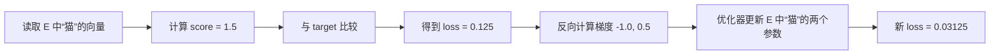

这个小模型是为了手算而简化的；真实 LLM 会在 Embedding 后经过多层 Attention、MLP、归一化和输出投影，再通过交叉熵得到 loss。但逻辑没有变化：前向传播计算预测和 loss，反向传播计算每个参数对 loss 的影响，优化器再按梯度更新参数。

##### 2. 反向传播用链式法则把影响逐层传回来

Embedding 向量不会直接产生 loss，它后面还有 Transformer、输出层、Softmax 和损失函数。反向传播从 loss 出发，利用链式法则逐层计算：输出层的改变怎样影响 loss、Transformer hidden state 的改变怎样影响输出、最后 Embedding 每个数的改变又怎样影响 hidden state。

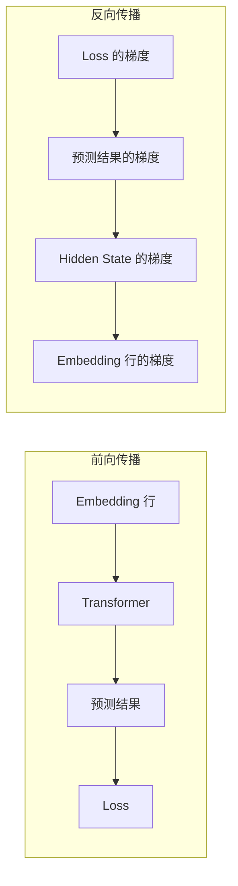

框架的自动求导系统会记录前向操作，并自动完成这些局部梯度的连乘。程序员通常只需调用 `loss.backward()`，但背后仍然是链式法则，不是黑盒猜测。

##### 3. Gather 的反向传播只负责把梯度送回原来的行

前向 Gather 执行的是：

```text
hidden[position] = E[input_ids[position]]
```

因此，某个输出位置 `hidden[position]` 的梯度应该送回它读取的那一行。这个过程像仓库退货：前向根据取货单从货位取东西，反向根据同一张单据把每件货的“修改意见”送回原货位。

其核心规则是：

```text
grad_E[input_ids[b, s], :] += grad_hidden[b, s, :]
```

`grad_hidden[b, s, :]` 是后续网络反传到第 `(b, s)` 个 token 向量的梯度。`grad_E` 则与 Embedding 矩阵形状相同，用于记录每个参数应该怎样调整。

##### 4. 为什么必须 Scatter-Add，而不是直接覆盖

假设本次输入是 `[2, 0, 2]`，ID `2` 出现了两次。后续网络传回来的梯度分别为：

```text
input_ids = [2, 0, 2]

grad_hidden[0] = [ 0.1, -0.2]   # 第一次使用 E[2] 产生的意见
grad_hidden[1] = [ 0.3,  0.4]   # 使用 E[0] 产生的意见
grad_hidden[2] = [-0.5,  0.7]   # 第二次使用 E[2] 产生的意见
```

把梯度送回 Embedding 矩阵时：

```text
grad_E[0] = [0.3, 0.4]

grad_E[2] = [0.1, -0.2] + [-0.5, 0.7]
          = [-0.4, 0.5]
```

第 2 行同时影响了两个位置的计算，所以两份影响必须相加。若用赋值覆盖，先出现的位置对 loss 的贡献就会丢失。这就是 `scatter-add` 名称的含义：把多个位置的梯度散射（scatter）回各自行号；落到同一行时累加（add）。本次没有读取的行，从这次 Gather 得到的梯度为 0。

然后优化器才使用这些梯度更新参数。例如学习率为 `0.1`、暂时忽略 AdamW 等复杂机制时：

```text
E[2]_new = E[2] - 0.1 × grad_E[2]
```

请区分三个连续但不同的动作：

1. `loss.backward()` 计算梯度；
2. `optimizer.step()` 根据梯度更新参数；
3. `optimizer.zero_grad()` 清除已累积梯度，为下一批数据做准备。

Token ID 本身是离散整数，只负责选择哪一行，通常不对 ID 求梯度。被训练的是 `E` 中的浮点参数，而不是把 ID `2` 更新成 `2.01`。

“只访问少量行”也不意味着优化器一定只保存或更新少量状态。是否真正使用稀疏梯度，取决于框架、`Embedding` 层参数和优化器是否支持；大型语言模型训练中也经常使用稠密梯度与分布式参数切分。

#### 用 PyTorch 直接观察查表与梯度累加

```python
import torch
from torch.nn import functional as F

weight = torch.tensor([
    [ 0.8,  0.2],
    [ 0.7,  0.3],
    [-0.4,  0.9],
], requires_grad=True)

input_ids = torch.tensor([[2, 0, 2]], dtype=torch.long)

# F.embedding 的语义就是用 input_ids 从 weight 中查行。
hidden = F.embedding(input_ids, weight)
print(hidden.shape)       # torch.Size([1, 3, 2])
print(hidden[0, 0])       # tensor([-0.4000, 0.9000])，即 weight[2]
print(hidden[0, 2])       # 同样是 weight[2]

# 为便于观察，让每个输出元素对 loss 的梯度都为 1。
loss = hidden.sum()
loss.backward()
print(weight.grad)
# tensor([[1., 1.],
#         [0., 0.],
#         [2., 2.]])
```

第 0 行被访问一次，所以梯度是 `[1, 1]`；第 1 行没有被访问，所以是 `[0, 0]`；第 2 行被访问两次，梯度累加为 `[2, 2]`。

#### 工程边界

- Token ID 必须是整数，并满足 `0 <= id < V`；越界索引通常会直接报错。
- `padding_idx` 可以让指定 padding 行不参与常规梯度更新，但它仍然是词表中的合法行。
- 查表只负责从参数矩阵取出初始向量，不负责 Attention，也不会让向量自动带上上下文。
- `gather` 是通用张量操作，而 `nn.Embedding` / `F.embedding` 是面向 Embedding 的专用接口，还可处理 `padding_idx`、稀疏梯度和最大范数等选项。
- 在 GPU 上，查表常受内存访问效率影响；连续矩阵乘法更容易充分利用计算单元，因此大规模系统还会关注词表切分、通信和内存布局。

### 用 NumPy 手工实现

```python
import numpy as np

embedding_table = np.array([
    [ 0.8,  0.2, -0.1],
    [ 0.7,  0.3, -0.2],
    [-0.4,  0.9,  0.1],
    [ 0.1, -0.5,  0.8],
    [ 0.0,  0.0,  0.0],
], dtype=np.float32)

token_ids = np.array([0, 2, 1], dtype=np.int64)
hidden = embedding_table[token_ids]

print(hidden.shape)  # (3, 3)
print(hidden)
```

批量输入同样只是多维索引：

```python
batch_ids = np.array([
    [0, 2, 1],
    [1, 3, 4],
])

hidden = embedding_table[batch_ids]
print(hidden.shape)  # (2, 3, 3)
```

### 用 PyTorch 的标准实现

```python
import torch
from torch import nn

vocab_size = 100_000
hidden_size = 4_096

token_embedding = nn.Embedding(
    num_embeddings=vocab_size,
    embedding_dim=hidden_size,
)

input_ids = torch.tensor([
    [10, 25, 83, 2],
    [91, 17,  2, 0],
], dtype=torch.long)

hidden = token_embedding(input_ids)

print(input_ids.shape)  # torch.Size([2, 4])
print(hidden.shape)     # torch.Size([2, 4, 4096])
```

`nn.Embedding` 的核心行为可以用下面的简化代码理解：

```python
class SimpleEmbedding(nn.Module):
    def __init__(self, vocab_size: int, hidden_size: int):
        super().__init__()
        self.weight = nn.Parameter(
            torch.randn(vocab_size, hidden_size) * 0.02
        )

    def forward(self, input_ids: torch.Tensor) -> torch.Tensor:
        return self.weight[input_ids]
```

真实框架会处理设备、稀疏梯度、padding、最大范数等细节，但最核心的前向算法就是矩阵索引。

## Embedding 数值是怎样学习出来的

初始 Embedding 通常是小随机数。随机初始化时，“猫”和“狗”并不天然接近。它们后来具有语义结构，是因为整个模型在训练任务中反复更新参数。

先给出最重要的结论：**Embedding 矩阵中的每个小数都是模型参数，地位与神经网络中其他权重完全相同。** 它没有一套能把“猫”直接换算成 `[0.21, -0.47, ...]` 的人工公式，也没有人为给每个维度指定“动物性”“大小”“褒贬”等含义。训练程序只规定：

1. 输入哪些 token；
2. 希望模型输出什么答案；
3. 用什么损失函数衡量输出与答案的差距；
4. 如何根据梯度调整参数，使下一次差距更小。

Embedding 中最终出现什么数值，是数十亿乃至数万亿个训练 token 对这些参数反复施加微小更新后的结果。

### 第 1 步：先随机初始化一张表

假设词表只有 4 个 token，隐藏维度为 3，则模型创建一个形状为 `[4, 3]` 的可训练矩阵：

```text
             dim_0    dim_1    dim_2
E[我]       +0.012   -0.018   +0.004
E[喜欢]     -0.007   +0.021   -0.011
E[苹果]     +0.016   +0.003   -0.019
E[汽车]     -0.014   +0.009   +0.006
```

这些初始值一般从均值接近 0、方差较小的随机分布中采样，例如：

```python
E = torch.randn(vocab_size, hidden_size) * 0.02
```

乘以 `0.02` 是为了让初始数值保持较小，避免网络一开始就出现过大的激活值。这里的 `0.02` 是初始化尺度，不是语义计算公式。更换随机种子会得到完全不同的初始矩阵；只要训练设置合理，它们都可以逐渐学出有效表示。

矩阵的列也不具有预先定义的业务含义。`dim_0` 并不天然代表“是否是动物”，单独观察某一维通常无法解释语义。信息往往分布在许多维度及其组合方向上，而且向量空间整体旋转后仍可表达近似相同的关系。

### 第 2 步：查表，让参数参与一次预测

若当前输入包含 token `喜欢`，前向计算会读取 `E[喜欢]` 这一行。这个向量再经过多层 Attention、MLP、归一化和输出投影，最终得到对下一个 token 的预测。


因此，Embedding 并不是独立训练的孤立字典。它位于一个端到端计算图的最前端：只要最终预测依赖这行向量，损失就能沿计算图反向追踪到这行里的每个数值。

以自回归语言模型为例，训练目标是根据前文预测下一个 token：

```text
输入：  我 喜欢 吃
目标：  喜欢 吃 苹果
```

流程如下：

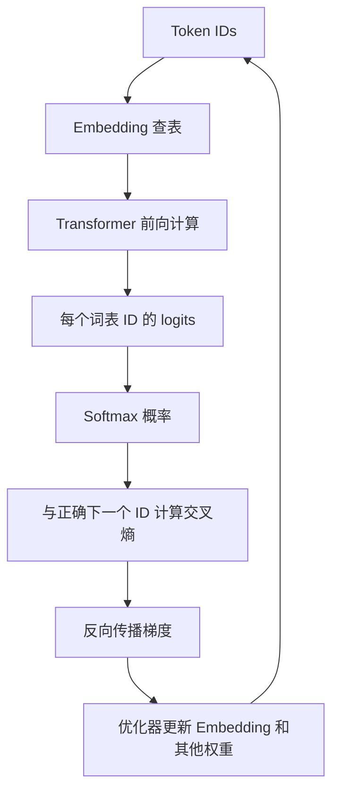

### 交叉熵损失

假设模型对下一个 token 的预测概率是：

```text
P(苹果) = 0.60
P(米饭) = 0.25
P(汽车) = 0.05
其他     = 0.10
```

正确答案是“苹果”，单个位置的负对数似然损失为：

```text
L = -log P(苹果) = -log(0.60) ≈ 0.511
```

如果模型只给正确答案 `0.01` 的概率：

```text
L = -log(0.01) ≈ 4.605
```

错误越严重，损失越大。反向传播用链式法则计算 `∂L/∂E`，优化器再更新矩阵。

### 哪些行会收到梯度

一次前向只读取输入中出现过的行，因此 Embedding 梯度具有稀疏性。若 ID `2` 在一个 batch 中出现三次，它对应行收到的梯度是三个位置贡献之和：

```text
∂L/∂E[2] = g_position_1 + g_position_2 + g_position_3
```

简化的梯度下降更新为：

```text
E[2] = E[2] - learning_rate × ∂L/∂E[2]
```

实际大模型通常使用 AdamW 等优化器。AdamW 会维护梯度的一阶矩和二阶矩，不是简单地直接减梯度，但目标相同：让下一次前向产生更低的训练损失。

### 梯度究竟怎样传回某个矩阵元素

假设某个位置读取了 Embedding 行 `e = E[token_id]`，后续网络计算出 logits `z`，损失为 `L`。从依赖关系看：

```text
E[token_id] -> e -> Transformer -> z -> softmax -> L
```

反向传播使用链式法则，从右向左计算：

```text
∂L/∂E[token_id]
  = ∂L/∂z
  × ∂z/∂TransformerOutput
  × ...
  × ∂FirstLayerOutput/∂e
  × ∂e/∂E[token_id]
```

可以把它理解为逐层回答三个问题：

- 最终预测偏离正确答案多少？
- 每一层的输出对这个偏差贡献了多少？
- 输入 Embedding 的每个分量如果略微变化，损失会上升还是下降？

某个元素的梯度为正，表示在其他条件暂时不变时，增大它会使损失增大，因此梯度下降会把它调小；梯度为负则相反。梯度绝对值越大，表示当前样本的损失对该元素越敏感。

::: tip 梯度不是“正确答案向量”
训练数据只提供目标 token，并不提供这个 token 应该对应什么 Embedding 向量。梯度只是当前模型、当前样本和当前参数状态下的局部调整方向。大量不同样本反复给出调整方向，矩阵才逐渐形成稳定结构。
:::

### 一个可以手算的二维更新例子

前面讲了参数通过梯度更新，但如果突然从概念跳到矩阵公式，确实很难看出每个数字在做什么。本节先构造一个**故意缩小的语言模型**，只保留预测和更新 Embedding 所必需的部件，然后把一次训练完整走一遍。

#### 先给出完整公式：例子是对公式的逐项展开

先不要急着计算数字。这个简化模型的一次训练，可以用下面 6 组通用公式描述。后面的“我喜欢 → 编程”例子不会替代这些公式，而是把具体数字逐项代入它们。

**公式 1：根据 Token ID 查询 Embedding**

```text
e = E[token_id]
```

其中：

```text
E.shape = [V, D]
e.shape = [D]
```

`V` 是词表大小，`D` 是 Embedding 维度。`token_id` 决定读取 `E` 的哪一行，读出的向量记作 `e`。

**公式 2：使用线性输出层计算所有候选的 Logit**

```text
z = e @ W
```

其中：

```text
e.shape = [D]
W.shape = [D, C]
z.shape = [C]
```

`C` 是候选类别数，在真实语言模型中通常就是词表大小 `V`。`@` 表示矩阵乘法。为简化手算，本例省略 Bias；若存在 Bias，则公式为 `z = e @ W + b`。

对第 `j` 个候选，矩阵公式展开为点积：

```text
z_j = Σᵢ e_i × W_i,j
```

符号 `Σᵢ` 表示把所有 Embedding 维度 `i` 的乘积加起来。

**公式 3：Softmax 把 Logit 转换为概率**

```text
p_j = exp(z_j) / Σₖ exp(z_k)
```

也可以整体写成：

```text
p = softmax(z)
```

`p_j` 是第 `j` 个候选的预测概率。分母把所有候选的指数值加起来，因此所有 `p_j` 的总和为 1。

**公式 4：交叉熵计算预测损失**

若正确答案使用 one-hot 向量 `y` 表示，多分类交叉熵为：

```text
L = -Σⱼ y_j × ln(p_j)
```

因为 one-hot 标签只有正确候选的位置为 1，其余位置都是 0，所以等价于：

```text
L = -ln(p_correct)
```

正确候选概率越高，`L` 越小；正确候选概率越低，`L` 越大。

**公式 5：反向传播计算梯度**

Softmax 与交叉熵组合后，Loss 对 Logit 的梯度具有简洁形式：

```text
∂L/∂z = p - y
```

然后通过线性层传回输入 Embedding：

```text
∂L/∂e = (∂L/∂z) @ Wᵀ
       = (p - y) @ Wᵀ
```

`Wᵀ` 表示 `W` 的转置，即交换行和列。前向时 `W` 把 Embedding 维度映射到候选维度；反向时 `Wᵀ` 把候选分数的梯度传回 Embedding 的每个维度。

由于 `e` 来自 `E[token_id]`，所以这份梯度还会写回 Embedding 矩阵对应行：

```text
∂L/∂E[token_id] += ∂L/∂e
```

如果同一个 Token ID 在 batch 中出现多次，就需要使用 `+=` 累加多个位置的贡献，这正是前文讲过的 Scatter-Add。

**公式 6：优化器更新 Embedding 参数**

使用最简单的 SGD 时：

```text
e_new = e - η × ∂L/∂e
```

等价地写回矩阵：

```text
E[token_id]_new = E[token_id]_old - η × ∂L/∂E[token_id]
```

这里的 `=` 是赋值关系，不是梯度累加；`η` 是学习率，控制每次沿梯度反方向移动多少。

把六步连起来，就是：

```text
e = E[token_id]                         # 查表
z = e @ W                               # 候选分数
p = softmax(z)                          # 候选概率
L = -Σ y × ln(p)                        # 预测损失
grad_e = (p - y) @ Wᵀ                   # 反向梯度
E[token_id] = E[token_id] - η × grad_e  # 参数更新
```

后面的例子会按完全相同的顺序回答：

| 通用公式 | 具体例子中要做的事情 |
| --- | --- |
| `e = E[token_id]` | 取出“喜欢”的二维向量 |
| `z = e @ W` | 给“苹果”和“编程”分别打分 |
| `p = softmax(z)` | 把两个分数变成概率 |
| `L = -ln(p_correct)` | 衡量模型没有选好“编程”的程度 |
| `grad_e = (p-y) @ Wᵀ` | 算出“喜欢”向量两维应该怎样调整 |
| `e_new = e-η×grad_e` | 更新 `E` 中“喜欢”对应的一行 |

#### 为什么要把模型简化成二维

真实 LLM 通常有以下规模：

```text
Embedding 维度：几千维
词表候选数：几万到几十万
中间网络：几十甚至上百层 Transformer
```

这样的模型无法在纸上逐项计算。为了看清基本机制，我们暂时改成：

```text
Embedding 维度：2
下一个 Token 的候选数：2
中间网络：省略，只保留一个线性输出层
```

这个例子不是在声称真实 LLM 只有两个候选，也不是在给“喜欢”定义真实向量。它的目的只有一个：让每一次乘法、误差和参数更新都能手算。

#### 先交代训练任务：让模型完成“我喜欢 → 编程”

假设训练语料中有一个片段：

```text
输入上下文：我 喜欢
正确的下一个 Token：编程
```

为了进一步简化，我们暂时忽略“我”的向量，也省略 Transformer，只取上下文最后一个 Token“喜欢”的 Embedding 来预测下一个 Token。

候选词表只有两个 Token：

| 候选编号 | 候选 Token | 是否为正确答案 |
| ---: | --- | --- |
| 0 | 苹果 | 否 |
| 1 | 编程 | 是 |

模型当前需要完成的任务是：让候选 1“编程”的概率变高，让候选 0“苹果”的概率变低。

#### 认识这次计算中的所有符号

| 符号 | 名称 | 在本例中的含义 |
| --- | --- | --- |
| `E` | Embedding 矩阵 | 保存所有输入 Token 的向量 |
| `e` | 输入向量 | 从 `E` 中取出的“喜欢”这一行 |
| `W` | 输出权重矩阵 | 把二维输入向量转换成两个候选分数 |
| `z` | Logits | 两个候选未经归一化的分数 |
| `p` | Probabilities | Softmax 得到的两个候选概率 |
| `y` | Label | 用 one-hot 表示的正确答案 |
| `L` | Loss | 当前预测错误程度 |
| `η` | Learning Rate | 参数每次更新的步长，读作 eta |

数据流是：

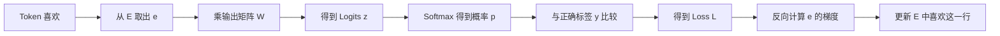

#### 第 1 步：查出“喜欢”的当前 Embedding

假设“喜欢”的 Token ID 是 `2`，当前 Embedding 矩阵对应行为：

```text
input_id = 2

e = E[2]
  = E[喜欢]
  = [0.20, -0.10]
```

为了方便书写，给两个维度分别取名 `e₀` 和 `e₁`：

```text
e₀ =  0.20
e₁ = -0.10
```

此时这两个数只是训练到当前时刻的参数值。不要把 `0.20` 理解为“喜欢程度”，也不要把 `-0.10` 理解为“讨厌程度”；单个维度没有这种人工规定的业务语义。

#### 第 2 步：输出矩阵 W 怎样给两个候选打分

我们需要从二维向量得到两个候选的分数，因此设输出权重矩阵为：

```text
               候选 0：苹果   候选 1：编程
W = [
  [                 1.0,            -1.0],  # e₀ 对两个候选的权重
  [                 0.5,             0.5]   # e₁ 对两个候选的权重
]

W.shape = [2, 2]
```

矩阵的两列分别服务于两个候选：

```text
“苹果”的权重列 = [ 1.0, 0.5]
“编程”的权重列 = [-1.0, 0.5]
```

用 `e` 与每一列做点积，就得到相应候选的 Logit。

候选 0“苹果”的分数：

```text
z₀ = e₀ × 1.0 + e₁ × 0.5
   = 0.20 × 1.0 + (-0.10) × 0.5
   = 0.20 - 0.05
   = 0.15
```

候选 1“编程”的分数：

```text
z₁ = e₀ × (-1.0) + e₁ × 0.5
   = 0.20 × (-1.0) + (-0.10) × 0.5
   = -0.20 - 0.05
   = -0.25
```

合在一起就是原来那条紧凑的矩阵公式：

```text
z = e @ W
  = [0.20, -0.10] @ [[1.0, -1.0], [0.5, 0.5]]
  = [0.15, -0.25]
```

符号 `@` 表示矩阵乘法。现在模型给“苹果”打了 `0.15` 分，给正确答案“编程”只打了 `-0.25` 分。因为 `0.15 > -0.25`，模型当前更倾向错误候选“苹果”。

#### 第 3 步：Softmax 把两个 Logit 转换成概率

Logit 不是概率。Softmax 对两个分数取指数并归一化：

```text
exp(0.15)  ≈ 1.162
exp(-0.25) ≈ 0.779

总和 = 1.162 + 0.779 = 1.941
```

于是：

```text
p₀ = P(苹果) = 1.162 / 1.941 ≈ 0.599
p₁ = P(编程) = 0.779 / 1.941 ≈ 0.401

p = [0.599, 0.401]
```

可以读成：

```text
模型认为下一个 Token 是“苹果”的概率约为 59.9%
模型认为下一个 Token 是“编程”的概率约为 40.1%
```

正确答案明明是“编程”，模型却只给它 `40.1%`，这就是本次训练要纠正的错误。

#### 第 4 步：one-hot 标签 y 表示哪个候选正确

候选顺序是：

```text
索引 0：苹果
索引 1：编程
```

正确答案是索引 1，因此标签写成：

```text
y = [0, 1]
```

这里：

- 第 0 位为 `0`：苹果不是正确答案；
- 第 1 位为 `1`：编程是正确答案。

这个 one-hot 标签只是在公式中标记正确类别，不是 Token Embedding，也不是前面讲过的“用 one-hot 乘 Embedding 矩阵来模拟查表”。两处都使用 one-hot 表示法，但承担的角色不同。

#### 第 5 步：交叉熵计算当前预测有多差

只有正确候选的预测概率进入这条简化的交叉熵公式：

```text
L = -ln(p_correct)
```

本例正确候选“编程”的概率是 `0.401`：

```text
L = -ln(0.401)
  ≈ 0.913
```

如果正确候选概率接近 `1`，`-ln(p_correct)` 接近 `0`；如果正确候选概率很小，Loss 会变大。因此，降低交叉熵会推动模型提高正确候选的概率。

#### 第 6 步：先得到两个 Logit 应该怎样调整

Softmax 与交叉熵组合后，对每个 Logit 的梯度可以简化为：

```text
∂L/∂z = p - y
```

把本例的预测概率和标签代入：

```text
p     = [0.599, 0.401]
y     = [0,     1    ]

p - y = [0.599 - 0, 0.401 - 1]
      = [0.599,    -0.599]
```

所以：

```text
∂L/∂z₀ =  0.599  # 错误候选“苹果”
∂L/∂z₁ = -0.599  # 正确候选“编程”
```

这两个符号非常符合直觉：

- “苹果”的梯度为正，梯度下降会设法降低它的 Logit；
- “编程”的梯度为负，梯度下降会设法提高它的 Logit。

数值恰好一正一负且绝对值相同，是因为本例只有两个候选，概率总和为 1。

#### 第 7 步：把 Logit 的梯度传回 Embedding 向量

我们已经知道两个候选分数应该怎样变化，但真正要观察的是 `e = E[喜欢]` 怎样更新。回顾前向公式：

```text
z₀ =  1.0 × e₀ + 0.5 × e₁
z₁ = -1.0 × e₀ + 0.5 × e₁
```

`e₀` 同时影响两个 Logit，因此要把两条路径的梯度贡献相加。

对 `e₀`：

```text
来自 z₀ 的贡献 = (∂L/∂z₀) × (∂z₀/∂e₀)
                = 0.599 × 1.0
                = 0.599

来自 z₁ 的贡献 = (∂L/∂z₁) × (∂z₁/∂e₀)
                = (-0.599) × (-1.0)
                = 0.599

∂L/∂e₀ = 0.599 + 0.599
        = 1.198
```

对 `e₁`：

```text
来自 z₀ 的贡献 = 0.599 × 0.5
                = 0.2995

来自 z₁ 的贡献 = (-0.599) × 0.5
                = -0.2995

∂L/∂e₁ = 0.2995 + (-0.2995)
        = 0
```

因此整个 Embedding 向量的梯度是：

```text
∂L/∂e = [1.198, 0.000]
```

原来的一行矩阵公式：

```text
∂L/∂e = (p - y) @ Wᵀ
```

只是把上面的四次乘法和两次加法一次写完。`Wᵀ` 表示把 `W` 的行列交换，以便反向时从“候选维度”映射回“Embedding 维度”。

第二维梯度为 0，并不意味着 `e₁` 永远没有用，也不意味着这一维训练结束了。它只表示：在**当前参数、当前样本和当前简化输出矩阵**下，两条路径对 `e₁` 的影响刚好抵消。本批次换一个样本或参数发生变化后，它完全可能得到非零梯度。

#### 第 8 步：SGD 根据梯度更新“喜欢”这一行

为了演示，使用最简单的 SGD，学习率设为：

```text
η = 0.1
```

更新公式是：

```text
参数新值 = 参数旧值 - 学习率 × 梯度
```

逐维计算：

```text
e₀_new = 0.20 - 0.1 × 1.198
       = 0.0802

e₁_new = -0.10 - 0.1 × 0
       = -0.10
```

所以：

```text
更新前：E[喜欢] = [0.2000, -0.1000]
更新后：E[喜欢] = [0.0802, -0.1000]
```

本例为了只观察 Embedding，假设 `W` 暂时固定。真实训练中，输出矩阵、Transformer 以及其他参与计算的参数通常也会同时收到梯度并由优化器更新。

#### 第 9 步：重新预测，检查更新有没有帮助

用新的 `e_new` 再算一次两个候选的 Logit。

“苹果”的新分数：

```text
z₀_new = 0.0802 × 1.0 + (-0.10) × 0.5
       = 0.0802 - 0.05
       = 0.0302
```

“编程”的新分数：

```text
z₁_new = 0.0802 × (-1.0) + (-0.10) × 0.5
       = -0.0802 - 0.05
       = -0.1302
```

注意，“编程”的 Logit 仍然是负数，但它与“苹果”的差距已经缩小：

```text
更新前：苹果 0.15，   编程 -0.25，差距 0.40
更新后：苹果 0.0302， 编程 -0.1302，差距约 0.1604
```

Softmax 关心相对差距，而不是要求正确候选 Logit 必须为正。重新计算概率：

```text
p_new ≈ [0.540, 0.460]

P(苹果) ≈ 54.0%
P(编程) ≈ 46.0%
```

正确候选“编程”的概率从约 `40.1%` 上升到约 `46.0%`。

新交叉熵为：

```text
L_new = -ln(0.460)
      ≈ 0.777
```

对比更新前后：

| 指标 | 更新前 | 更新后 | 变化是否正确 |
| --- | ---: | ---: | --- |
| `P(苹果)` | 59.9% | 54.0% | 错误候选概率下降 |
| `P(编程)` | 40.1% | 46.0% | 正确候选概率上升 |
| 交叉熵 Loss | 0.913 | 0.777 | Loss 下降 |
| `E[喜欢]` 第一维 | 0.2000 | 0.0802 | 按梯度方向更新 |
| `E[喜欢]` 第二维 | -0.1000 | -0.1000 | 本次梯度为 0，未变化 |

一次更新还没有让“编程”超过“苹果”，这很正常。训练不是要求每个样本一步就完全正确，而是在大量样本上反复执行微小更新。如果后续训练数据持续支持“我喜欢编程”这种模式，相关参数会继续调整。

#### 把整个例子压缩成一条因果链

```text
读取 E[喜欢] = [0.20, -0.10]
  ↓
输出层给苹果、编程打分：[0.15, -0.25]
  ↓
Softmax 概率：[59.9%, 40.1%]
  ↓
正确答案是编程，交叉熵 Loss = 0.913
  ↓
反向传播得到 grad(E[喜欢]) = [1.198, 0]
  ↓
SGD 更新 E[喜欢] = [0.0802, -0.10]
  ↓
重新预测：[54.0%, 46.0%]
  ↓
正确答案概率上升，Loss 降到 0.777
```

这就是“Embedding 数值通过训练形成”的最小可计算版本：**预测产生可度量的错误，损失函数把错误变成一个标量，反向传播计算 Embedding 每个参数对错误的影响，优化器再修改被读取的矩阵行。**

#### 这个简化例子与真实 LLM 分别对应什么

| 手算示例 | 真实 LLM |
| --- | --- |
| 只使用 `E[喜欢]` | 使用整个上下文中所有 Token 的表示 |
| 省略中间网络 | 经过多层 Attention、MLP、归一化和残差连接 |
| Embedding 只有 2 维 | 隐藏维度通常为数千维 |
| 只有“苹果、编程”两个候选 | 为完整词表中数万到数十万个 Token 打分 |
| 只更新 `E[喜欢]` | 同时更新许多 Embedding 行和网络参数 |
| 使用简单 SGD | 常使用 AdamW、学习率调度、梯度裁剪等机制 |
| 只处理一个样本 | 使用大规模 batch 和分布式训练 |

真实模型规模更大、路径更长，但基本因果链没有变化：**前向计算预测 → 损失函数评分 → 反向传播求梯度 → 优化器更新参数 → 下一次预测有所改变。**

### 为什么不是每次只更新“正确答案”那一行

在自回归语言模型中，输入侧 Embedding 行因为参与了上下文计算而收到梯度。例如用“我 喜欢 吃”预测“苹果”时，`我`、`喜欢`、`吃` 对应的输入行都可能更新。目标 token `苹果` 是否直接更新其 Embedding 行，则取决于模型是否采用输入输出权重共享（Weight Tying）：

- 不共享时，目标侧主要更新独立的输出投影矩阵；
- 共享时，输出投影复用 Embedding 矩阵，`苹果` 对应行也会作为输出分类权重收到梯度；
- 无论是否共享，模型的 Attention、MLP 等其他参数也会同时更新。

所以不能把训练理解为“看到一次苹果，就给苹果向量加一个固定值”。一次训练步骤是整个网络共同分摊预测误差，优化器根据各参数的梯度分别更新。

### 为什么语义相近的 token 会靠近

模型没有被直接告知“猫和狗相似”。它反复看到它们出现在相似上下文中：

```text
我养了一只猫
我养了一只狗
给猫喂食
给狗喂食
```

为了在这些上下文中完成相似预测，训练会推动相关表示形成可复用结构。但需要注意：

- 语义不只存储在初始 Embedding 表中，也分布在 Transformer 各层参数里。
- Token Embedding 的余弦相似度不一定等同于最终上下文语义。
- 同一个 token 的初始向量固定，但经过 Transformer 后会因上下文不同得到不同表示。

例如“苹果很好吃”和“苹果发布了新设备”中的“苹果”查到同一个初始向量，但经过 Attention 后形成的上下文化向量不同。

## 位置信息如何加入

仅有 Token Embedding 时，模型知道有哪些 token，却不知道顺序。`我打你` 和 `你打我` 包含相同 token，但含义不同。

经典 Transformer 会把 Token Embedding 与 Position Embedding 相加：

```text
h_t^(0) = token_embedding[token_id_t] + position_embedding[t]
```

其中 `t` 是序列位置。两者维度必须相同，才能逐元素相加。

现代生成模型也常使用 RoPE。RoPE 通常不直接加在输入 Embedding 上，而是在 Attention 内部旋转 Q/K 向量，使点积自然携带相对位置信息。无论采用哪种方案，Token Embedding 与位置信息是两个不同概念。

有些架构还会加入：

- Segment/Token Type Embedding：区分句子 A 与句子 B；
- Modality Embedding：区分文字、图像或音频；
- Role Embedding：在特定架构中区分消息角色。

## 从 input_ids 到下一个 Token：完整预测流程

到目前为止，我们已经知道 `input_ids` 如何通过 Embedding 矩阵变成向量。但必须明确：**仅靠 Embedding 查表不能预测下一个 Token。** Embedding 层只完成“离散编号 → 初始浮点向量”的转换，后面还需要位置信息、多层 Transformer、输出投影、Softmax 和解码策略。

完整流程是：

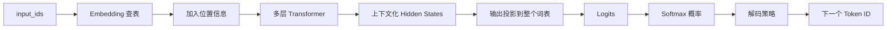

下面使用输入“我喜欢吃”逐步展开。为了便于展示，假设 Tokenizer 得到：

```text
文本：我 喜欢 吃

input_ids = [10, 25, 83]
```

真实 Token ID 由具体模型的 Tokenizer 决定，这里的数字仅用于说明流程。

### 第 1 步：Embedding 查表得到初始向量

假设隐藏维度 `D = 4`，Embedding 矩阵中相关行是：

```text
E[10] = [0.2, 0.8, -0.1, 0.3]  # 我
E[25] = [0.7, 0.1,  0.4, 0.2]  # 喜欢
E[83] = [0.1, 0.5, -0.3, 0.9]  # 吃
```

Gather 按照 `[10,25,83]` 依次取行：

```text
initial_hidden = [
  [0.2, 0.8, -0.1, 0.3],  # E[10]：我
  [0.7, 0.1,  0.4, 0.2],  # E[25]：喜欢
  [0.1, 0.5, -0.3, 0.9]   # E[83]：吃
]

initial_hidden.shape = [3, 4] = [S, D]
```

此时最后一行只是 Token“吃”的初始表示。无论前面是“我喜欢”还是“不要继续”，只要 Token ID 都是 `83`，查表得到的 `E[83]` 就相同。因此，仅凭这一行还不知道当前完整上下文是“我喜欢吃”。

### 第 2 步：让模型知道 Token 的位置

如果只有三个 Token 向量，模型还需要知道它们的先后顺序：

```text
位置 0：我
位置 1：喜欢
位置 2：吃
```

经典绝对位置 Embedding 可以概念化为：

```text
x[0] = E[我]   + Position[0]
x[1] = E[喜欢] + Position[1]
x[2] = E[吃]   + Position[2]
```

现代生成模型常使用 RoPE。RoPE 通常不是直接给输入向量加一个位置向量，而是在 Attention 内旋转 Query 和 Key，使点积带有相对位置信息。实现方式不同，但目标相同：让模型区分“我喜欢吃”与“吃喜欢我”。

### 第 3 步：Self-Attention 让每个位置读取前文

自回归语言模型使用因果掩码（Causal Mask），保证当前位置不能偷看未来 Token：

```text
位置 0“我”   可以看：我
位置 1“喜欢” 可以看：我、喜欢
位置 2“吃”   可以看：我、喜欢、吃
```

可以把允许查看的关系画成下三角矩阵，其中 `1` 表示允许 Attention，`0` 表示屏蔽：

```text
               Key 位置
              我  喜欢  吃
Query 我       1    0    0
位置  喜欢     1    1    0
      吃       1    1    1
```

最后一个位置“吃”通过 Self-Attention 读取前面的“我”和“喜欢”。Attention 并不是简单把三个向量相加，而是把每个位置映射成 Query、Key、Value，计算相关性分数，再对 Value 加权汇总。经过 Attention、MLP、残差连接和归一化后，每个位置得到新的向量。

### 第 4 步：多层 Transformer 形成上下文化表示

一层 Transformer 的输出会成为下一层输入。经过许多层后：

```text
初始向量：E[吃]
    ↓ 读取前文并经过多层非线性变换
最终向量：h_last
```

`h_last` 不再只表示词典意义上的“吃”，而是近似表达：

```text
“出现在‘我喜欢’之后、当前需要继续预测的‘吃’”
```

为了演示，假设最后一层在最后一个位置输出：

```text
h_last = [0.6, -0.2, 0.9, 0.4]
h_last.shape = [D] = [4]
```

这个向量的单独维度通常没有人工指定的含义，语境信息分布在整个向量及多层网络参数中。

同一个 Token 在不同上下文中，初始 Embedding 相同，最终隐藏状态可以不同：

```text
“我喜欢吃”中的“吃” → h_last_A
“这种药不能吃”中的“吃” → h_last_B

E[吃] 相同，但 h_last_A 通常不等于 h_last_B
```

### 第 5 步：输出投影为词表中每个 Token 计算分数

`h_last` 只有 `D = 4` 个数，但模型要在整个词表中选择下一个 Token。若词表大小为 `V = 100,000`，就必须把 `[D]` 映射为 `[V]`。

输出层包含矩阵：

```text
W_out.shape = [V, D]
```

计算可以写作：

```text
logits = h_last · W_outᵀ + bias

h_last.shape = [D]
W_outᵀ.shape = [D, V]
logits.shape = [V]
```

词表中的每个候选 Token 都得到一个 Logit：

```text
Token        Logit
苹果          4.8
米饭          3.9
汽车          0.2
北京          0.7
睡觉         -0.4
……            ……
```

Logit 是未经归一化的候选分数：

- 可以是正数或负数；
- 不要求位于 `0～1`；
- 所有 Logit 不要求相加等于 1；
- 相对大小比绝对值更重要，Logit 越高，模型越倾向选择该 Token。

模型在这里并不是从词典中检索一条现成回答，而是使用同一个上下文向量，一次性对词表中的所有候选 Token 打分。

### 第 6 步：Weight Tying 如何复用 Embedding 矩阵

输入 Embedding 矩阵的形状是：

```text
E.shape = [V, D]
```

输出矩阵 `W_out` 也可以是 `[V,D]`。许多模型采用 Weight Tying，让两者共享同一组参数：

```text
W_out = E
```

此时某个候选 Token `i` 的 Logit 可以近似理解为：

```text
logit_i = h_last · E[i] + bias_i
```

也就是将当前上下文表示 `h_last` 与每个候选 Token 的向量做点积。若方向更匹配，点积往往更大，候选分数也更高。

Weight Tying 有两个直观作用：

1. 输入时用这张表“读取 Token 表示”，输出时用同一张表“判断哪个 Token 与当前上下文匹配”；
2. 避免再保存一张同样大小的独立输出矩阵，减少参数量。

但不是所有模型都共享权重。有些架构使用独立输出矩阵，有些还会在输出前增加 LayerNorm 或其他变换，应以具体模型配置和源码为准。

### 第 7 步：Softmax 把 Logit 转换成概率

为了演示，假设只保留四个候选 Logit：

```text
苹果： 4.8
米饭： 3.9
汽车： 0.2
睡觉：-0.4
```

Softmax 的计算是：

```text
P(token_i) = exp(logit_i) / Σ exp(logit_j)
```

它先对每个 Logit 取指数，再除以所有指数值的总和。结果可能近似为：

```text
苹果：约 70.3%
米饭：约 28.6%
汽车：约  0.7%
睡觉：约  0.4%
```

Softmax 输出满足：

```text
每个概率 >= 0
所有概率之和 = 1
```

这表示模型认为：在“我喜欢吃”之后，“苹果”最可能，“米饭”次之。概率不是事实保证，只是模型根据训练数据和当前上下文给出的条件分布。

实际实现常不会先把所有概率完整展示出来；为了数值稳定和性能，框架可能直接在 Logit 上完成后续筛选或使用 Log-Softmax，但数学含义相同。

### 第 8 步：解码策略从概率分布中选择 Token

拥有概率分布后，还需要决定怎样选出具体 Token。

#### Greedy / Argmax

直接选择概率最大的候选：

```text
next_token_id = argmax(logits)
```

示例会选择“苹果”。这种方式确定、可复现，但可能使输出过于保守或出现重复。

#### Temperature

Temperature 在 Softmax 前缩放 Logit：

```text
probabilities = softmax(logits / temperature)
```

- 温度较低：高分候选更加突出，结果更确定；
- 温度较高：分布更平坦，低分候选也更有机会，结果更多样；
- 温度接近 0 时，行为趋近于选择最大 Logit。

Temperature 不会让模型学到新知识，它只改变当前分布的尖锐程度。

#### Top-k Sampling

只保留 Logit 最高的 `k` 个候选，将其余候选排除，再从保留集合中采样。例如 `k = 2` 时只保留“苹果”和“米饭”。

#### Top-p / Nucleus Sampling

将候选按概率从高到低排列，选择累计概率达到阈值 `p` 的最小集合，再从中采样。候选集合大小会随当前分布变化：模型非常确定时集合较小，不确定时集合较大。

生产系统还可能结合重复惩罚、频率惩罚、Presence Penalty、禁止 Token 列表或语法约束。它们都在模型产生 Logit 之后影响最终选择，不属于 Embedding 查表本身。

### 第 9 步：把选出的 Token 追加到输入并继续生成

假设本轮选择了“苹果”，系统将其 ID 追加到已有序列：

```text
原序列：我 喜欢 吃
追加后：我 喜欢 吃 苹果
```

模型再根据新序列预测下一个 Token：

```text
我 喜欢 吃 苹果 → 预测“。”
我 喜欢 吃 苹果 。 → 预测下一个 Token
```

这个循环持续到以下任一条件发生：

- 生成 EOS 等结束 Token；
- 达到最大输出 Token 数；
- 命中停止字符串或其他停止规则；
- 用户或系统中断；
- 结构化输出解码器判定内容已完成。

真实推理不会每一步都从头重复计算全部前文。Transformer 通常使用 KV Cache 保存此前各层的 Key 和 Value，新一步主要计算新增 Token 的部分，从而显著降低自回归生成成本。但每一步仍然要产生新的词表 Logit 并选择下一个 Token。

### 第 10 步：为什么使用最后一个有效位置预测

输入“我喜欢吃”经过 Transformer 后，每个位置都有自己的最终隐藏向量：

```text
h[0]：已经看过“我”
h[1]：已经看过“我 喜欢”
h[2]：已经看过“我 喜欢 吃”
```

继续生成时，需要基于完整前文预测，所以使用最后一个有效位置：

```text
next_token_logits = output_projection(h[2])
```

如果 batch 使用 Padding，“最后一个数组位置”不一定是真实文本的最后位置，必须根据 `attention_mask` 或序列长度找到每条样本的最后一个有效 Token。

训练时情况稍有不同。因果语言模型可以一次并行计算所有位置的下一个 Token 预测：

| 当前可见内容 | 该位置的训练目标 |
| --- | --- |
| 我 | 喜欢 |
| 我 喜欢 | 吃 |
| 我 喜欢 吃 | 苹果 |

这通常通过把标签相对输入错开一位（shift）实现。虽然训练能并行处理各位置，生成时未知的下一个 Token 必须先选出来并追加，所以自回归推理仍然逐 Token 进行。

### 完整张量形状如何变化

假设：

```text
B = 2        # 两条输入
S = 3        # 每条输入当前占 3 个位置
D = 4096     # 隐藏维度
V = 100000   # 词表大小
```

形状依次变化：

```text
input_ids
[B, S] = [2, 3]

    ↓ Embedding Gather

initial_hidden
[B, S, D] = [2, 3, 4096]

    ↓ 多层 Transformer

contextual_hidden
[B, S, D] = [2, 3, 4096]

    ↓ 输出投影 W_outᵀ

logits
[B, S, V] = [2, 3, 100000]

    ↓ 取每条样本最后一个有效位置

next_token_logits
[B, V] = [2, 100000]

    ↓ 解码策略

next_token_ids
[B] = [2]
```

在训练时保留 `[B,S,V]`，以便同时计算每个位置的交叉熵；在生成时通常只关心最后一个有效位置的 `[B,V]`。

### 一段接近真实代码的伪实现

```python
def predict_next_token(input_ids, attention_mask):
    # [B, S] → [B, S, D]：按 ID 读取初始向量。
    hidden = token_embedding(input_ids)

    # [B, S, D] → [B, S, D]：融合位置和上下文。
    hidden = transformer(hidden, attention_mask=attention_mask)

    # 找到每条样本最后一个真实 Token 的位置。
    # 此写法假设使用右侧 Padding；左侧 Padding 需要采用相应索引规则。
    last_positions = attention_mask.sum(dim=1) - 1
    batch_indices = range(input_ids.shape[0])
    last_hidden = hidden[batch_indices, last_positions]

    # [B, D] → [B, V]：为整个词表生成候选分数。
    logits = output_projection(last_hidden)

    # Temperature、Top-k、Top-p 等策略选择下一个 ID。
    next_token_ids = decode(logits)
    return next_token_ids
```

这段代码省略了 RoPE、KV Cache、LayerNorm、分布式词表投影等实现细节，但清楚展示了各组件的职责边界。

最关键的结论是：

> Embedding 矩阵只负责把离散 Token ID 转换成初始向量；Transformer 负责将位置和前文信息融合成上下文化表示；输出层再把最后位置的上下文向量转换成整个词表的候选分数，Softmax 与解码策略最终选出下一个 Token。

## 第二类：用于检索的文本 Embedding

RAG 中使用的 Embedding 通常不是简单取某个 token 的矩阵行，而是把整段文本经过完整 Encoder/Transformer 后压缩成一个固定长度向量。

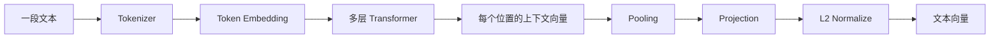

假设一段文本有 `T` 个 token，Transformer 输出：

```text
H.shape = [T, D]
```

要得到整段文本的单一向量，需要 Pooling。

### Mean Pooling

对所有有效 token 向量求平均：

```text
sentence = (h_1 + h_2 + ... + h_T) / T
```

有 padding 时必须使用 mask：

```python
def mean_pool(last_hidden_state, attention_mask):
    mask = attention_mask.unsqueeze(-1).to(last_hidden_state.dtype)
    summed = (last_hidden_state * mask).sum(dim=1)
    count = mask.sum(dim=1).clamp(min=1e-9)
    return summed / count
```

如果把 PAD 也平均进去，短文本会被大量零向量或 padding 表示污染。

### CLS Pooling

某些 Encoder 在序列开头加入 `[CLS]`，训练时让该位置聚合整句信息，最终直接取：

```text
sentence = H[CLS_position]
```

只有模型在训练时为 `[CLS]` 设计了聚合目标，这种取法才可靠。不能随便对任意生成模型取第一个 token 当句向量。

### Last-token Pooling

单向因果模型中，最后一个有效 token 能看到之前所有 token，因此有些 Embedding 模型取最后一个位置：

```text
sentence = H[last_non_padding_position]
```

仍然必须遵循模型训练时定义的 pooling 方式。

### Projection 与归一化

模型可能把隐藏维度 `D` 通过线性层投影成目标维度 `d`：

```text
z = W · sentence + b
```

然后执行 L2 归一化：

```text
embedding = z / ||z||₂
```

归一化后向量长度为 1，两个向量的点积就等于余弦相似度，有利于向量数据库统一检索规则。

## 文本 Embedding 用什么训练算法

常见方法是对比学习（Contrastive Learning）。训练数据包含语义相关的正样本对和不相关的负样本。

例如：

```text
Query:    如何重置数据库密码？
Positive: 数据库密码重置操作指南
Negative: 申请办公用品的流程
```

模型分别生成向量 `q`、`d+` 和 `d-`，训练目标是让：

```text
sim(q, d+) > sim(q, d-)
```

一种常见损失是 InfoNCE / Softmax Contrastive Loss：

```text
L_i = -log(
  exp(sim(q_i, d_i+) / τ)
  /
  Σ_j exp(sim(q_i, d_j) / τ)
)
```

其中：

- `sim` 通常是余弦相似度或点积；
- `d_i+` 是正确文档；
- batch 中其他文档可作为 in-batch negatives；
- `τ` 是 temperature，控制概率分布尖锐程度。

直觉上，分子奖励正确配对，分母包含所有候选文档。若负样本与 query 也很接近，损失就会上升，反向传播会把它们推远。

还可能使用 Triplet Loss：

```text
L = max(0, margin - sim(anchor, positive) + sim(anchor, negative))
```

实际高质量 Embedding 模型会混合人工标注、点击数据、弱监督数据、难负样本挖掘和多任务训练，而不是只靠一个简单公式。

## 相似度是怎样计算的

### 余弦相似度

```text
cos(a, b) = (a · b) / (||a||₂ × ||b||₂)
```

假设：

```text
a = [1, 2]
b = [2, 1]
```

则：

```text
a · b = 1×2 + 2×1 = 4
||a|| = sqrt(1² + 2²) = sqrt(5)
||b|| = sqrt(2² + 1²) = sqrt(5)
cos(a,b) = 4/5 = 0.8
```

### 点积

```text
dot(a, b) = Σ a_i b_i
```

如果所有向量已做 L2 归一化，点积等于余弦相似度。点积通常比每次重新计算模长更方便。

### 欧氏距离

```text
distance(a, b) = sqrt(Σ(a_i - b_i)²)
```

单位向量上，欧氏距离与余弦相似度具有单调关系，但向量未归一化时两者关注点不同。向量库使用什么距离，必须与模型训练方式和是否归一化匹配。

```python
import numpy as np

def l2_normalize(x):
    return x / np.linalg.norm(x, axis=-1, keepdims=True)

a = l2_normalize(np.array([1.0, 2.0]))
b = l2_normalize(np.array([2.0, 1.0]))

cosine = a @ b
euclidean = np.linalg.norm(a - b)

print(cosine)   # 0.8
print(euclidean)
```

## Embedding 计算与向量检索不是同一个算法

Embedding 模型负责把文本计算成向量；向量数据库负责从海量向量中找近邻。后者常用 HNSW、IVF、PQ 等 Approximate Nearest Neighbor 算法。

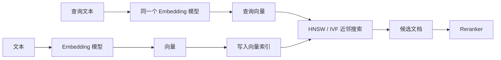

- HNSW 构建多层近邻图，用图遍历快速逼近最近向量。
- IVF 先把空间分区，查询时只搜索最相关的若干分区。
- PQ 将向量分段量化以减少内存，但会损失精度。

这些算法不会创造语义，只是在已有向量空间中加速搜索。Embedding 模型质量差时，换更复杂的向量数据库索引也无法从根本上补救。

## 一个最小的文本 Embedding 前向实现

下面代码展示 `Token Embedding -> Encoder -> Mean Pooling -> Projection -> L2 Normalize` 的数据流。它用于理解结构，不是训练完成的生产模型：

```python
import torch
from torch import nn
import torch.nn.functional as F


class TinyTextEmbedding(nn.Module):
    def __init__(
        self,
        vocab_size: int,
        hidden_size: int,
        output_size: int,
        num_layers: int = 2,
    ):
        super().__init__()
        self.token_embedding = nn.Embedding(vocab_size, hidden_size)
        encoder_layer = nn.TransformerEncoderLayer(
            d_model=hidden_size,
            nhead=4,
            batch_first=True,
        )
        self.encoder = nn.TransformerEncoder(encoder_layer, num_layers)
        self.projection = nn.Linear(hidden_size, output_size)

    def forward(self, input_ids, attention_mask):
        # [batch, sequence] -> [batch, sequence, hidden]
        hidden = self.token_embedding(input_ids)

        # PyTorch 的 padding mask 中 True 表示需要忽略
        hidden = self.encoder(
            hidden,
            src_key_padding_mask=~attention_mask.bool(),
        )

        # Masked mean pooling
        mask = attention_mask.unsqueeze(-1).to(hidden.dtype)
        pooled = (hidden * mask).sum(dim=1) / mask.sum(dim=1).clamp(min=1)

        # [batch, hidden] -> [batch, output_size]
        projected = self.projection(pooled)
        return F.normalize(projected, p=2, dim=-1)


model = TinyTextEmbedding(
    vocab_size=50_000,
    hidden_size=768,
    output_size=384,
)

input_ids = torch.randint(0, 50_000, (8, 128))
attention_mask = torch.ones((8, 128), dtype=torch.long)
embeddings = model(input_ids, attention_mask)

print(embeddings.shape)              # torch.Size([8, 384])
print(embeddings.norm(dim=-1))       # 每条向量的 L2 范数接近 1
print(embeddings @ embeddings.T)     # batch 内两两点积相似度
```

这个模型若没有经过对比学习训练，输出只是随机向量。网络结构定义了“怎么算”，训练数据和损失函数才决定“算出来是否有语义”。

## 张量形状：调试模型的第一语言

LLM 工程中，很多错误不是算法不懂，而是维度不匹配。常见形状如下：

```text
token_ids:       [batch, sequence]
token_hidden:    [batch, sequence, d_model]
Q / K / V:       [batch, heads, sequence, head_dim]
text_embedding:  [batch, embedding_dim]
similarity:      [query_batch, document_batch]
```

多头注意力通常满足：

```text
d_model = num_heads × head_dim
```

建议在实现中把每一层的形状断言写出来：

```python
assert input_ids.ndim == 2
assert hidden.shape[:2] == input_ids.shape
assert hidden.shape[-1] == hidden_size
```

## RAG 工程中的关键决策

### Query 和 Document 必须使用兼容编码

查询和文档必须进入同一个向量空间。有些模型要求使用不同前缀或不同编码分支，例如 `query:` 与 `passage:`。不能只看输出维度相同就认为向量兼容。

### Chunk 大小会改变向量语义

过大的文档块包含多个主题，一个向量难以准确表达；过小的块缺少上下文。Chunk 策略、Embedding 模型和召回评测必须一起调优。

### 向量维度影响成本

若有一千万条文档，每条 1536 维、使用 FP32：

```text
10,000,000 × 1,536 × 4 bytes ≈ 61.44 GB
```

这还不包括 HNSW 图、元数据、副本和数据库开销。降维、FP16、量化能节省空间，但必须评估召回率损失。

### 相似不等于正确

Embedding 相似度只表示模型认为两段内容在训练出的空间中接近，不保证：

- 文档事实正确；
- 文档足以回答问题；
- 时间和权限过滤正确；
- 排名第一就是最佳上下文。

生产 RAG 仍需 metadata filter、混合检索、rerank、引用验证和端到端答案评测。

## 常见误区

- **误区：Token ID 本身包含语义。** ID 只是矩阵行号。
- **误区：Embedding 是固定公式算出来的。** 查表是固定操作，表中参数由训练学习。
- **误区：初始 Token Embedding 就等于词义。** 上下文语义主要由多层 Transformer 进一步形成。
- **误区：任意隐藏层做平均都能得到高质量句向量。** Pooling 必须与训练目标匹配。
- **误区：余弦相似度越高，答案越正确。** 它只衡量向量空间接近程度。
- **误区：Embedding 与向量数据库是一套算法。** 前者生成向量，后者建立索引并检索。
- **误区：维度越高效果必然越好。** 更高维度增加存储和计算，效果取决于模型训练。

## 动手实验

1. 用 NumPy 实现矩阵索引，并用 one-hot 矩阵乘法验证结果相同。
2. 创建 `nn.Embedding(10, 3)`，让同一个 ID 重复出现，反向传播后检查哪些行的梯度非零。
3. 对同一批 token hidden states 分别做 mean、first-token、last-token pooling，比较向量差异。
4. 对归一化向量验证“点积等于余弦相似度”。
5. 选取 20 组相似与不相似文本进行检索，专门记录违反直觉的 hard negatives。
6. 改变 chunk 大小和 overlap，测量 Recall@K、MRR 与存储量，而不是只观察个别查询。

## 本章检查表

- 能写出 `E.shape = [vocab_size, hidden_size]` 并解释两个维度。
- 能手算一个 Token ID 如何取出 Embedding 矩阵的一行。
- 能解释为什么查表等价于 one-hot 乘矩阵，但实现不创建 one-hot。
- 能说明 Embedding 参数如何通过交叉熵、反向传播和优化器更新。
- 能区分 Token Embedding、上下文化表示和文本 Embedding。
- 能解释 mean pooling、CLS pooling 与 last-token pooling 的适用边界。
- 能写出余弦相似度和对比学习损失的含义。
- 能区分 Embedding 模型与 HNSW/IVF 等检索算法。
- 能根据向量数量、维度和数据类型估算基础存储成本。

### 检查表答案与原文依据

1. **`E.shape = [vocab_size, hidden_size]` 的两个维度分别是什么？**
   - **答案：** `vocab_size` 是词表中的 token 数量，每个 token 对应矩阵一行；`hidden_size` 是每个 token 向量的维度，也是该行包含的浮点参数数量。
   - **原文依据：** [Embedding 矩阵是什么](#embedding-矩阵是什么)。

2. **一个 Token ID 怎样取出 Embedding 矩阵的一行？**
   - **答案：** Token ID 就是行索引。若 `token_id = 2`，前向计算执行 `E[2]`，返回矩阵第 2 行、长度为 `hidden_size` 的向量；batch 和 sequence 只是同时执行多次相同的索引操作。
   - **原文依据：** [前向计算：按 Token ID 取矩阵的一行](#前向计算-按-token-id-取矩阵的一行)和[用 NumPy 手工实现](#用-numpy-手工实现)。

3. **为什么查表等价于 one-hot 乘矩阵，但实现不创建 one-hot？**
   - **答案：** one-hot 向量只有 Token ID 对应位置为 1，与 `E` 相乘时恰好保留对应行；但显式 one-hot 的长度等于整个词表，绝大多数元素都是 0，浪费内存和乘法，因此框架直接执行 gather/index lookup。
   - **原文依据：** [为什么也可以写成 one-hot 乘矩阵](#为什么也可以写成-one-hot-乘矩阵)与[Gather / Index Lookup 到底是什么](#gather-index-lookup-到底是什么)。

4. **Embedding 参数如何通过交叉熵、反向传播和优化器更新？**
   - **答案：** 模型先用 Embedding 和后续网络预测下一个 token，交叉熵衡量预测概率与正确 token 的差距；反向传播通过链式法则得到被读取 Embedding 行的梯度，SGD 或 AdamW 再沿降低损失的方向更新这些参数。重复出现的同一 ID 会累加各位置的梯度贡献。
   - **原文依据：** [Embedding 数值是怎样学习出来的](#embedding-数值是怎样学习出来的)、[交叉熵损失](#交叉熵损失)、[哪些行会收到梯度](#哪些行会收到梯度)和[一个可以手算的二维更新例子](#一个可以手算的二维更新例子)。

5. **Token Embedding、上下文化表示和文本 Embedding 有什么区别？**
   - **答案：** Token Embedding 是按 ID 查表得到的初始向量，同一 ID 初始值固定；上下文化表示是该向量经过 Transformer 后的逐位置 hidden state，会随上下文变化；文本 Embedding 则把整句或整段的 hidden states 经过 Pooling、Projection 和归一化压缩为用于检索或相似度计算的固定长度向量。
   - **原文依据：** [第一类：模型内部的 Token Embedding](#第一类-模型内部的-token-embedding)、[为什么语义相近的 token 会靠近](#为什么语义相近的-token-会靠近)和[第二类：用于检索的文本 Embedding](#第二类-用于检索的文本-embedding)。

6. **Mean、CLS 与 Last-token Pooling 分别适合什么情况？**
   - **答案：** Mean Pooling 汇总所有有效 token，适合模型按平均池化目标训练的场景；CLS Pooling 取专用首 token，前提是训练明确让该位置承载全局语义；Last-token Pooling 常用于因果模型，因为最后一个有效位置能够看到此前上下文。实际使用必须遵循模型训练时的 Pooling 约定。
   - **原文依据：** [Mean Pooling](#mean-pooling)、[CLS Pooling](#cls-pooling)和[Last-token Pooling](#last-token-pooling)。

7. **余弦相似度和对比学习损失分别表达什么？**
   - **答案：** 余弦相似度衡量两个向量方向的一致程度，忽略绝对长度；对比学习损失则在训练时提高正样本对的相似度、降低负样本对的相似度，从而塑造适合语义检索的向量空间。
   - **原文依据：** [余弦相似度](#余弦相似度)和[文本 Embedding 用什么训练算法](#文本-embedding-用什么训练算法)。

8. **Embedding 模型与 HNSW、IVF 等检索算法有什么区别？**
   - **答案：** Embedding 模型负责把文本映射为语义向量；HNSW、IVF、PQ 等算法负责在已有向量集合中近似寻找邻居。前者决定向量表达的语义质量，后者主要决定检索速度、内存占用和召回率之间的权衡。
   - **原文依据：** [Embedding 计算与向量检索不是同一个算法](#embedding-计算与向量检索不是同一个算法)。

9. **怎样估算向量的基础存储成本？**
   - **答案：** 基础向量数据量约为 `向量数量 × 向量维度 × 每个元素字节数`。例如 100 万个 1536 维 FP32 向量约占 `1,000,000 × 1536 × 4 ≈ 6.14 GB`；实际系统还要额外计算 HNSW/IVF 索引、元数据、副本和数据库管理开销。
   - **原文依据：** [向量维度影响成本](#向量维度影响成本)。

## 中文延伸学习资源

下面三组资源分别补充经典词向量、现代 LLM 体系和 Embedding 代码实现。阅读时要继续区分 Word2Vec 静态词向量、LLM 的 Token Embedding 和用于检索的文本 Embedding：

- [15分钟弄懂 Token 和 Embedding——详解 LLM 与 RAG 的数据处理机制](https://www.bilibili.com/video/BV1oNv8BPE2m/) — 作者：隔壁的程序员老王；平台：哔哩哔哩。视频从 Token 到向量化串联 LLM 与 RAG 的数据处理过程，适合作为本章的直观导读；观看后再结合本章的矩阵查表、反向传播、Pooling 和向量检索内容深入理解。
- [《动手学深度学习》词向量相关课程](https://www.bilibili.com/list/ml1790640075?bvid=BV18h411r7Z7&oid=204229678) — 课程作者：李沐等；平台：哔哩哔哩课程列表。重点学习 Word2Vec、Skip-gram、CBOW、负采样以及向量结构如何通过训练形成。Word2Vec 不是现代 LLM Token Embedding 的完整实现，但很适合理解“参数如何从数据中学习出来”。
- [LLM 前世今生](https://datawhalechina.github.io/base-llm/) — 来源：Datawhale 开源社区。教程从传统词向量、RNN 讲到 Attention、Transformer、BERT、GPT 与 Llama，适合建立静态词向量到上下文化表示的演进脉络。
- [Transformer 架构](https://infrasys-ai.github.io/aiinfra-docs/06AlgoData01Basic/README.html) — 来源：AIInfra 中文开源课程。其中“手把手实现核心机制 Embedding 词嵌入”可用于对照本章的矩阵查表、张量形状和训练过程。

> **版权与来源说明：** 本节仅提供外部学习资源的标题、作者/机构、发布平台、原始链接和简短导读，不转载其正文、图片、代码、字幕或视频。上述哔哩哔哩视频页面明确标注“未经作者授权，禁止转载”，本站只提供跳转链接，不缓存或内嵌视频。资源版权归各原作者及发布平台所有；引用或二次使用时，请遵守来源页面标注的许可协议与版权要求。外部页面内容和地址可能发生变化，请以原作者页面为准。
