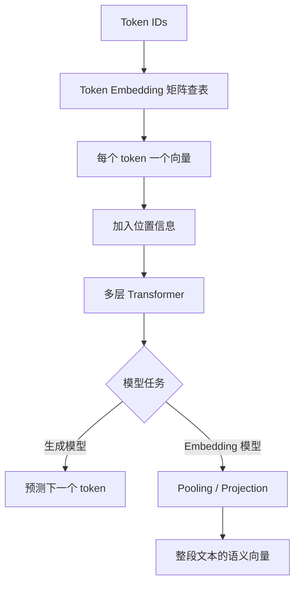
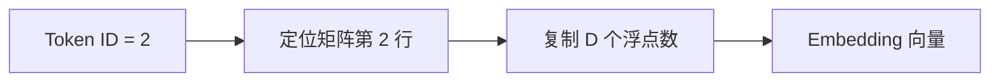
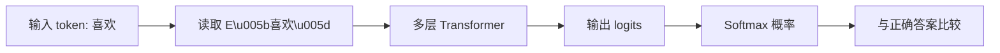
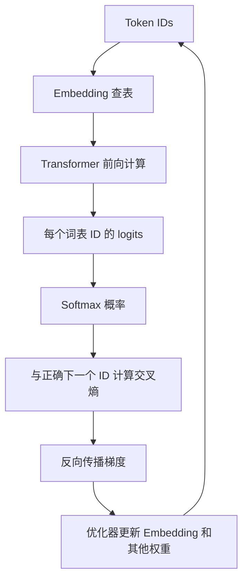
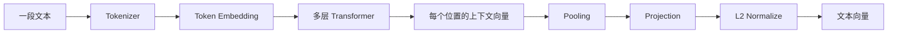
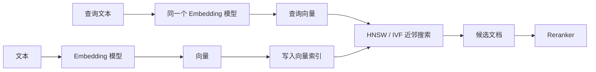

# Embedding 与张量：模型如何把编号变成语义空间

Tokenizer 输出的是整数 ID，例如 `[18327, 7864, 221]`。这些整数只是词表行号，数值大小没有语义：ID `100` 与 ID `101` 不一定相似，ID `100` 与 ID `50000` 也不一定无关。神经网络需要可进行加法、乘法和梯度更新的浮点数，因此首先要把每个离散 ID 转换成一个连续向量。这个过程就是 Embedding。

“Embedding 用了什么算法”需要拆成两个问题：

1. **前向计算用什么算法？** 对 Token Embedding 来说，本质是按 ID 从矩阵中取行，也就是 table lookup / gather。
2. **矩阵里的数值怎么得到？** 它们不是人工公式算出来的，而是在模型训练过程中，通过损失函数、反向传播和梯度下降学习得到。

此外，工程里常说的“文本 Embedding”是另一种产物：它使用完整神经网络把一句话压缩成一个语义向量。两者相关，但不能混为一谈。



## 第一类：模型内部的 Token Embedding

### Embedding 矩阵是什么

设：

- 词表大小为 `V`，即 `vocab_size`；
- 模型隐藏维度为 `D`，即 `d_model` 或 `hidden_size`；
- Embedding 矩阵记为 `E`。

那么：

```text
E.shape = [V, D]
```

`E` 有 `V` 行，每个 token 对应一行；每行包含 `D` 个浮点数。若词表大小是 100,000，隐藏维度是 4,096，则矩阵参数量为：

```text
100,000 × 4,096 = 409,600,000 个参数
```

仅以 BF16 保存权重时，每个参数约 2 字节，这张表大约需要：

```text
409,600,000 × 2 ≈ 819 MB
```

所以 Embedding 并不是没有成本的轻量字典，它可能占据模型相当一部分参数。

### 前向计算：按 Token ID 取矩阵的一行

假设只有 5 个 token，隐藏维度为 3：

```text
词表：
0 -> "猫"
1 -> "狗"
2 -> "苹果"
3 -> "汽车"
4 -> "<EOS>"
```

为了演示，假设当前 Embedding 矩阵已经是：

```text
E = [
  [ 0.8,  0.2, -0.1],  # ID 0: 猫
  [ 0.7,  0.3, -0.2],  # ID 1: 狗
  [-0.4,  0.9,  0.1],  # ID 2: 苹果
  [ 0.1, -0.5,  0.8],  # ID 3: 汽车
  [ 0.0,  0.0,  0.0],  # ID 4: EOS，仅为演示
]
```

输入 token ID 是：

```text
ids = [0, 2, 1]
```

Embedding 的输出就是取出第 0、2、1 行：

```text
X = E[ids]

X = [
  [ 0.8,  0.2, -0.1],  # 猫
  [-0.4,  0.9,  0.1],  # 苹果
  [ 0.7,  0.3, -0.2],  # 狗
]
```

输入形状从 `[sequence_length] = [3]` 变为 `[sequence_length, hidden_size] = [3, 3]`。在批处理场景中：

```text
input_ids: [batch_size, sequence_length]
output:    [batch_size, sequence_length, hidden_size]
```

例如 `[8, 512]` 的 ID 张量经过隐藏维度为 4096 的 Embedding 后，得到 `[8, 512, 4096]` 的浮点张量。

### 为什么也可以写成 one-hot 乘矩阵

从数学上，查表等价于 one-hot 向量乘 Embedding 矩阵。

ID `2` 在大小为 5 的词表中可以表示为：

```text
one_hot(2) = [0, 0, 1, 0, 0]
```

矩阵乘法：

```text
[0, 0, 1, 0, 0] × E = E[2] = [-0.4, 0.9, 0.1]
```

公式写作：

```text
x_t = one_hot(token_id_t) · E
```

但工程实现不会真的构造 one-hot。假设词表有 100,000 个 token，一个 ID 的 one-hot 里有 99,999 个零，既浪费内存又浪费乘法。框架直接执行 `gather` 或索引操作，结果完全相同，复杂度却只与取出的向量大小有关。



### 用 NumPy 手工实现

```python
import numpy as np

embedding_table = np.array([
    [ 0.8,  0.2, -0.1],
    [ 0.7,  0.3, -0.2],
    [-0.4,  0.9,  0.1],
    [ 0.1, -0.5,  0.8],
    [ 0.0,  0.0,  0.0],
], dtype=np.float32)

token_ids = np.array([0, 2, 1], dtype=np.int64)
hidden = embedding_table[token_ids]

print(hidden.shape)  # (3, 3)
print(hidden)
```

批量输入同样只是多维索引：

```python
batch_ids = np.array([
    [0, 2, 1],
    [1, 3, 4],
])

hidden = embedding_table[batch_ids]
print(hidden.shape)  # (2, 3, 3)
```

### 用 PyTorch 的标准实现

```python
import torch
from torch import nn

vocab_size = 100_000
hidden_size = 4_096

token_embedding = nn.Embedding(
    num_embeddings=vocab_size,
    embedding_dim=hidden_size,
)

input_ids = torch.tensor([
    [10, 25, 83, 2],
    [91, 17,  2, 0],
], dtype=torch.long)

hidden = token_embedding(input_ids)

print(input_ids.shape)  # torch.Size([2, 4])
print(hidden.shape)     # torch.Size([2, 4, 4096])
```

`nn.Embedding` 的核心行为可以用下面的简化代码理解：

```python
class SimpleEmbedding(nn.Module):
    def __init__(self, vocab_size: int, hidden_size: int):
        super().__init__()
        self.weight = nn.Parameter(
            torch.randn(vocab_size, hidden_size) * 0.02
        )

    def forward(self, input_ids: torch.Tensor) -> torch.Tensor:
        return self.weight[input_ids]
```

真实框架会处理设备、稀疏梯度、padding、最大范数等细节，但最核心的前向算法就是矩阵索引。

## Embedding 数值是怎样学习出来的

初始 Embedding 通常是小随机数。随机初始化时，“猫”和“狗”并不天然接近。它们后来具有语义结构，是因为整个模型在训练任务中反复更新参数。

先给出最重要的结论：**Embedding 矩阵中的每个小数都是模型参数，地位与神经网络中其他权重完全相同。** 它没有一套能把“猫”直接换算成 `[0.21, -0.47, ...]` 的人工公式，也没有人为给每个维度指定“动物性”“大小”“褒贬”等含义。训练程序只规定：

1. 输入哪些 token；
2. 希望模型输出什么答案；
3. 用什么损失函数衡量输出与答案的差距；
4. 如何根据梯度调整参数，使下一次差距更小。

Embedding 中最终出现什么数值，是数十亿乃至数万亿个训练 token 对这些参数反复施加微小更新后的结果。

### 第 1 步：先随机初始化一张表

假设词表只有 4 个 token，隐藏维度为 3，则模型创建一个形状为 `[4, 3]` 的可训练矩阵：

```text
             dim_0    dim_1    dim_2
E[我]       +0.012   -0.018   +0.004
E[喜欢]     -0.007   +0.021   -0.011
E[苹果]     +0.016   +0.003   -0.019
E[汽车]     -0.014   +0.009   +0.006
```

这些初始值一般从均值接近 0、方差较小的随机分布中采样，例如：

```python
E = torch.randn(vocab_size, hidden_size) * 0.02
```

乘以 `0.02` 是为了让初始数值保持较小，避免网络一开始就出现过大的激活值。这里的 `0.02` 是初始化尺度，不是语义计算公式。更换随机种子会得到完全不同的初始矩阵；只要训练设置合理，它们都可以逐渐学出有效表示。

矩阵的列也不具有预先定义的业务含义。`dim_0` 并不天然代表“是否是动物”，单独观察某一维通常无法解释语义。信息往往分布在许多维度及其组合方向上，而且向量空间整体旋转后仍可表达近似相同的关系。

### 第 2 步：查表，让参数参与一次预测

若当前输入包含 token `喜欢`，前向计算会读取 `E[喜欢]` 这一行。这个向量再经过多层 Attention、MLP、归一化和输出投影，最终得到对下一个 token 的预测。



因此，Embedding 并不是独立训练的孤立字典。它位于一个端到端计算图的最前端：只要最终预测依赖这行向量，损失就能沿计算图反向追踪到这行里的每个数值。

以自回归语言模型为例，训练目标是根据前文预测下一个 token：

```text
输入：  我 喜欢 吃
目标：  喜欢 吃 苹果
```

流程如下：



### 交叉熵损失

假设模型对下一个 token 的预测概率是：

```text
P(苹果) = 0.60
P(米饭) = 0.25
P(汽车) = 0.05
其他     = 0.10
```

正确答案是“苹果”，单个位置的负对数似然损失为：

```text
L = -log P(苹果) = -log(0.60) ≈ 0.511
```

如果模型只给正确答案 `0.01` 的概率：

```text
L = -log(0.01) ≈ 4.605
```

错误越严重，损失越大。反向传播用链式法则计算 `∂L/∂E`，优化器再更新矩阵。

### 哪些行会收到梯度

一次前向只读取输入中出现过的行，因此 Embedding 梯度具有稀疏性。若 ID `2` 在一个 batch 中出现三次，它对应行收到的梯度是三个位置贡献之和：

```text
∂L/∂E[2] = g_position_1 + g_position_2 + g_position_3
```

简化的梯度下降更新为：

```text
E[2] = E[2] - learning_rate × ∂L/∂E[2]
```

实际大模型通常使用 AdamW 等优化器。AdamW 会维护梯度的一阶矩和二阶矩，不是简单地直接减梯度，但目标相同：让下一次前向产生更低的训练损失。

### 梯度究竟怎样传回某个矩阵元素

假设某个位置读取了 Embedding 行 `e = E[token_id]`，后续网络计算出 logits `z`，损失为 `L`。从依赖关系看：

```text
E[token_id] -> e -> Transformer -> z -> softmax -> L
```

反向传播使用链式法则，从右向左计算：

```text
∂L/∂E[token_id]
  = ∂L/∂z
  × ∂z/∂TransformerOutput
  × ...
  × ∂FirstLayerOutput/∂e
  × ∂e/∂E[token_id]
```

可以把它理解为逐层回答三个问题：

- 最终预测偏离正确答案多少？
- 每一层的输出对这个偏差贡献了多少？
- 输入 Embedding 的每个分量如果略微变化，损失会上升还是下降？

某个元素的梯度为正，表示在其他条件暂时不变时，增大它会使损失增大，因此梯度下降会把它调小；梯度为负则相反。梯度绝对值越大，表示当前样本的损失对该元素越敏感。

::: tip 梯度不是“正确答案向量”
训练数据只提供目标 token，并不提供这个 token 应该对应什么 Embedding 向量。梯度只是当前模型、当前样本和当前参数状态下的局部调整方向。大量不同样本反复给出调整方向，矩阵才逐渐形成稳定结构。
:::

### 一个可以手算的二维更新例子

为了只观察 Embedding 的更新，先把复杂 Transformer 临时简化成一个线性预测层。设输入 token 的二维 Embedding 为：

```text
e = E[喜欢] = [0.20, -0.10]
```

预测层输出两个候选 token 的 logits：

```text
z = e @ W

W = [[ 1.0, -1.0],
     [ 0.5,  0.5]]
```

矩阵乘法得到：

```text
z = [0.20, -0.10] @ W
  = [0.15, -0.25]
```

经过 Softmax：

```text
p ≈ [0.599, 0.401]
```

假设正确答案是第 2 个候选，其 one-hot 标签为 `y = [0, 1]`。Softmax 与交叉熵组合后，对 logits 的梯度有一个非常实用的结果：

```text
∂L/∂z = p - y
       = [0.599, -0.599]
```

再穿过线性层传回输入向量：

```text
∂L/∂e = (p - y) @ Wᵀ
       ≈ [1.198, 0.000]
```

若为了演示使用普通 SGD，学习率 `η = 0.1`，则更新为：

```text
e_new = e - η × ∂L/∂e
      = [0.20, -0.10] - 0.1 × [1.198, 0.000]
      ≈ [0.0802, -0.10]
```

再次用更新后的向量计算：

```text
z_new ≈ [0.0302, -0.1302]
p_new ≈ [0.540, 0.460]
```

正确候选的概率从约 `0.401` 上升到约 `0.460`，对应交叉熵随之下降。这就是“矩阵里的数值通过训练得到”的最小可计算版本：**预测产生误差，误差变成梯度，梯度修改被读取的 Embedding 行，修改后的参数让相似训练场景中的预测更准确。**

真实 LLM 只是把例子中的线性层替换为许多 Transformer 层，把二维向量扩展到数千维，把一次样本扩展到大规模 batch，并使用 AdamW、学习率调度、梯度裁剪和分布式训练等工程机制；基本因果链没有变化。

### 为什么不是每次只更新“正确答案”那一行

在自回归语言模型中，输入侧 Embedding 行因为参与了上下文计算而收到梯度。例如用“我 喜欢 吃”预测“苹果”时，`我`、`喜欢`、`吃` 对应的输入行都可能更新。目标 token `苹果` 是否直接更新其 Embedding 行，则取决于模型是否采用输入输出权重共享（Weight Tying）：

- 不共享时，目标侧主要更新独立的输出投影矩阵；
- 共享时，输出投影复用 Embedding 矩阵，`苹果` 对应行也会作为输出分类权重收到梯度；
- 无论是否共享，模型的 Attention、MLP 等其他参数也会同时更新。

所以不能把训练理解为“看到一次苹果，就给苹果向量加一个固定值”。一次训练步骤是整个网络共同分摊预测误差，优化器根据各参数的梯度分别更新。

### 为什么语义相近的 token 会靠近

模型没有被直接告知“猫和狗相似”。它反复看到它们出现在相似上下文中：

```text
我养了一只猫
我养了一只狗
给猫喂食
给狗喂食
```

为了在这些上下文中完成相似预测，训练会推动相关表示形成可复用结构。但需要注意：

- 语义不只存储在初始 Embedding 表中，也分布在 Transformer 各层参数里。
- Token Embedding 的余弦相似度不一定等同于最终上下文语义。
- 同一个 token 的初始向量固定，但经过 Transformer 后会因上下文不同得到不同表示。

例如“苹果很好吃”和“苹果发布了新设备”中的“苹果”查到同一个初始向量，但经过 Attention 后形成的上下文化向量不同。

## 位置信息如何加入

仅有 Token Embedding 时，模型知道有哪些 token，却不知道顺序。`我打你` 和 `你打我` 包含相同 token，但含义不同。

经典 Transformer 会把 Token Embedding 与 Position Embedding 相加：

```text
h_t^(0) = token_embedding[token_id_t] + position_embedding[t]
```

其中 `t` 是序列位置。两者维度必须相同，才能逐元素相加。

现代生成模型也常使用 RoPE。RoPE 通常不直接加在输入 Embedding 上，而是在 Attention 内部旋转 Q/K 向量，使点积自然携带相对位置信息。无论采用哪种方案，Token Embedding 与位置信息是两个不同概念。

有些架构还会加入：

- Segment/Token Type Embedding：区分句子 A 与句子 B；
- Modality Embedding：区分文字、图像或音频；
- Role Embedding：在特定架构中区分消息角色。

## 输出层与 Weight Tying

生成模型最后要把隐藏向量重新映射为整个词表的分数。若最后一个位置的隐藏向量是 `h`，输出矩阵是 `W_out`：

```text
logits = h · W_out^T
logits.shape = [vocab_size]
```

经过 Softmax 后得到下一个 token 的概率。

很多模型采用 Weight Tying：输入 Embedding 矩阵和输出投影矩阵共享权重，即：

```text
W_out = E
```

这样既减少参数，又让“读取 token 表示”和“预测 token”共享同一空间。但是否共享取决于具体模型架构，不能一概而论。

## 第二类：用于检索的文本 Embedding

RAG 中使用的 Embedding 通常不是简单取某个 token 的矩阵行，而是把整段文本经过完整 Encoder/Transformer 后压缩成一个固定长度向量。



假设一段文本有 `T` 个 token，Transformer 输出：

```text
H.shape = [T, D]
```

要得到整段文本的单一向量，需要 Pooling。

### Mean Pooling

对所有有效 token 向量求平均：

```text
sentence = (h_1 + h_2 + ... + h_T) / T
```

有 padding 时必须使用 mask：

```python
def mean_pool(last_hidden_state, attention_mask):
    mask = attention_mask.unsqueeze(-1).to(last_hidden_state.dtype)
    summed = (last_hidden_state * mask).sum(dim=1)
    count = mask.sum(dim=1).clamp(min=1e-9)
    return summed / count
```

如果把 PAD 也平均进去，短文本会被大量零向量或 padding 表示污染。

### CLS Pooling

某些 Encoder 在序列开头加入 `[CLS]`，训练时让该位置聚合整句信息，最终直接取：

```text
sentence = H[CLS_position]
```

只有模型在训练时为 `[CLS]` 设计了聚合目标，这种取法才可靠。不能随便对任意生成模型取第一个 token 当句向量。

### Last-token Pooling

单向因果模型中，最后一个有效 token 能看到之前所有 token，因此有些 Embedding 模型取最后一个位置：

```text
sentence = H[last_non_padding_position]
```

仍然必须遵循模型训练时定义的 pooling 方式。

### Projection 与归一化

模型可能把隐藏维度 `D` 通过线性层投影成目标维度 `d`：

```text
z = W · sentence + b
```

然后执行 L2 归一化：

```text
embedding = z / ||z||₂
```

归一化后向量长度为 1，两个向量的点积就等于余弦相似度，有利于向量数据库统一检索规则。

## 文本 Embedding 用什么训练算法

常见方法是对比学习（Contrastive Learning）。训练数据包含语义相关的正样本对和不相关的负样本。

例如：

```text
Query:    如何重置数据库密码？
Positive: 数据库密码重置操作指南
Negative: 申请办公用品的流程
```

模型分别生成向量 `q`、`d+` 和 `d-`，训练目标是让：

```text
sim(q, d+) > sim(q, d-)
```

一种常见损失是 InfoNCE / Softmax Contrastive Loss：

```text
L_i = -log(
  exp(sim(q_i, d_i+) / τ)
  /
  Σ_j exp(sim(q_i, d_j) / τ)
)
```

其中：

- `sim` 通常是余弦相似度或点积；
- `d_i+` 是正确文档；
- batch 中其他文档可作为 in-batch negatives；
- `τ` 是 temperature，控制概率分布尖锐程度。

直觉上，分子奖励正确配对，分母包含所有候选文档。若负样本与 query 也很接近，损失就会上升，反向传播会把它们推远。

还可能使用 Triplet Loss：

```text
L = max(0, margin - sim(anchor, positive) + sim(anchor, negative))
```

实际高质量 Embedding 模型会混合人工标注、点击数据、弱监督数据、难负样本挖掘和多任务训练，而不是只靠一个简单公式。

## 相似度是怎样计算的

### 余弦相似度

```text
cos(a, b) = (a · b) / (||a||₂ × ||b||₂)
```

假设：

```text
a = [1, 2]
b = [2, 1]
```

则：

```text
a · b = 1×2 + 2×1 = 4
||a|| = sqrt(1² + 2²) = sqrt(5)
||b|| = sqrt(2² + 1²) = sqrt(5)
cos(a,b) = 4/5 = 0.8
```

### 点积

```text
dot(a, b) = Σ a_i b_i
```

如果所有向量已做 L2 归一化，点积等于余弦相似度。点积通常比每次重新计算模长更方便。

### 欧氏距离

```text
distance(a, b) = sqrt(Σ(a_i - b_i)²)
```

单位向量上，欧氏距离与余弦相似度具有单调关系，但向量未归一化时两者关注点不同。向量库使用什么距离，必须与模型训练方式和是否归一化匹配。

```python
import numpy as np

def l2_normalize(x):
    return x / np.linalg.norm(x, axis=-1, keepdims=True)

a = l2_normalize(np.array([1.0, 2.0]))
b = l2_normalize(np.array([2.0, 1.0]))

cosine = a @ b
euclidean = np.linalg.norm(a - b)

print(cosine)   # 0.8
print(euclidean)
```

## Embedding 计算与向量检索不是同一个算法

Embedding 模型负责把文本计算成向量；向量数据库负责从海量向量中找近邻。后者常用 HNSW、IVF、PQ 等 Approximate Nearest Neighbor 算法。



- HNSW 构建多层近邻图，用图遍历快速逼近最近向量。
- IVF 先把空间分区，查询时只搜索最相关的若干分区。
- PQ 将向量分段量化以减少内存，但会损失精度。

这些算法不会创造语义，只是在已有向量空间中加速搜索。Embedding 模型质量差时，换更复杂的向量数据库索引也无法从根本上补救。

## 一个最小的文本 Embedding 前向实现

下面代码展示 `Token Embedding -> Encoder -> Mean Pooling -> Projection -> L2 Normalize` 的数据流。它用于理解结构，不是训练完成的生产模型：

```python
import torch
from torch import nn
import torch.nn.functional as F


class TinyTextEmbedding(nn.Module):
    def __init__(
        self,
        vocab_size: int,
        hidden_size: int,
        output_size: int,
        num_layers: int = 2,
    ):
        super().__init__()
        self.token_embedding = nn.Embedding(vocab_size, hidden_size)
        encoder_layer = nn.TransformerEncoderLayer(
            d_model=hidden_size,
            nhead=4,
            batch_first=True,
        )
        self.encoder = nn.TransformerEncoder(encoder_layer, num_layers)
        self.projection = nn.Linear(hidden_size, output_size)

    def forward(self, input_ids, attention_mask):
        # [batch, sequence] -> [batch, sequence, hidden]
        hidden = self.token_embedding(input_ids)

        # PyTorch 的 padding mask 中 True 表示需要忽略
        hidden = self.encoder(
            hidden,
            src_key_padding_mask=~attention_mask.bool(),
        )

        # Masked mean pooling
        mask = attention_mask.unsqueeze(-1).to(hidden.dtype)
        pooled = (hidden * mask).sum(dim=1) / mask.sum(dim=1).clamp(min=1)

        # [batch, hidden] -> [batch, output_size]
        projected = self.projection(pooled)
        return F.normalize(projected, p=2, dim=-1)


model = TinyTextEmbedding(
    vocab_size=50_000,
    hidden_size=768,
    output_size=384,
)

input_ids = torch.randint(0, 50_000, (8, 128))
attention_mask = torch.ones((8, 128), dtype=torch.long)
embeddings = model(input_ids, attention_mask)

print(embeddings.shape)              # torch.Size([8, 384])
print(embeddings.norm(dim=-1))       # 每条向量的 L2 范数接近 1
print(embeddings @ embeddings.T)     # batch 内两两点积相似度
```

这个模型若没有经过对比学习训练，输出只是随机向量。网络结构定义了“怎么算”，训练数据和损失函数才决定“算出来是否有语义”。

## 张量形状：调试模型的第一语言

LLM 工程中，很多错误不是算法不懂，而是维度不匹配。常见形状如下：

```text
token_ids:       [batch, sequence]
token_hidden:    [batch, sequence, d_model]
Q / K / V:       [batch, heads, sequence, head_dim]
text_embedding:  [batch, embedding_dim]
similarity:      [query_batch, document_batch]
```

多头注意力通常满足：

```text
d_model = num_heads × head_dim
```

建议在实现中把每一层的形状断言写出来：

```python
assert input_ids.ndim == 2
assert hidden.shape[:2] == input_ids.shape
assert hidden.shape[-1] == hidden_size
```

## RAG 工程中的关键决策

### Query 和 Document 必须使用兼容编码

查询和文档必须进入同一个向量空间。有些模型要求使用不同前缀或不同编码分支，例如 `query:` 与 `passage:`。不能只看输出维度相同就认为向量兼容。

### Chunk 大小会改变向量语义

过大的文档块包含多个主题，一个向量难以准确表达；过小的块缺少上下文。Chunk 策略、Embedding 模型和召回评测必须一起调优。

### 向量维度影响成本

若有一千万条文档，每条 1536 维、使用 FP32：

```text
10,000,000 × 1,536 × 4 bytes ≈ 61.44 GB
```

这还不包括 HNSW 图、元数据、副本和数据库开销。降维、FP16、量化能节省空间，但必须评估召回率损失。

### 相似不等于正确

Embedding 相似度只表示模型认为两段内容在训练出的空间中接近，不保证：

- 文档事实正确；
- 文档足以回答问题；
- 时间和权限过滤正确；
- 排名第一就是最佳上下文。

生产 RAG 仍需 metadata filter、混合检索、rerank、引用验证和端到端答案评测。

## 常见误区

- **误区：Token ID 本身包含语义。** ID 只是矩阵行号。
- **误区：Embedding 是固定公式算出来的。** 查表是固定操作，表中参数由训练学习。
- **误区：初始 Token Embedding 就等于词义。** 上下文语义主要由多层 Transformer 进一步形成。
- **误区：任意隐藏层做平均都能得到高质量句向量。** Pooling 必须与训练目标匹配。
- **误区：余弦相似度越高，答案越正确。** 它只衡量向量空间接近程度。
- **误区：Embedding 与向量数据库是一套算法。** 前者生成向量，后者建立索引并检索。
- **误区：维度越高效果必然越好。** 更高维度增加存储和计算，效果取决于模型训练。

## 动手实验

1. 用 NumPy 实现矩阵索引，并用 one-hot 矩阵乘法验证结果相同。
2. 创建 `nn.Embedding(10, 3)`，让同一个 ID 重复出现，反向传播后检查哪些行的梯度非零。
3. 对同一批 token hidden states 分别做 mean、first-token、last-token pooling，比较向量差异。
4. 对归一化向量验证“点积等于余弦相似度”。
5. 选取 20 组相似与不相似文本进行检索，专门记录违反直觉的 hard negatives。
6. 改变 chunk 大小和 overlap，测量 Recall@K、MRR 与存储量，而不是只观察个别查询。

## 本章检查表

- 能写出 `E.shape = [vocab_size, hidden_size]` 并解释两个维度。
- 能手算一个 Token ID 如何取出 Embedding 矩阵的一行。
- 能解释为什么查表等价于 one-hot 乘矩阵，但实现不创建 one-hot。
- 能说明 Embedding 参数如何通过交叉熵、反向传播和优化器更新。
- 能区分 Token Embedding、上下文化表示和文本 Embedding。
- 能解释 mean pooling、CLS pooling 与 last-token pooling 的适用边界。
- 能写出余弦相似度和对比学习损失的含义。
- 能区分 Embedding 模型与 HNSW/IVF 等检索算法。
- 能根据向量数量、维度和数据类型估算基础存储成本。

### 检查表答案与原文依据

1. **`E.shape = [vocab_size, hidden_size]` 的两个维度分别是什么？**
   - **答案：** `vocab_size` 是词表中的 token 数量，每个 token 对应矩阵一行；`hidden_size` 是每个 token 向量的维度，也是该行包含的浮点参数数量。
   - **原文依据：** [Embedding 矩阵是什么](#embedding-矩阵是什么)。

2. **一个 Token ID 怎样取出 Embedding 矩阵的一行？**
   - **答案：** Token ID 就是行索引。若 `token_id = 2`，前向计算执行 `E[2]`，返回矩阵第 2 行、长度为 `hidden_size` 的向量；batch 和 sequence 只是同时执行多次相同的索引操作。
   - **原文依据：** [前向计算：按 Token ID 取矩阵的一行](#前向计算-按-token-id-取矩阵的一行)和[用 NumPy 手工实现](#用-numpy-手工实现)。

3. **为什么查表等价于 one-hot 乘矩阵，但实现不创建 one-hot？**
   - **答案：** one-hot 向量只有 Token ID 对应位置为 1，与 `E` 相乘时恰好保留对应行；但显式 one-hot 的长度等于整个词表，绝大多数元素都是 0，浪费内存和乘法，因此框架直接执行 gather/index lookup。
   - **原文依据：** [为什么也可以写成 one-hot 乘矩阵](#为什么也可以写成-one-hot-乘矩阵)。

4. **Embedding 参数如何通过交叉熵、反向传播和优化器更新？**
   - **答案：** 模型先用 Embedding 和后续网络预测下一个 token，交叉熵衡量预测概率与正确 token 的差距；反向传播通过链式法则得到被读取 Embedding 行的梯度，SGD 或 AdamW 再沿降低损失的方向更新这些参数。重复出现的同一 ID 会累加各位置的梯度贡献。
   - **原文依据：** [Embedding 数值是怎样学习出来的](#embedding-数值是怎样学习出来的)、[交叉熵损失](#交叉熵损失)、[哪些行会收到梯度](#哪些行会收到梯度)和[一个可以手算的二维更新例子](#一个可以手算的二维更新例子)。

5. **Token Embedding、上下文化表示和文本 Embedding 有什么区别？**
   - **答案：** Token Embedding 是按 ID 查表得到的初始向量，同一 ID 初始值固定；上下文化表示是该向量经过 Transformer 后的逐位置 hidden state，会随上下文变化；文本 Embedding 则把整句或整段的 hidden states 经过 Pooling、Projection 和归一化压缩为用于检索或相似度计算的固定长度向量。
   - **原文依据：** [第一类：模型内部的 Token Embedding](#第一类-模型内部的-token-embedding)、[为什么语义相近的 token 会靠近](#为什么语义相近的-token-会靠近)和[第二类：用于检索的文本 Embedding](#第二类-用于检索的文本-embedding)。

6. **Mean、CLS 与 Last-token Pooling 分别适合什么情况？**
   - **答案：** Mean Pooling 汇总所有有效 token，适合模型按平均池化目标训练的场景；CLS Pooling 取专用首 token，前提是训练明确让该位置承载全局语义；Last-token Pooling 常用于因果模型，因为最后一个有效位置能够看到此前上下文。实际使用必须遵循模型训练时的 Pooling 约定。
   - **原文依据：** [Mean Pooling](#mean-pooling)、[CLS Pooling](#cls-pooling)和[Last-token Pooling](#last-token-pooling)。

7. **余弦相似度和对比学习损失分别表达什么？**
   - **答案：** 余弦相似度衡量两个向量方向的一致程度，忽略绝对长度；对比学习损失则在训练时提高正样本对的相似度、降低负样本对的相似度，从而塑造适合语义检索的向量空间。
   - **原文依据：** [余弦相似度](#余弦相似度)和[文本 Embedding 用什么训练算法](#文本-embedding-用什么训练算法)。

8. **Embedding 模型与 HNSW、IVF 等检索算法有什么区别？**
   - **答案：** Embedding 模型负责把文本映射为语义向量；HNSW、IVF、PQ 等算法负责在已有向量集合中近似寻找邻居。前者决定向量表达的语义质量，后者主要决定检索速度、内存占用和召回率之间的权衡。
   - **原文依据：** [Embedding 计算与向量检索不是同一个算法](#embedding-计算与向量检索不是同一个算法)。

9. **怎样估算向量的基础存储成本？**
   - **答案：** 基础向量数据量约为 `向量数量 × 向量维度 × 每个元素字节数`。例如 100 万个 1536 维 FP32 向量约占 `1,000,000 × 1536 × 4 ≈ 6.14 GB`；实际系统还要额外计算 HNSW/IVF 索引、元数据、副本和数据库管理开销。
   - **原文依据：** [向量维度影响成本](#向量维度影响成本)。

## 中文延伸学习资源

下面三组资源分别补充经典词向量、现代 LLM 体系和 Embedding 代码实现。阅读时要继续区分 Word2Vec 静态词向量、LLM 的 Token Embedding 和用于检索的文本 Embedding：

- [15分钟弄懂 Token 和 Embedding——详解 LLM 与 RAG 的数据处理机制](https://www.bilibili.com/video/BV1oNv8BPE2m/) — 作者：隔壁的程序员老王；平台：哔哩哔哩。视频从 Token 到向量化串联 LLM 与 RAG 的数据处理过程，适合作为本章的直观导读；观看后再结合本章的矩阵查表、反向传播、Pooling 和向量检索内容深入理解。
- [《动手学深度学习》词向量相关课程](https://www.bilibili.com/list/ml1790640075?bvid=BV18h411r7Z7&oid=204229678) — 课程作者：李沐等；平台：哔哩哔哩课程列表。重点学习 Word2Vec、Skip-gram、CBOW、负采样以及向量结构如何通过训练形成。Word2Vec 不是现代 LLM Token Embedding 的完整实现，但很适合理解“参数如何从数据中学习出来”。
- [LLM 前世今生](https://datawhalechina.github.io/base-llm/) — 来源：Datawhale 开源社区。教程从传统词向量、RNN 讲到 Attention、Transformer、BERT、GPT 与 Llama，适合建立静态词向量到上下文化表示的演进脉络。
- [Transformer 架构](https://infrasys-ai.github.io/aiinfra-docs/06AlgoData01Basic/README.html) — 来源：AIInfra 中文开源课程。其中“手把手实现核心机制 Embedding 词嵌入”可用于对照本章的矩阵查表、张量形状和训练过程。

> **版权与来源说明：** 本节仅提供外部学习资源的标题、作者/机构、发布平台、原始链接和简短导读，不转载其正文、图片、代码、字幕或视频。上述哔哩哔哩视频页面明确标注“未经作者授权，禁止转载”，本站只提供跳转链接，不缓存或内嵌视频。资源版权归各原作者及发布平台所有；引用或二次使用时，请遵守来源页面标注的许可协议与版权要求。外部页面内容和地址可能发生变化，请以原作者页面为准。
