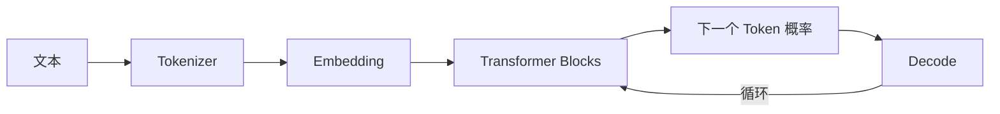

# LLM 基础

目标是建立足够准确的心智模型：文本如何变成 token，token 如何变成向量，注意力如何混合上下文，模型如何逐 token 生成，以及推理系统为何需要 KV Cache。

## 学习产出

- 手写一个简化 tokenizer 与 attention。
- 用 PyTorch 跟踪每层 tensor shape。
- 测量 prefill、decode 与 KV Cache 对延迟的影响。
