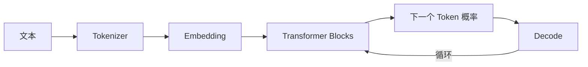

# LLM 基础

目标是建立足够准确的心智模型：文本如何变成 token，token 如何变成向量，注意力如何混合上下文，模型如何逐 token 生成，以及推理系统为何需要 KV Cache。

## 学习产出

- 手写一个简化 tokenizer 与 attention。
- 用 PyTorch 跟踪每层 tensor shape。
- 测量 prefill、decode 与 KV Cache 对延迟的影响。

## 模块级推荐阅读

- [预训练语言模型的前世今生——从 Word Embedding 到 BERT](https://www.cnblogs.com/nickchen121/p/16470569.html) — 发布账号：B站-水论文的程序猿；文内署名/原始出处：二十三岁的有德；平台：博客园。长文从统计语言模型和神经网络语言模型出发，依次串联 Word Embedding、Word2Vec、RNN/LSTM、ELMo、Attention、Position Embedding、Transformer、GPT 与 BERT。它覆盖本模块多个章节，适合先通读以建立技术演进脉络，也适合学完各章后回看，检查这些组件为什么会逐步出现。

> **版权与来源说明：** 本节仅提供原始文章链接、来源署名和本站撰写的简短导读，不转载文章正文、公式、图片、代码或配套视频。来源页面明确要求转载时标明出处；本文版权归原作者及发布平台所有。如需摘录、转载或使用其中图片，请进入原文确认作者的署名与授权要求。
