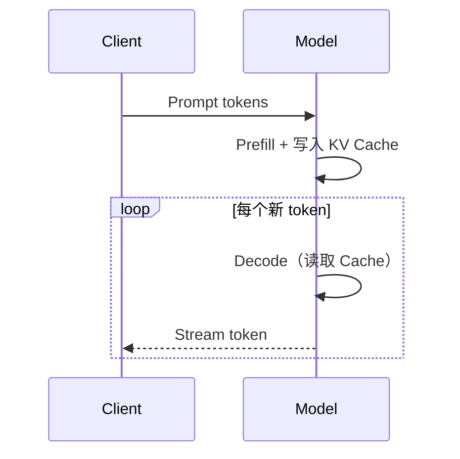

# 推理、Prefill 与 KV Cache

推理分成两个阶段：Prefill 并行处理已有上下文，Decode 每次生成一个新 token。

## KV Cache

过去 token 的 K/V 不会随新 token 改变，因此可缓存复用。代价是显存随并发、上下文长度、层数和 head 维度增长。

## 关键指标

- **TTFT**：首 token 延迟，受排队和 prefill 影响。
- **TPOT**：每个输出 token 的时间，体现 decode 速度。
- **吞吐**：单位时间处理的 token 或请求。

连续批处理、PagedAttention、Prefix Cache 和推测解码分别针对调度、显存碎片、公共前缀与串行 decode 瓶颈。

## 中文延伸学习资源

- [KV Cache 原理：LLM 推理的底层机制](https://cuiliang.ai/posts/prompt-caching-kv-cache-fundamentals/) — 作者：崔亮（Cui Liang）；平台：个人 AI Agent 工程博客。文章从 Token、Embedding、Attention 讲到 Prefill/Decode、TTFT/TPOT、显存估算及 Compute Bound/Memory Bound，并专门区分 LLM KV Cache 与 Redis/Memcached。
- [KV Cache 原理讲解](https://www.bilibili.com/video/BV17CPkeEEzk/) — 作者：LLM 张老师；平台：哔哩哔哩。该系列还包含手写 `Model.py`、`Train.py`、`Inference.py` 和 Flash Attention，适合从推理代码理解缓存生命周期。
- [为什么能做 KV Cache？——从基础推导看其推理优化](https://www.bilibili.com/video/BV19LwReMEVH/) — 作者：我是小小升；平台：哔哩哔哩。重点解释历史 token 的 K/V 为什么能够复用，以及 KV Cache 如何减少自回归生成中的重复计算。

> **版权与来源说明：** 本节仅提供外部文章和视频的来源信息、原始链接及简短导读，不下载、内嵌或转载正文、配图、字幕和视频文件。资源版权归原作者及哔哩哔哩等发布平台所有；如需引用内容，请在原页面确认转载、引用与署名规则。
