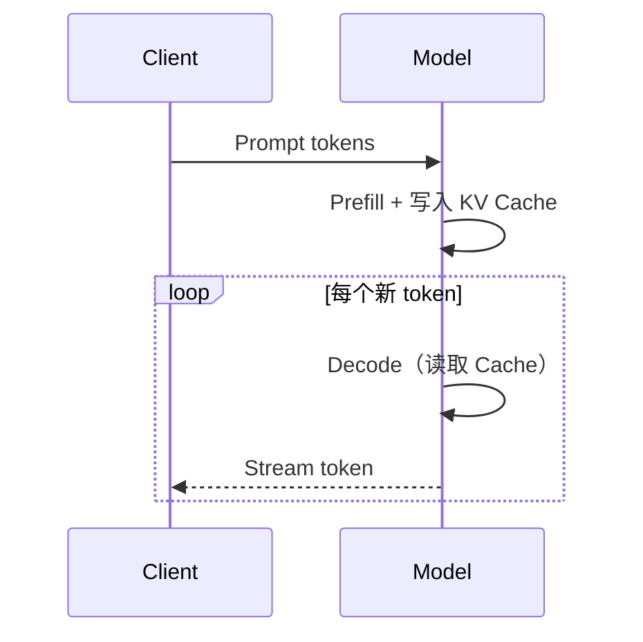

# 推理、Prefill 与 KV Cache

推理分成两个阶段：Prefill 并行处理已有上下文，Decode 每次生成一个新 token。

## KV Cache

过去 token 的 K/V 不会随新 token 改变，因此可缓存复用。代价是显存随并发、上下文长度、层数和 head 维度增长。

## 关键指标

- **TTFT**：首 token 延迟，受排队和 prefill 影响。
- **TPOT**：每个输出 token 的时间，体现 decode 速度。
- **吞吐**：单位时间处理的 token 或请求。

连续批处理、PagedAttention、Prefix Cache 和推测解码分别针对调度、显存碎片、公共前缀与串行 decode 瓶颈。
