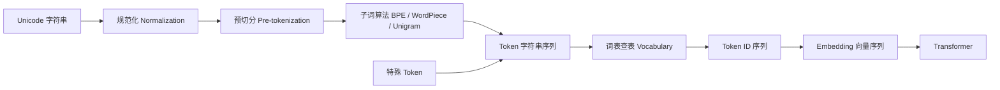
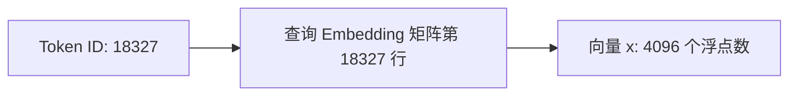
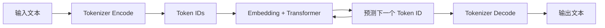
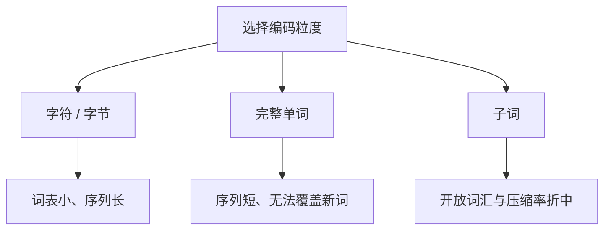
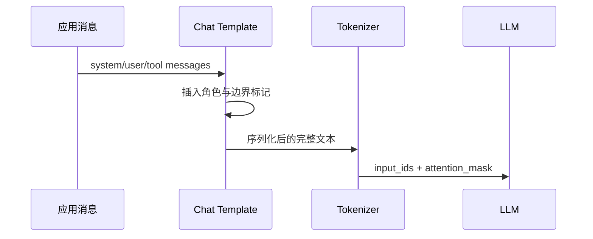

# Tokenizer：语言进入模型的第一道编译器

Tokenizer（分词器）负责把人类可读的字符串转换为模型可以处理的整数序列，也负责把模型输出的整数序列还原成文本。这个定义看似简单，但它不是一个无关紧要的字符串工具：**Tokenizer 决定了模型看到的最小信息单元、上下文窗口如何消耗、不同语言的表示效率，以及一段文本能否无损往返。**

对于后端工程师，可以把它理解成 LLM 前端的一套“词法分析器 + 编码表”：模型主体只接收定长词表中的 ID，正如虚拟机只执行字节码而不直接执行源代码。不过 Tokenizer 通常不是按语法规则人工编写的，它的词表和切分策略主要从训练语料中统计学习得到。

## 从字符串到模型输入



这张图描述了文本进入 Transformer 之前的完整转换链。它不是一次简单的 `字符串 -> 数字` 强制类型转换，而是多个阶段组成的管线。每个阶段都有不同的输入、输出和职责。下面使用 `Agent 调用 tool` 作为贯穿示例；具体切分和 ID 仅用于解释，真实结果由目标模型的 Tokenizer 决定。

### 第 1 步：Unicode 字符串——应用程序交出的原始文本

管线入口是应用程序中的字符串，例如 Java 的 `String`、Python 的 `str` 或 JavaScript 的字符串。所谓 Unicode，是一套给全世界字符分配“码点”的标准。例如英文字母 `A`、汉字 `调` 和 Emoji 都有自己的 Unicode 表示。

这里需要区分三个概念：

- **字符**是人看到的文字单位。
- **Unicode code point** 是标准为字符分配的编号，通常写作 `U+XXXX`。
- **UTF-8** 是把 code point 保存或传输为字节的编码方式。

一个“看起来只有一个”的字符不一定只对应一个 code point。例如 `é` 既可以是一个已经组合好的 code point，也可以由 `e` 加重音符号两个 code point 组成。家庭 Emoji 也可能由多个 Emoji 和连接符组合而成。它们视觉上相同，底层序列却可能不同，这就是下一步需要规范化的原因。

此时输入仍是人类文本：

```text
Agent 调用 tool
```

### 第 2 步：规范化——消除不必要的表示差异

Normalization（规范化）把“含义相同但底层写法不同”的文本转换成更一致的形式。可能执行的操作包括：

- 把组合字符和分解字符统一为 NFC 或 NFKC 形式；
- 把全角字母 `Ａ` 转成半角 `A`；
- 对不区分大小写的模型把 `Agent` 转成 `agent`；
- 统一某些空白符或控制字符；
- 处理重音符号。

规范化规则不是 Unicode 固定替模型完成的，而是 Tokenizer 配置的一部分。有些生成模型尽量保持输入可逆，另一些分类模型会主动丢弃大小写等信息。后端系统不能自行先做一套“清洗”再假定效果等价，因为重复规范化可能改变语义，例如代码中的空格、大小写和全角字符都可能有业务含义。

示意结果可能仍然是：

```text
Agent 调用 tool
```

虽然肉眼看不出变化，但底层 Unicode 表示已经被统一。

### 第 3 步：预切分——先找出允许切分和合并的边界

Pre-tokenization（预切分）不是最终分词，而是先按空格、标点、数字或正则规则把长字符串划分为候选片段。它回答的是：“后面的子词算法可以在哪些范围内工作？”

示意结果可能是：

```text
["Agent", " 调用", " tool"]
```

注意空格可能被保留在后一个片段中，而不是直接删除。对生成模型来说，空格本身也是需要预测的信息。如果把所有空格都丢掉，模型就无法准确还原代码缩进、Markdown 或自然语言中的词间空格。

不同 Tokenizer 的预切分规则差异很大：有的禁止子词跨越空格合并，有的专门识别数字，有的从 UTF-8 字节开始工作。因此，不能仅凭肉眼推断某段文本会被切成多少 token。

### 第 4 步：子词算法——把候选片段拆成词表能够覆盖的单元

BPE、WordPiece 和 Unigram 都属于子词算法。它们解决两个相互冲突的问题：

- 如果只用完整单词，遇到从未见过的名字、URL 或代码标识符就无法编码。
- 如果只用字符或字节，任何内容都能编码，但序列会非常长。

子词算法把高频片段保留为较大的单元，把低频内容拆成较小的单元。例如 `Agent` 在相关训练语料中足够常见时可能保持完整；一个罕见标识符 `AgentExecutionCoordinator` 可能被拆成多个有复用价值的片段。

对贯穿示例，算法可能得到：

```text
["Agent", " 调", "用", " tool"]
```

这里的 `" 调"` 表示前导空格与汉字可能属于同一个 token。这个结果并不是按中文词语人工切分出来的，而是训练语料统计和合并规则共同决定的。

### 第 5 步：Token 字符串序列——便于人理解的中间表示

图中的 Token 字符串序列是为了帮助开发者观察切分结果。每一项代表 Tokenizer 词表中的一个条目，例如：

```text
["Agent", " 调", "用", " tool"]
```

“Token 字符串”不一定总能显示为完整可读字符。Byte-level Tokenizer 的某个中间单元可能只是 UTF-8 字节的一部分，单独打印时看起来像乱码。它只有与相邻 token 合并解码后，才构成有效字符。

实际模型接口通常不会接收这组字符串，而是接收下一步生成的整数 ID。这层表示主要用于调试、解释 token 数量和定位异常切分。

### 第 6 步：特殊 Token——把协议结构编码进序列

特殊 Token 不是来自用户原文，而是 Tokenizer 或对话模板根据协议插入的控制标记，例如序列开始、序列结束、消息角色和工具调用边界。

例如用户看到的是一句文本，模型实际接收到的序列可能在概念上类似：

```text
[<|user|>, "Agent", " 调", "用", " tool", <|end|>, <|assistant|>]
```

这些标记告诉模型哪部分是用户输入、用户消息在哪里结束，以及接下来应该生成助手回答。它们同样占用 token 数量。特殊 Token 的 ID 是模型训练协议的一部分，不能随意修改或用普通字符串拼接替代。

### 第 7 步：Vocabulary 查表——把每个 token 换成整数编号

Vocabulary（词表）本质上是一张固定映射表，可以近似理解为：

```json
{
  "<|user|>": 100001,
  "Agent": 18327,
  " 调": 7864,
  "用": 221,
  " tool": 5501,
  "<|end|>": 100002
}
```

Tokenizer 用 token 字符串作为 key 查表，得到 Token ID 序列。词表通常在模型训练前确定，并与模型权重一起发布。ID 没有跨模型通用的含义：`18327` 在模型 A 中可能表示 `Agent`，在模型 B 中可能代表完全不同的内容。

查表后的结果可能是：

```text
[100001, 18327, 7864, 221, 5501, 100002, 100003]
```

到这里，Tokenizer 的主要编码工作结束。

### 第 8 步：Token ID 序列——模型真正接收的离散输入

Token ID 是整数索引，不是包含语义的数值。ID 大小不表示语义远近：ID 为 `100` 的 token 不会天然比 ID 为 `50000` 的 token 更重要，也不存在 `ID 之差` 这种有意义的计算。

服务端通常把多个请求的 ID 补齐为二维张量：

```text
input_ids.shape = [batch_size, sequence_length]
```

同时生成 `attention_mask`，告诉模型哪些位置是真实内容，哪些只是为了批处理对齐而添加的 PAD。序列长度就是上下文预算和大量推理成本计算的基础。

### 第 9 步：Embedding——把离散编号变成可计算的连续向量

Transformer 不能直接从整数编号的大小关系中学习语言。模型内部有一张可训练的 Embedding 矩阵：

```text
embedding_table.shape = [vocab_size, hidden_size]
```

假设词表有 100,000 个 token，模型隐藏维度是 4,096，那么矩阵有 100,000 行、每行 4,096 个浮点数。Token ID 就是行索引：ID `18327` 会取出矩阵第 `18327` 行，得到一个 4,096 维向量。



Embedding 是模型参数，会在训练过程中通过反向传播更新。语义相近 token 的向量可能在空间中形成某种结构，但这不是由 Token ID 编号决定的，而是模型从训练任务中学出来的。

### 第 10 步：Transformer——在上下文中计算每个位置的表示

Embedding 向量序列进入多层 Transformer。Transformer 通过 Attention 让每个 token 读取上下文中的其他 token，再经过前馈网络逐层变换表示。此时模型处理的不再是字符串或 ID，而是形状近似为下面这样的浮点张量：

```text
[batch_size, sequence_length, hidden_size]
```

最后一层的表示经过输出投影，得到“下一个 token 是词表中每个 ID 的概率”。模型选择一个 ID，Tokenizer 再执行相反方向的 Decode，将生成的 ID 逐步还原为文本。

因此，完整闭环是：



### 用一张表串起整个过程

| 阶段 | 输入 | 输出 | 核心职责 |
| --- | --- | --- | --- |
| Unicode 字符串 | 应用文本 | code point 序列 | 保存人类输入 |
| Normalization | 多种等价表示 | 规范化文本 | 减少无意义差异 |
| Pre-tokenization | 规范化文本 | 候选片段 | 确定边界并保留空格等信息 |
| 子词算法 | 候选片段 | token 序列 | 在覆盖能力与序列长度间折中 |
| 特殊 Token | 消息结构 | 控制标记 | 表达角色、边界和工具协议 |
| Vocabulary | token 序列 | token ID 序列 | 将符号映射为固定整数索引 |
| Embedding | token ID | 连续向量 | 将离散编号转换成可学习表示 |
| Transformer | 向量序列 | 上下文化表示和概率 | 理解上下文并预测下一个 token |

最重要的边界是：**Tokenizer 负责文本与离散 ID 之间的转换；Embedding 才开始进入神经网络的连续数值空间；Transformer 则负责结合上下文计算和生成。** 把这三层分清，后续理解 Attention、KV Cache、上下文窗口和模型输出会容易很多。

## 用 OpenAI 接口观察输入与返回

理解 OpenAI 的调用方式时，要先区分两个层次：

1. **OpenAI Responses API** 是托管模型接口。开发者提交文本或结构化消息，服务端完成 Tokenizer、模型推理和解码，返回生成结果与 token 用量。
2. **tiktoken** 是 OpenAI 开源的本地 Tokenizer 库。开发者可以直接调用 `encode`、`decode`，观察 token ID 和字节，还可以阅读具体源码。

Responses API 并不会把 Normalization、Pre-tokenization、BPE 每次合并等内部过程逐层返回。线上服务把这些实现细节封装在模型后面。需要理解 Tokenizer 内部逻辑时，应在本地使用 `tiktoken`，而不是期待模型 API 返回全部中间状态。

### OpenAI Responses API：提交文本

安装官方 Python SDK：

```bash
pip install openai
```

最小调用如下：

```python
from openai import OpenAI

client = OpenAI()

response = client.responses.create(
    model="gpt-5",
    input="Agent 调用 tool 是什么意思？",
)

print(response.output_text)
print(response.usage)
```

`responses.create` 的关键输入可以从程序员视角理解为：

```python
response = client.responses.create(
    model="gpt-5",       # 选择模型，也间接决定服务端使用的编码与模板
    input="...",         # 字符串，或包含多条消息/内容块的结构化输入
    max_output_tokens=300 # 为模型输出设置上限
)
```

返回对象不是 token ID 数组，而是包含输出内容、状态和用量信息的 Response。简化后的结构类似：

```json
{
  "id": "resp_...",
  "status": "completed",
  "output": [
    {
      "type": "message",
      "role": "assistant",
      "content": [
        {
          "type": "output_text",
          "text": "……模型生成的回答……"
        }
      ]
    }
  ],
  "usage": {
    "input_tokens": 18,
    "output_tokens": 86,
    "total_tokens": 104
  }
}
```

这里的数字仅用于说明字段含义，真实 token 数由模型、输入内容、工具定义和请求格式决定。不要把示例数字写进容量逻辑。

常用返回字段：

| Python 属性 | 含义 |
| --- | --- |
| `response.id` | 本次响应的唯一标识 |
| `response.status` | 请求是否完成 |
| `response.output` | 完整的结构化输出项 |
| `response.output_text` | SDK 聚合出的文本快捷属性 |
| `response.usage.input_tokens` | 服务端实际统计的输入 token |
| `response.usage.output_tokens` | 模型生成所消耗的输出 token |
| `response.usage.total_tokens` | 总 token 用量 |

生产计费与观测应优先使用响应中的 `usage`，因为它反映服务端最终采用的完整请求，包括可能存在的消息模板与工具相关开销。本地估算主要用于请求发送前的预算和裁剪。

官方入口：

- [OpenAI 文本生成指南](https://developers.openai.com/api/docs/guides/text)
- [Responses create API Reference](https://developers.openai.com/api/reference/resources/responses/methods/create)

### tiktoken：直接查看 Encode 的输入与返回

[tiktoken](https://github.com/openai/tiktoken) 是 OpenAI 发布的开源 BPE Tokenizer。安装后可以直接观察文本如何变成 token ID：

```bash
pip install tiktoken
```

```python
import tiktoken

# 使用编码名称可以让实验结果更稳定；模型到编码的映射可能随模型发布而扩展。
encoding = tiktoken.get_encoding("o200k_base")

text = "Agent 调用 tool"
token_ids: list[int] = encoding.encode(text)

print("input:", repr(text))
print("return:", token_ids)
print("count:", len(token_ids))
```

方法的概念签名是：

```python
Encoding.encode(
    text: str,
    *,
    allowed_special: set[str] | Literal["all"] = set(),
    disallowed_special: Collection[str] | Literal["all"] = "all",
) -> list[int]
```

- 输入 `text` 是 Python Unicode 字符串。
- 返回值是 `list[int]`，每个整数都是词表中的 token ID。
- `allowed_special` 决定哪些特殊字符串可以按特殊 token 编码。
- 默认情况下，文本若包含已注册但不允许出现的特殊 token 字符串，会抛出异常，防止普通内容意外突破协议边界。

如果只想把文本当普通内容编码，不把任何字符串解释成特殊 token，可以使用：

```python
token_ids = encoding.encode_ordinary("<|endoftext|> 只是示例文本")
```

它的返回值仍然是 `list[int]`，但输入中的特殊标记文本会按普通字符序列处理。

### tiktoken：查看每个 ID 对应的原始字节

不要直接假设一个 token ID 必然对应一个完整 Unicode 字符。更可靠的研究方式是调用 `decode_single_token_bytes`：

```python
rows = []

for position, token_id in enumerate(token_ids):
    raw: bytes = encoding.decode_single_token_bytes(token_id)
    rows.append({
        "position": position,
        "token_id": token_id,
        "bytes_hex": raw.hex(" "),
        "bytes_repr": repr(raw),
        "text_if_complete": raw.decode("utf-8", errors="replace"),
    })

for row in rows:
    print(row)
```

方法的概念签名：

```python
Encoding.decode_single_token_bytes(token: int) -> bytes
```

它返回 `bytes` 而不是 `str`，因为单个 token 可能只包含某个 UTF-8 字符的一部分。`errors="replace"` 只适合调试显示；不要把替换字符后的结果拿来恢复原文。

### tiktoken：把 Token ID 序列还原为文本

```python
decoded: str = encoding.decode(token_ids)

print("decoded:", repr(decoded))
print("round_trip:", decoded == text)
```

概念签名：

```python
Encoding.decode(tokens: Sequence[int], errors: str = "replace") -> str
```

`decode` 会先把所有 token 对应的字节连接起来，再按 UTF-8 解码，因此它比逐 token 转成字符串更可靠。对需要严格验证无损往返的系统，也可以先获得完整字节：

```python
decoded_bytes: bytes = encoding.decode_bytes(token_ids)
assert decoded_bytes == text.encode("utf-8")
```

### 一段可直接运行的完整研究程序

下面的程序把输入、ID、单 token 字节和最终返回放在一起，适合作为本章实验起点：

```python
from dataclasses import asdict, dataclass
import json
import tiktoken


@dataclass
class TokenView:
    position: int
    token_id: int
    bytes_hex: str
    bytes_text: str


def inspect_tokens(text: str, encoding_name: str = "o200k_base") -> dict:
    encoding = tiktoken.get_encoding(encoding_name)
    token_ids = encoding.encode(text)

    tokens = []
    for position, token_id in enumerate(token_ids):
        raw = encoding.decode_single_token_bytes(token_id)
        tokens.append(TokenView(
            position=position,
            token_id=token_id,
            bytes_hex=raw.hex(" "),
            bytes_text=raw.decode("utf-8", errors="replace"),
        ))

    decoded_bytes = encoding.decode_bytes(token_ids)
    decoded_text = decoded_bytes.decode("utf-8")

    return {
        "encoding": encoding.name,
        "input": text,
        "input_chars": len(text),
        "input_bytes": len(text.encode("utf-8")),
        "token_count": len(token_ids),
        "token_ids": token_ids,
        "tokens": [asdict(token) for token in tokens],
        "decoded": decoded_text,
        "round_trip": decoded_text == text,
    }


if __name__ == "__main__":
    result = inspect_tokens("Agent 调用 tool 👨‍👩‍👧‍👦")
    print(json.dumps(result, ensure_ascii=False, indent=2))
```

程序返回的结构大致如下：

```json
{
  "encoding": "o200k_base",
  "input": "Agent 调用 tool 👨‍👩‍👧‍👦",
  "input_chars": 21,
  "input_bytes": 43,
  "token_count": "以本机实际执行结果为准",
  "token_ids": ["以本机实际执行结果为准"],
  "tokens": [
    {
      "position": 0,
      "token_id": 变量中的真实整数,
      "bytes_hex": "实际字节的十六进制",
      "bytes_text": "可显示文本或替换字符"
    }
  ],
  "decoded": "Agent 调用 tool 👨‍👩‍👧‍👦",
  "round_trip": true
}
```

示例故意不硬编码 token ID，因为读者应运行程序观察目标编码的真实结果，避免把某个版本的输出误认为跨模型标准。

### 从哪里开始阅读开源源码

tiktoken 仓库中最值得程序员研究的入口包括：

- [`tiktoken/core.py`](https://github.com/openai/tiktoken/blob/main/tiktoken/core.py)：Python `Encoding` 类，包含 `encode`、`decode`、`decode_bytes` 等公开方法。
- [`tiktoken_ext/openai_public.py`](https://github.com/openai/tiktoken/blob/main/tiktoken_ext/openai_public.py)：OpenAI 公共编码的构造方式、特殊 token 和编码注册信息。
- [`src/lib.rs`](https://github.com/openai/tiktoken/blob/main/src/lib.rs)：Python 与 Rust 核心之间的绑定入口。
- [`src/py.rs`](https://github.com/openai/tiktoken/blob/main/src/py.rs)：暴露给 Python 的核心编码实现。
- [`tiktoken/_educational.py`](https://github.com/openai/tiktoken/blob/main/tiktoken/_educational.py)：更适合学习的 BPE 训练与编码实现，性能不是重点，但步骤更容易阅读。

推荐阅读顺序是 `_educational.py -> core.py -> openai_public.py -> Rust 实现`。先用教学实现理解算法，再追踪生产实现的性能优化和 Python/Rust 边界。

### OpenAI API 与 tiktoken 的职责对照

| 目标 | 应使用的接口 | 输入 | 返回 |
| --- | --- | --- | --- |
| 调用托管模型生成回答 | `client.responses.create` | 文本或结构化 input | Response、输出文本、usage |
| 本地把文本编码为 ID | `encoding.encode` | `str` | `list[int]` |
| 查看单 token 原始内容 | `decode_single_token_bytes` | 单个 token ID | `bytes` |
| 把完整 ID 序列还原为文本 | `encoding.decode` | ID 序列 | `str` |
| 严格验证字节级往返 | `encoding.decode_bytes` | ID 序列 | `bytes` |
| 研究 BPE 如何训练和合并 | 阅读 `_educational.py` | 训练语料与词表大小 | 合并规则与编码结果 |

工程上应同时保留两类测试：用 tiktoken 做发送前预算与边界测试，用 Responses API 返回的 `usage` 做服务端实际用量记录。两者数值不一致时，应首先检查模型到编码的映射、结构化消息模板、工具定义和特殊 token 开销。

## Token、字符、单词不是同一个概念

Token 是 Tokenizer 选择的编码单元，不等于自然语言中的“词”，也不等于 Unicode 字符。

- 英文高频词可能是一个 token，例如 `the`。
- 低频长词可能被拆成多个子词，例如 `tokenization` 被拆成 `token` 和 `ization`。
- 中文常见字可能各自成 token，也可能与相邻字符组成词组。
- 空格和换行经常属于 token 的一部分，`hello` 与 ` hello` 可能对应不同 ID。
- Emoji 可能由多个 Unicode code point 组成，并进一步被拆成多个 token。
- JSON 标点、缩进和代码符号都会占用上下文窗口。

因此，“一千个字符大约等于多少 token”只能作为粗略估算。可靠做法永远是使用目标模型的官方 Tokenizer 实际编码。

## 为什么不直接按字符或完整单词编码

按字符编码的词表容易控制，但 Unicode 字符数量巨大，而且序列太长。Transformer 需要对更长的序列执行计算，推理时间和 KV Cache 都会上升。字符也无法直接复用高频词组的统计结构。

按完整单词编码虽然序列更短，但真实世界不断出现新名字、拼写、版本号、URL 和代码标识符，词表不可能枚举完；未登录词只能退化为 `<unk>`，造成信息丢失。

现代 LLM 多采用**子词编码**：高频片段使用一个 token，低频内容拆成更小单元。它在词表大小、序列长度和开放词汇之间取得折中。



## BPE 的内部逻辑

BPE（Byte Pair Encoding）最初是一种数据压缩算法，后来被用于构造子词词表。核心思想是：**反复把语料中出现频率最高的相邻单元合并成新单元。**

假设训练语料包含 `low low low lower lower newest widest`。初始时可把单词拆成字符，并添加词尾标记：

```text
l o w </w>
l o w e r </w>
```

训练过程如下：

1. 统计所有相邻单元对，例如 `(l, o)`、`(o, w)`、`(w, </w>)`。
2. 找出频率最高的一对。
3. 把这对单元合并，例如将 `l + o` 合并为 `lo`。
4. 更新整个语料中的切分和相邻对频率。
5. 重复执行，直到词表达到目标大小或合并次数达到上限。

```python
vocabulary = initial_alphabet(corpus)
splits = split_into_initial_units(corpus)

while len(vocabulary) < target_vocab_size:
    pair_counts = count_adjacent_pairs(splits)
    best_pair = max(pair_counts, key=pair_counts.get)
    vocabulary.add(concat(best_pair))
    splits = merge_pair_everywhere(splits, best_pair)
```

训练结束后会得到两份关键数据：

- **Vocabulary**：token 到 token ID 的映射表。
- **Merge rules**：相邻单元的合并顺序或优先级。

线上编码不会重新统计输入文本，而是按训练得到的规则执行切分。因此，Tokenizer 的“训练”发生在模型训练前；推理阶段只是确定性的规则执行和查表。

### Byte-level BPE 为什么常见

如果 BPE 从 Unicode 字符开始，仍需决定哪些字符属于初始词表。Byte-level BPE 先把 UTF-8 文本转换为字节，再对字节序列执行合并。一个字节只有 256 种可能值，所以理论上能表示任意输入，不需要 `<unk>`。

代价是非 ASCII 文本在合并不足时可能消耗更多 token。一个中文字符的 UTF-8 编码通常占三个字节，如果训练语料中的中文覆盖不足，它可能被拆成多个低级单元。这也是不同语言 token 使用效率不同的根源之一。

## WordPiece 与 Unigram

WordPiece 与 BPE 都会逐步构建子词，但选择合并项时不仅看绝对频率，还倾向于选择相对于组成部分更有信息量的组合。BERT 系列广泛使用 WordPiece，子词常以 `##` 表示它不能作为词首，例如 `playing -> play + ##ing`。

Unigram 则从较大的候选词表开始，逐步删除对语料似然贡献较低的 token。编码时，同一字符串可能存在多种候选切分，通过动态规划选择概率最高或代价最低的路径。SentencePiece 常使用这种算法。

| 算法 | 构建方向 | 训练核心 | 编码特点 |
| --- | --- | --- | --- |
| BPE | 从小词表向上合并 | 高频相邻对 | 按合并优先级确定切分 |
| WordPiece | 从小词表向上合并 | 语言模型式收益 | 常保留词首/词中边界 |
| Unigram | 从大词表向下裁剪 | 最大化语料似然 | 在多个候选切分中搜索最优解 |

## 规范化与预切分

子词算法之前通常还有两层处理，它们常被教程忽略，却会直接影响生产系统。

### Normalization

规范化可能包含 Unicode NFC/NFKC 归一化、大小写转换、全角半角转换、重音符号或空白处理。如果规范化有损，`decode(encode(text))` 就不一定严格等于原文。例如 uncased 模型可能把 `Apple` 与 `apple` 编码成相同结果。生成模型通常更重视可逆性，而分类模型可能接受这种信息损失。

### Pre-tokenization

预切分先利用空格、标点或正则表达式划分候选片段，限制后续子词合并的边界。例如，它可以禁止 token 跨越空格合并。这解释了为什么 `hello` 和带前导空格的 ` hello` 可能得到完全不同的 token。

## 特殊 Token 与对话模板

模型除了普通文本 token，还会定义具有协议意义的特殊 token：

| 类型 | 典型用途 |
| --- | --- |
| BOS / EOS | 标记序列开始和生成结束 |
| PAD | 批处理时补齐不同长度 |
| UNK | 表示无法编码的内容 |
| MASK | 掩码语言模型训练 |
| system/user/assistant | 区分对话角色或消息边界 |
| tool/function | 标记工具调用及工具结果 |

聊天 API 接收结构化 messages，但模型最终看到的仍是一条 token 序列。SDK 通过 chat template 将消息序列化，概念上可能变成：

```text
<|system|>你是一个助手<|end|>
<|user|>查询订单 42<|end|>
<|assistant|>
```

角色标记、换行和工具 schema 全部消耗 token。仅对消息正文计数会低估真实请求长度；精确预算必须应用模型对应的对话模板。



## Encode、Decode 与流式输出

典型编码接口返回 `input_ids` 和 `attention_mask`：

```python
encoded = tokenizer(
    text,
    add_special_tokens=True,
    truncation=True,
    max_length=4096,
    return_attention_mask=True,
)
```

- `input_ids` 是词表 ID。
- `attention_mask` 区分真实 token 和 padding。
- `add_special_tokens` 决定是否自动插入 BOS/EOS。
- `truncation` 决定超长输入如何截断。

解码会执行反向词表查询、拼接和字节/Unicode 还原：

```python
text = tokenizer.decode(
    encoded["input_ids"],
    skip_special_tokens=True,
    clean_up_tokenization_spaces=False,
)
```

流式输出不能简单地逐个 token 调用 `decode` 后拼接。一个 Unicode 字符可能跨越多个字节 token，单 token 解码可能暂时是不完整字符。可靠实现应使用增量解码器，或累计足够 token 后统一解码。

## Tokenizer 如何影响成本与容量

Tokenizer 通过序列长度影响三个核心指标：

1. **请求计费**：多数 API 按输入和输出 token 数计费。
2. **首 token 延迟**：Prefill 阶段需要处理全部输入 token。
3. **显存占用**：KV Cache 随序列长度、层数和并发增长。

完整输入预算应包含：

```text
系统提示 + 对话历史 + 用户消息 + RAG 片段
+ 工具定义 + 工具结果 + 对话模板开销
```

只限制用户输入无法防止上下文溢出。Context Builder 必须对每个组成部分分别计数、预留输出空间，并定义确定性的裁剪优先级。

## 工具调用中的高风险边界

Agent 系统中，Tokenizer 问题常表现为结构化协议故障：

- JSON 在右括号前被截断，导致解析失败；
- UTF-8 多字节字符在错误边界被截断，产生替换字符；
- 工具 schema 太长，挤占任务上下文；
- 检索片段按字符截断，实际 token 数仍然超限；
- 切换模型后仍沿用旧 Tokenizer 估算预算；
- 在特殊 token 附近拼接不可信输入，破坏角色边界。

不要先生成超长字符串再按 token ID 生硬切片结构化数据。对于 JSON、XML 或代码，应在业务结构层裁剪字段、数组项和文档块，然后重新序列化并重新计数。

## 生产实现建议

### Tokenizer 与模型版本绑定

把模型名称、模型修订版本、Tokenizer 文件哈希和 chat template 作为同一份部署元数据。模型权重升级但 Tokenizer 未同步，轻则输出质量下降，重则特殊 token ID 错位。

### 集中管理 Token Budget

不要让 RAG、Memory、Tool Calling 各自使用字符数估算。建立统一预算接口：

```python
def plan_context(parts, context_window, reserved_output):
    input_budget = context_window - reserved_output
    measured = [(p.name, tokenizer.count(p.render())) for p in parts]
    return trim_by_priority(measured, input_budget)
```

### 记录 token 级指标

至少观测输入/输出 token 分布，system、history、RAG、tools 各自占比，截断次数与内容类型，不同语言的 token/字符比，以及达到上下文上限的请求比例。这些指标能回答成本为何上升、某类语言为何延迟更高、工具调用为何突然失败。

## 动手实验

选择实际使用模型的官方 Tokenizer，分别编码自然语言、JSON、代码、Emoji 和完整对话模板，记录字符数、字节数、token 数和往返结果：

```python
cases = [
    "Agent 调用 tool",
    '{"order_id":42,"include_items":true}',
    "👨‍👩‍👧‍👦 café e\u0301",
]

for text in cases:
    ids = tokenizer.encode(text, add_special_tokens=False)
    decoded = tokenizer.decode(ids, clean_up_tokenization_spaces=False)
    print({
        "text": text,
        "chars": len(text),
        "bytes": len(text.encode("utf-8")),
        "tokens": len(ids),
        "ids": ids,
        "round_trip": decoded == text,
    })
```

然后回答：格式化 JSON 增加了多少 token？中英文谁更紧凑？Emoji 被拆成多少 token？特殊 token 是否自动加入？这些结果会直接影响限流、计费、上下文裁剪和容量规划。

## 本章检查表

- 能解释 token、字符、字节和单词的区别。
- 能描述 BPE 的训练过程与线上编码为何不同。
- 知道 Normalization、Pre-tokenization 和子词算法各自负责什么。
- 能解释 Byte-level BPE 如何避免未登录字符。
- 知道 chat template 和特殊 token 也占用上下文。
- 不再使用字符数替代目标模型的真实 token 数。
- 能为 system、history、RAG、tools 和 output 建立独立预算。
- 能识别截断对 JSON、Unicode 和工具调用造成的风险。

## 延伸思考

Tokenizer 是在模型训练前固定的离散接口。若某种语言在训练语料中占比很低，它的 token 效率和模型能力会受到什么影响？如果可以重新训练 Tokenizer，但模型参数量和上下文窗口不变，又该如何衡量新词表是真的更好，而不只是让某一类基准更短？

## 中文延伸学习资源

以下资源适合在完成本章后继续学习 BPE、Byte-level BPE 与 SentencePiece 的工程实现：

- [BPE 与字节级 Tokenizer：从合并规则到可运行实现](https://tonlp.fun/post/bpe/) — 作者/站点：HuanQ（ToNLP）。包含 BPE 训练、编码、解码、词表持久化以及一份可运行的 Python 参考实现。
- [Transformer 架构](https://infrasys-ai.github.io/aiinfra-docs/06AlgoData01Basic/README.html) — 来源：AIInfra 中文开源课程。其中“手把手实现核心机制 BPE 分词算法”可作为本章代码练习的补充。
- [Token 到底是什么？——揭秘大模型背后的“文字压缩术”](https://www.bilibili.com/video/BV1S5miBvEsu/) — 作者：马克的技术工作坊；平台：哔哩哔哩。适合用动画和例子直观理解 Token、BPE 训练过程及 Context Window。
- [[SentencePiece] Tokenizer 的原理与实现](https://www.cnblogs.com/wildkid1024/p/18379857) — 作者：wildkid1024；平台：博客园。文章结合 Google SentencePiece 源码讲解链式数据结构、pair 合并与优先队列实现。

> **版权与来源说明：** 本节仅提供外部学习资源的标题、作者/机构、发布平台、原始链接和简短导读，不转载其正文、图片、代码、字幕或视频。资源版权归各原作者及发布平台所有；引用或二次使用时，请遵守来源页面标注的许可协议与版权要求。外部页面内容和地址可能发生变化，请以原作者页面为准。
