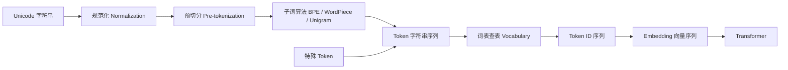
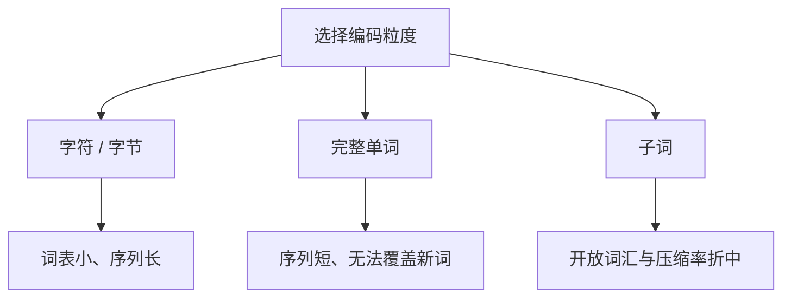
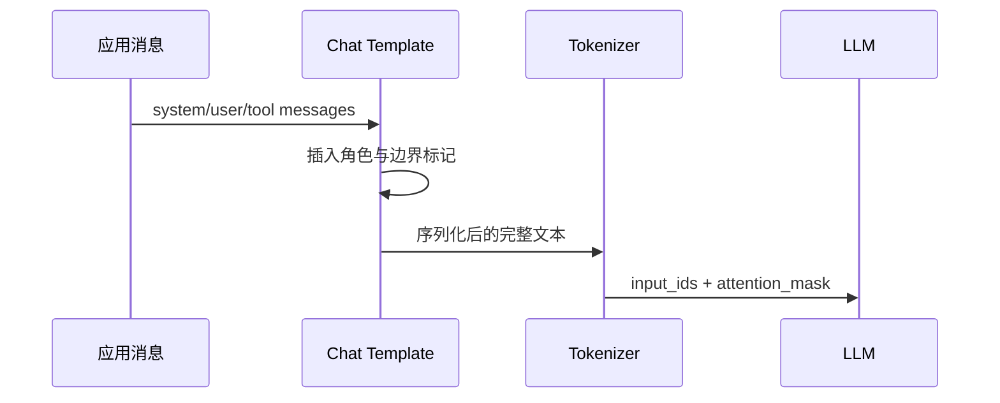

# Tokenizer：语言进入模型的第一道编译器

Tokenizer（分词器）负责把人类可读的字符串转换为模型可以处理的整数序列，也负责把模型输出的整数序列还原成文本。这个定义看似简单，但它不是一个无关紧要的字符串工具：**Tokenizer 决定了模型看到的最小信息单元、上下文窗口如何消耗、不同语言的表示效率，以及一段文本能否无损往返。**

对于后端工程师，可以把它理解成 LLM 前端的一套“词法分析器 + 编码表”：模型主体只接收定长词表中的 ID，正如虚拟机只执行字节码而不直接执行源代码。不过 Tokenizer 通常不是按语法规则人工编写的，它的词表和切分策略主要从训练语料中统计学习得到。

## 从字符串到模型输入



例如文本 `Agent 调用 tool`，某个 Tokenizer 可能将它切成：

```text
["Agent", " 调", "用", " tool"]
```

再通过词表映射为 `[18327, 7864, 221, 5501]`。这些数字本身没有语言含义，只是词表行号。模型随后用每个 ID 查询 Embedding 矩阵，得到连续向量。不同模型使用不同的 Tokenizer，同一句话得到的切分和 ID 通常不同，因此不能把一个模型的 token ID 直接交给另一个模型。

## Token、字符、单词不是同一个概念

Token 是 Tokenizer 选择的编码单元，不等于自然语言中的“词”，也不等于 Unicode 字符。

- 英文高频词可能是一个 token，例如 `the`。
- 低频长词可能被拆成多个子词，例如 `tokenization` 被拆成 `token` 和 `ization`。
- 中文常见字可能各自成 token，也可能与相邻字符组成词组。
- 空格和换行经常属于 token 的一部分，`hello` 与 ` hello` 可能对应不同 ID。
- Emoji 可能由多个 Unicode code point 组成，并进一步被拆成多个 token。
- JSON 标点、缩进和代码符号都会占用上下文窗口。

因此，“一千个字符大约等于多少 token”只能作为粗略估算。可靠做法永远是使用目标模型的官方 Tokenizer 实际编码。

## 为什么不直接按字符或完整单词编码

按字符编码的词表容易控制，但 Unicode 字符数量巨大，而且序列太长。Transformer 需要对更长的序列执行计算，推理时间和 KV Cache 都会上升。字符也无法直接复用高频词组的统计结构。

按完整单词编码虽然序列更短，但真实世界不断出现新名字、拼写、版本号、URL 和代码标识符，词表不可能枚举完；未登录词只能退化为 `<unk>`，造成信息丢失。

现代 LLM 多采用**子词编码**：高频片段使用一个 token，低频内容拆成更小单元。它在词表大小、序列长度和开放词汇之间取得折中。



## BPE 的内部逻辑

BPE（Byte Pair Encoding）最初是一种数据压缩算法，后来被用于构造子词词表。核心思想是：**反复把语料中出现频率最高的相邻单元合并成新单元。**

假设训练语料包含 `low low low lower lower newest widest`。初始时可把单词拆成字符，并添加词尾标记：

```text
l o w </w>
l o w e r </w>
```

训练过程如下：

1. 统计所有相邻单元对，例如 `(l, o)`、`(o, w)`、`(w, </w>)`。
2. 找出频率最高的一对。
3. 把这对单元合并，例如将 `l + o` 合并为 `lo`。
4. 更新整个语料中的切分和相邻对频率。
5. 重复执行，直到词表达到目标大小或合并次数达到上限。

```python
vocabulary = initial_alphabet(corpus)
splits = split_into_initial_units(corpus)

while len(vocabulary) < target_vocab_size:
    pair_counts = count_adjacent_pairs(splits)
    best_pair = max(pair_counts, key=pair_counts.get)
    vocabulary.add(concat(best_pair))
    splits = merge_pair_everywhere(splits, best_pair)
```

训练结束后会得到两份关键数据：

- **Vocabulary**：token 到 token ID 的映射表。
- **Merge rules**：相邻单元的合并顺序或优先级。

线上编码不会重新统计输入文本，而是按训练得到的规则执行切分。因此，Tokenizer 的“训练”发生在模型训练前；推理阶段只是确定性的规则执行和查表。

### Byte-level BPE 为什么常见

如果 BPE 从 Unicode 字符开始，仍需决定哪些字符属于初始词表。Byte-level BPE 先把 UTF-8 文本转换为字节，再对字节序列执行合并。一个字节只有 256 种可能值，所以理论上能表示任意输入，不需要 `<unk>`。

代价是非 ASCII 文本在合并不足时可能消耗更多 token。一个中文字符的 UTF-8 编码通常占三个字节，如果训练语料中的中文覆盖不足，它可能被拆成多个低级单元。这也是不同语言 token 使用效率不同的根源之一。

## WordPiece 与 Unigram

WordPiece 与 BPE 都会逐步构建子词，但选择合并项时不仅看绝对频率，还倾向于选择相对于组成部分更有信息量的组合。BERT 系列广泛使用 WordPiece，子词常以 `##` 表示它不能作为词首，例如 `playing -> play + ##ing`。

Unigram 则从较大的候选词表开始，逐步删除对语料似然贡献较低的 token。编码时，同一字符串可能存在多种候选切分，通过动态规划选择概率最高或代价最低的路径。SentencePiece 常使用这种算法。

| 算法 | 构建方向 | 训练核心 | 编码特点 |
| --- | --- | --- | --- |
| BPE | 从小词表向上合并 | 高频相邻对 | 按合并优先级确定切分 |
| WordPiece | 从小词表向上合并 | 语言模型式收益 | 常保留词首/词中边界 |
| Unigram | 从大词表向下裁剪 | 最大化语料似然 | 在多个候选切分中搜索最优解 |

## 规范化与预切分

子词算法之前通常还有两层处理，它们常被教程忽略，却会直接影响生产系统。

### Normalization

规范化可能包含 Unicode NFC/NFKC 归一化、大小写转换、全角半角转换、重音符号或空白处理。如果规范化有损，`decode(encode(text))` 就不一定严格等于原文。例如 uncased 模型可能把 `Apple` 与 `apple` 编码成相同结果。生成模型通常更重视可逆性，而分类模型可能接受这种信息损失。

### Pre-tokenization

预切分先利用空格、标点或正则表达式划分候选片段，限制后续子词合并的边界。例如，它可以禁止 token 跨越空格合并。这解释了为什么 `hello` 和带前导空格的 ` hello` 可能得到完全不同的 token。

## 特殊 Token 与对话模板

模型除了普通文本 token，还会定义具有协议意义的特殊 token：

| 类型 | 典型用途 |
| --- | --- |
| BOS / EOS | 标记序列开始和生成结束 |
| PAD | 批处理时补齐不同长度 |
| UNK | 表示无法编码的内容 |
| MASK | 掩码语言模型训练 |
| system/user/assistant | 区分对话角色或消息边界 |
| tool/function | 标记工具调用及工具结果 |

聊天 API 接收结构化 messages，但模型最终看到的仍是一条 token 序列。SDK 通过 chat template 将消息序列化，概念上可能变成：

```text
<|system|>你是一个助手<|end|>
<|user|>查询订单 42<|end|>
<|assistant|>
```

角色标记、换行和工具 schema 全部消耗 token。仅对消息正文计数会低估真实请求长度；精确预算必须应用模型对应的对话模板。



## Encode、Decode 与流式输出

典型编码接口返回 `input_ids` 和 `attention_mask`：

```python
encoded = tokenizer(
    text,
    add_special_tokens=True,
    truncation=True,
    max_length=4096,
    return_attention_mask=True,
)
```

- `input_ids` 是词表 ID。
- `attention_mask` 区分真实 token 和 padding。
- `add_special_tokens` 决定是否自动插入 BOS/EOS。
- `truncation` 决定超长输入如何截断。

解码会执行反向词表查询、拼接和字节/Unicode 还原：

```python
text = tokenizer.decode(
    encoded["input_ids"],
    skip_special_tokens=True,
    clean_up_tokenization_spaces=False,
)
```

流式输出不能简单地逐个 token 调用 `decode` 后拼接。一个 Unicode 字符可能跨越多个字节 token，单 token 解码可能暂时是不完整字符。可靠实现应使用增量解码器，或累计足够 token 后统一解码。

## Tokenizer 如何影响成本与容量

Tokenizer 通过序列长度影响三个核心指标：

1. **请求计费**：多数 API 按输入和输出 token 数计费。
2. **首 token 延迟**：Prefill 阶段需要处理全部输入 token。
3. **显存占用**：KV Cache 随序列长度、层数和并发增长。

完整输入预算应包含：

```text
系统提示 + 对话历史 + 用户消息 + RAG 片段
+ 工具定义 + 工具结果 + 对话模板开销
```

只限制用户输入无法防止上下文溢出。Context Builder 必须对每个组成部分分别计数、预留输出空间，并定义确定性的裁剪优先级。

## 工具调用中的高风险边界

Agent 系统中，Tokenizer 问题常表现为结构化协议故障：

- JSON 在右括号前被截断，导致解析失败；
- UTF-8 多字节字符在错误边界被截断，产生替换字符；
- 工具 schema 太长，挤占任务上下文；
- 检索片段按字符截断，实际 token 数仍然超限；
- 切换模型后仍沿用旧 Tokenizer 估算预算；
- 在特殊 token 附近拼接不可信输入，破坏角色边界。

不要先生成超长字符串再按 token ID 生硬切片结构化数据。对于 JSON、XML 或代码，应在业务结构层裁剪字段、数组项和文档块，然后重新序列化并重新计数。

## 生产实现建议

### Tokenizer 与模型版本绑定

把模型名称、模型修订版本、Tokenizer 文件哈希和 chat template 作为同一份部署元数据。模型权重升级但 Tokenizer 未同步，轻则输出质量下降，重则特殊 token ID 错位。

### 集中管理 Token Budget

不要让 RAG、Memory、Tool Calling 各自使用字符数估算。建立统一预算接口：

```python
def plan_context(parts, context_window, reserved_output):
    input_budget = context_window - reserved_output
    measured = [(p.name, tokenizer.count(p.render())) for p in parts]
    return trim_by_priority(measured, input_budget)
```

### 记录 token 级指标

至少观测输入/输出 token 分布，system、history、RAG、tools 各自占比，截断次数与内容类型，不同语言的 token/字符比，以及达到上下文上限的请求比例。这些指标能回答成本为何上升、某类语言为何延迟更高、工具调用为何突然失败。

## 动手实验

选择实际使用模型的官方 Tokenizer，分别编码自然语言、JSON、代码、Emoji 和完整对话模板，记录字符数、字节数、token 数和往返结果：

```python
cases = [
    "Agent 调用 tool",
    '{"order_id":42,"include_items":true}',
    "👨‍👩‍👧‍👦 café e\u0301",
]

for text in cases:
    ids = tokenizer.encode(text, add_special_tokens=False)
    decoded = tokenizer.decode(ids, clean_up_tokenization_spaces=False)
    print({
        "text": text,
        "chars": len(text),
        "bytes": len(text.encode("utf-8")),
        "tokens": len(ids),
        "ids": ids,
        "round_trip": decoded == text,
    })
```

然后回答：格式化 JSON 增加了多少 token？中英文谁更紧凑？Emoji 被拆成多少 token？特殊 token 是否自动加入？这些结果会直接影响限流、计费、上下文裁剪和容量规划。

## 本章检查表

- 能解释 token、字符、字节和单词的区别。
- 能描述 BPE 的训练过程与线上编码为何不同。
- 知道 Normalization、Pre-tokenization 和子词算法各自负责什么。
- 能解释 Byte-level BPE 如何避免未登录字符。
- 知道 chat template 和特殊 token 也占用上下文。
- 不再使用字符数替代目标模型的真实 token 数。
- 能为 system、history、RAG、tools 和 output 建立独立预算。
- 能识别截断对 JSON、Unicode 和工具调用造成的风险。

## 延伸思考

Tokenizer 是在模型训练前固定的离散接口。若某种语言在训练语料中占比很低，它的 token 效率和模型能力会受到什么影响？如果可以重新训练 Tokenizer，但模型参数量和上下文窗口不变，又该如何衡量新词表是真的更好，而不只是让某一类基准更短？
