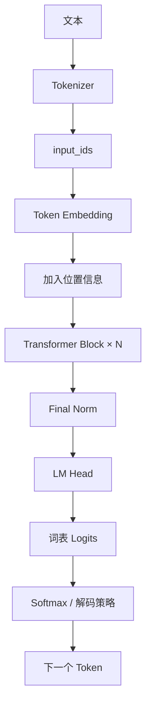
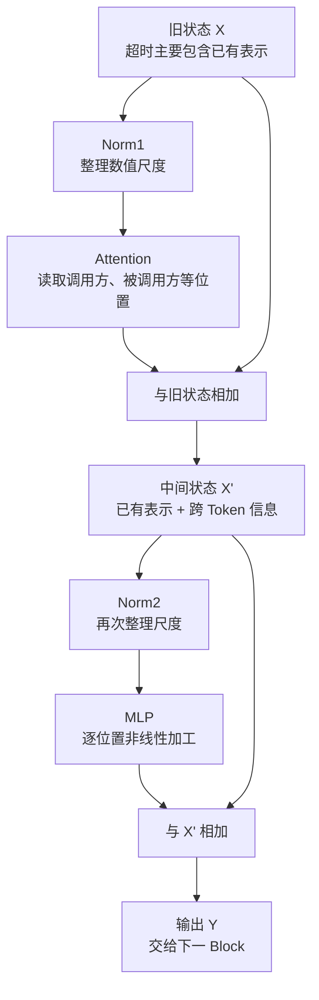
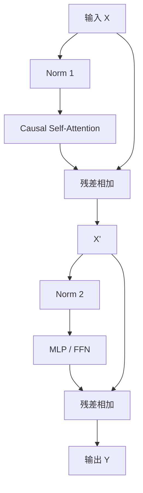

# Transformer：从 Token 向量到语言模型

Transformer 不是单独一种“神奇算法”，而是一套可重复堆叠的神经网络架构。它把几种职责明确的组件组合起来：

- Embedding 把离散 Token ID 转成向量；
- 位置信息让模型知道顺序；
- Attention 让不同 Token 位置交换信息；
- MLP 在每个位置内部进行非线性特征变换；
- 残差连接保存主信息流，并让深层网络更容易训练；
- Normalization 控制数值尺度；
- 输出层把最终 Hidden State 映射为词表 Logit。



本章以现代 Decoder-only 大语言模型为主线，同时解释 Encoder-only 和 Encoder-Decoder 的区别。Attention 的内部推导见 [Attention 章节](/llm/attention)，Embedding 查表与训练见 [Embedding 与预测](/llm/embedding)，位置机制见 [RoPE](/llm/rope)。

## 为什么需要 Transformer

### 语言模型面对的三个核心问题

第一，输入是变长序列。模型既要理解相邻词，也要连接相距很远的信息：

```text
用户在第一段定义了变量 retry_limit，几百个 Token 后才再次引用它。
```

第二，同一个 Token 的含义随上下文改变：

```text
苹果 很甜
苹果 发布 新设备
```

第三，训练需要高吞吐。现代模型要处理海量 Token，如果时间维完全串行，硬件利用率和训练速度会受到限制。

### 与 RNN 的关键差异

RNN 按时间步递归：

```text
h_t = f(x_t, h_{t-1})
```

位置 `t` 依赖 `t-1`，训练时很难把同一序列的全部时间步完全并行。远距离信息还必须逐步穿过许多状态。

Transformer 的 Self-Attention 允许一个位置直接与其他允许位置建立连接。训练时，整段序列的 Q/K/V 可以通过矩阵运算并行计算。

这不表示 Transformer 在所有方面都“免费优于”RNN：标准全局 Attention 会产生 `S×S` 关系矩阵，长序列成本随长度近似二次增长。Transformer 用更好的并行性和直接依赖路径，换来了显著的计算与显存需求。

### 一个后端开发者容易理解的类比

可以把 Transformer 看成多级数据处理流水线：

```text
残差流 X：贯穿所有层的主数据对象
Attention：跨记录 Join / 动态信息路由
MLP：对每条记录独立执行的业务转换
Norm：进入子模块前的数值协议标准化
Residual Add：把子模块产生的增量合并回主对象
```

这个类比只用于理解职责边界。Transformer 的“记录”是浮点向量，“Join 条件”由训练参数动态产生，所有过程都参与自动求导。

## 三种常见 Transformer 架构

### Encoder-only

代表思路是让每个位置双向读取整段输入：

```text
位置 i 可以关注左侧和右侧 Token
```

适合分类、序列标注、检索编码等理解任务。经典 BERT 属于这一类。

### Decoder-only

使用 Causal Mask：

```text
位置 i 只能关注位置 0..i
```

适合自回归生成。GPT、Llama 等通用 LLM 主要采用该架构。本章后续代码以 Decoder-only 为主。

### Encoder-Decoder

由两部分组成：

1. Encoder 双向编码源序列；
2. Decoder 使用 Causal Self-Attention 处理已生成内容，并通过 Cross-Attention 读取 Encoder 输出。

常用于翻译、摘要等输入到输出任务。经典原始 Transformer 就是 Encoder-Decoder。

| 架构 | Self-Attention 可见范围 | Cross-Attention | 典型用途 |
| --- | --- | --- | --- |
| Encoder-only | 双向 | 通常无 | 理解、分类、检索编码 |
| Decoder-only | 仅过去和当前 | 通常无 | 文本生成、对话、代码补全 |
| Encoder-Decoder | Encoder 双向，Decoder 因果 | 有 | 翻译、条件生成 |

## Decoder-only 模型的完整数据流

假设输入：

```text
“我喜欢学习”
```

Tokenizer 可能产生：

```text
input_ids = [101, 205, 309]
```

对于 Batch：

```text
input_ids.shape = [B, S]
```

Embedding 查表后：

```text
X.shape = [B, S, D]
```

- `B`：Batch Size；
- `S`：序列长度；
- `D`：模型隐藏维度。

经过 `N` 个 Transformer Block 后，形状通常仍是 `[B,S,D]`。Block 不改变序列位置数和主隐藏维度，而是持续更新每个位置的内容。

最后：

```text
logits = LMHead(FinalNorm(X))
logits.shape = [B, S, V]
```

`V` 是词表大小。训练时使用所有位置的 Logit 计算下一 Token 损失；生成时通常使用最后一个有效位置的 `[B,V]` 选择下一个 Token。

## 一个 Transformer Block 的整体结构

看到下面的代码和公式之前，先不要把 Transformer Block 想成一个巨大黑盒。它其实是一个**反复执行两次“读取旧状态、计算增量、合并增量”**的处理单元：

```text
第一次更新：让每个 Token 通过 Attention 读取其他位置的信息
第二次更新：让每个 Token 通过 MLP 加工自己当前位置的特征
```

一个 Block 不直接输出自然语言，也不直接预测最终答案。它接收一组 Token 的 Hidden States，进行一次上下文交换和一次位置内计算，然后把同形状的新 Hidden States 交给下一个 Block。

### 先分清 Model、Block、子层和算子

这些名称经常混用，容易让读者以为每出现一个“层”就是一套完整模型：

| 名称 | 本章中的含义 | 例子 |
| --- | --- | --- |
| Model | 完整语言模型 | Embedding + 32 个 Block + LM Head |
| Transformer Block | 可重复堆叠的主计算单元 | 第 7 个 Decoder Block |
| Sublayer / 子层 | Block 内承担一种职责的模块 | Attention 子层、MLP 子层 |
| Linear Layer | 一次带参数的线性投影 | `x @ W_Q`、`x @ W_up` |
| Operator / 算子 | 更细粒度张量操作 | 加法、Softmax、SiLU、矩阵乘法 |

假设某模型有 32 个 Block，不是说模型只执行 32 个矩阵乘法。每个 Block 内部又有多次 Q/K/V/O 投影、Attention、MLP 投影、Norm 和残差加法。

### Block 的输入和输出究竟是什么

假设当前 Batch 有 2 条序列，每条补齐到 4 个 Token，隐藏维度是 8：

```text
X.shape = [B, S, D] = [2, 4, 8]
```

它不是一张简单的二维词表，而是三层数据：

```text
X[
  第几条序列 b,
  这条序列中的第几个 Token s,
  该 Token 的第几个隐藏特征 d
]
```

例如：

```text
X[1, 2, :]  # 第 1 条序列、第 2 个 Token 的完整 8 维向量
X[1, 2, 5]  # 上述向量的第 5 个数
```

Block 输出：

```text
Y.shape = [2, 4, 8]
```

形状没变，不代表内容没变。输入 `X[1,2,:]` 可能主要表示当前 Token 自身，输出 `Y[1,2,:]` 已经加入其他位置的信息，并经过 MLP 重新组合特征。

### 什么是“特征”或“通道”

隐藏向量中的每一个位置常称为一个 feature dimension 或 channel：

```text
x = [0.18, -0.42, 0.07, ..., 0.31]
      dim0   dim1   dim2       dimD-1
```

不要把某一维直接命名为“是否是人”“是否是主语”。真实模型的信息通常分布在许多维度及其组合方向上。这里说“MLP 加工特征”，指对这些浮点维度做训练得到的线性变换、门控和非线性计算。

### 什么是残差流

残差流不是额外的一张特殊缓存，而是贯穿各 Block 的主 Hidden State 张量。可以把它想成一个不断追加修订意见的工作文档：

```text
初始文档：Token Embedding 与位置信息
第 1 个 Attention：补充 Token 间关系
第 1 个 MLP：补充位置内变换结果
第 2 个 Attention：基于更新后的文档继续关联
...
```

每个子层读取主状态，生成同形状增量，再通过加法合并回去：

```text
新主状态 = 旧主状态 + 子层增量
```

“增量”不是 Git Diff 格式，也不要求数值很小；它只是指子层输出通过加法合入，而不是彻底替换输入。

## 用一条服务调用记录贯穿整个 Block

接下来使用一个持续出现的例子：

```text
payment-service 调用 inventory-service 后发生超时
```

为了阅读方便，把它粗略表示为 6 个 Token：

```text
[payment-service] [调用] [inventory-service] [后] [发生] [超时]
```

真实 Tokenizer 可能把英文服务名拆成多个 Token，这里只为解释 Block 职责而简化。

### 进入 Block 之前

假设当前是第 5 个 Block。此时每个位置已经经过前 4 个 Block，不再只是原始词义：

```text
X[0]：包含 payment-service 及此前层形成的信息
X[1]：包含“调用”及可能的调用关系线索
X[2]：包含 inventory-service 及实体线索
X[3]：包含时序连接“后”的信息
X[4]：包含“发生”的事件线索
X[5]：包含“超时”及当前上下文线索
```

### 第一步：Norm 为 Attention 准备稳定输入

不同位置向量的数值尺度可能差异很大：

```text
X[0] 的 RMS = 0.8
X[5] 的 RMS = 4.6
```

如果直接进入 Q/K/V 投影，较大的尺度可能导致点积分数和激活不稳定。Norm 对每个 Token 的隐藏维度做尺度调整：

```text
N1 = Norm1(X)
```

Norm 不决定“超时应该关注 inventory-service”，也不在 Token 之间传递信息；它只是把数值整理到适合下一个子层处理的尺度。

### 第二步：Attention 跨 Token 读取信息

Attention 接收 `N1`，为每个位置生成 Query、Key、Value。更新“超时”位置时，某些 Head 可能形成类似下面的示意权重：

```text
payment-service    0.12
调用               0.08
inventory-service  0.46
后                 0.06
发生               0.10
超时               0.18
```

Attention 对相应 Value 加权求和，得到“超时”位置的上下文增量：

```text
A = Attention(N1)
```

这份增量可能加强“超时事件与 inventory-service 调用有关”的特征。数字只是帮助理解，真实权重因模型、层和 Head 而异。

### 第三步：第一次残差相加，保留旧信息并加入上下文

如果直接写成：

```text
X' = A
```

旧状态完全由 Attention 输出替换。残差结构采用：

```text
X' = X + A
```

对“超时”位置就是逐元素相加：

```text
X'[5, :] = X[5, :] + A[5, :]
```

因此 `X'[5]` 同时保留旧的“超时”相关表示，并加入本层从其他 Token 聚合来的信息。

### 第四步：再次 Norm，为 MLP 准备输入

Attention 增量加回后，数值分布再次变化，因此使用另一套 Norm 参数：

```text
N2 = Norm2(X')
```

`Norm1` 与 `Norm2` 的结构可能相同，但可训练缩放参数通常不是同一份，因为它们服务于不同子层输入。

### 第五步：MLP 在每个位置内部加工特征

MLP 不再读取其他 Token。它对 6 个位置分别应用同一套参数：

```text
M[0] = MLP(N2[0])
M[1] = MLP(N2[1])
...
M[5] = MLP(N2[5])
```

“同一套参数”意味着所有位置共享 MLP 权重；“分别应用”意味着 `M[5]` 的计算不直接读取 `N2[2]`。不过 `N2[5]` 已经通过 Attention 吸收了位置 2 的信息，所以 MLP 可以继续加工这些上下文特征。

对“超时”位置，MLP 可能强化某些与“远程调用失败、服务依赖、异常事件”相关的内部特征组合。它不是在执行人工编写的故障规则，而是在训练目标下学习到的非线性变换。

### 第六步：第二次残差相加，得到 Block 输出

```text
Y = X' + M
```

对位置 5：

```text
Y[5, :] = X'[5, :] + M[5, :]
```

`Y` 作为下一 Block 的输入。下一层 Attention 可以基于本层形成的“调用关系和超时事件”特征继续读取更远的信息，例如前文出现的连接池耗尽日志。



## 现在再看代码：每个临时变量是什么

现代 Decoder-only 模型常采用 Pre-Norm。把原来只有三行的代码完整展开：

```python
def block(x):
    # x：进入本 Block 的残差流，形状 [B,S,D]
    normed_for_attention = norm1(x)

    # attn_delta：Attention 产生的上下文增量，形状仍为 [B,S,D]
    attn_delta = attention(normed_for_attention)

    # x_after_attention：第一次残差相加
    x_after_attention = x + attn_delta

    normed_for_mlp = norm2(x_after_attention)

    # mlp_delta：每个位置内部计算出的增量，形状 [B,S,D]
    mlp_delta = mlp(normed_for_mlp)

    # output：第二次残差相加，也是下一个 Block 的输入
    output = x_after_attention + mlp_delta
    return output
```

紧凑写法只是把临时变量省略：

```python
def block(x):
    x = x + attention(norm1(x))
    x = x + mlp(norm2(x))
    return x
```

## 现在再看公式：逐个符号对应代码和例子

第一条公式：

$$
X' = X + \operatorname{Attention}(\operatorname{Norm}_1(X))
$$

逐项对应：

| 公式部分 | 代码变量 | 服务调用例子中的含义 |
| --- | --- | --- |
| `X` | `x` | 进入当前 Block 的全部 Token 状态 |
| `Norm₁(X)` | `normed_for_attention` | 为 Attention 整理每个位置的数值尺度 |
| `Attention(...)` | `attn_delta` | 跨位置读取服务名、调用、超时等信息 |
| `X + ...` | `x + attn_delta` | 保留旧状态并加入上下文增量 |
| `X'` | `x_after_attention` | Attention 残差合并后的中间状态 |

第二条公式：

$$
Y = X' + \operatorname{MLP}(\operatorname{Norm}_2(X'))
$$

逐项对应：

| 公式部分 | 代码变量 | 服务调用例子中的含义 |
| --- | --- | --- |
| `X'` | `x_after_attention` | 已经融合跨 Token 信息的中间状态 |
| `Norm₂(X')` | `normed_for_mlp` | 为 MLP 再次整理数值尺度 |
| `MLP(...)` | `mlp_delta` | 每个位置独立进行非线性特征加工 |
| `X' + ...` | `x_after_attention + mlp_delta` | 保留中间状态并加入 MLP 增量 |
| `Y` | `output` | 当前 Block 最终输出 |

公式中的括号表示计算顺序。例如：

```text
Attention(Norm₁(X))
```

必须先算 `Norm₁(X)`，再把结果交给 Attention；不是先算 Attention 再 Norm。外层的 `X + ...` 最后执行残差相加。



这两条残差支路非常重要：Attention 和 MLP 都不是替换整个主状态，而是计算一个更新量，再加回残差流。后面的 Normalization、Attention、残差和 MLP 小节，会分别放大这张图中的一个节点。

## Normalization：为什么子层前要归一化

### LayerNorm 的计算

对某个 Token 位置的向量：

```text
x = [x₁, x₂, ..., x_D]
```

LayerNorm 在隐藏维度上计算均值和方差：

$$
\mu=\frac{1}{D}\sum_i x_i
$$

$$
\sigma^2=\frac{1}{D}\sum_i(x_i-\mu)^2
$$

$$
\operatorname{LayerNorm}(x)
=\gamma\odot\frac{x-\mu}{\sqrt{\sigma^2+\epsilon}}+\beta
$$

`γ` 和 `β` 是可训练参数，`ε` 防止除零。

把公式中的动作拆开：

1. **减去均值 `x-μ`**：把整组数平移到以 0 为中心；
2. **除以标准差 `√(σ²+ε)`**：把过大或过小的整体尺度调整到较稳定范围；
3. **乘 `γ`**：允许模型重新放大或缩小每个特征通道；
4. **加 `β`**：允许模型重新平移每个特征通道。

如果标准化后永远强制均值 0、方差 1，可能限制模型表达。可训练的 `γ、β` 让模型在获得稳定数值基础后，仍能学习适合任务的尺度和偏移。

`ε` 通常是很小的正数。如果某个向量所有维度都相同：

```text
x = [2, 2, 2]
σ² = 0
```

没有 `ε` 就会除以 0。加入 `ε` 后分母仍为正数，也有助于浮点计算稳定。

### LayerNorm 是对哪些数求均值

对 `[B,S,D]` 的 Hidden States，LayerNorm 通常独立处理每个 `(b,s)` 位置的最后一维：

```text
X[0,0,:] 单独计算一组 μ、σ²
X[0,1,:] 单独计算另一组 μ、σ²
...
```

它不会把不同句子、不同 Token 的数值混在一起求均值。这一点与 BatchNorm 不同，也是语言模型中 LayerNorm/RMSNorm 更常见的重要原因。

### 一个三维手算

假设：

```text
x = [1, 2, 3]
```

均值：

```text
μ = (1+2+3)/3 = 2
```

方差：

```text
σ² = ((1-2)² + (2-2)² + (3-2)²)/3
   = (1+0+1)/3
   = 2/3
```

忽略 `ε`，标准化后约为：

```text
[-1.225, 0, 1.225]
```

这一步控制每个 Token 向量的尺度，但不会让不同 Token 彼此交换信息。

### RMSNorm

许多现代 LLM 使用 RMSNorm：

$$
\operatorname{RMSNorm}(x)
=g\odot\frac{x}{\sqrt{\frac{1}{D}\sum_i x_i^2+\epsilon}}
$$

它不减去均值，也通常没有 Bias，计算更简洁。LayerNorm 和 RMSNorm 公式不同，但都用于稳定进入子层的数值尺度。

### Pre-Norm 与 Post-Norm

Pre-Norm：

```text
x = x + sublayer(norm(x))
```

Post-Norm：

```text
x = norm(x + sublayer(x))
```

Pre-Norm 给梯度提供更直接的残差路径，常用于深层现代 LLM。Post-Norm 是原始 Transformer 论文中的经典形式。不能只看是否存在 Norm，还要看它位于残差相加之前还是之后。

## Attention 子层：在 Token 之间交换信息

Attention 接收 `[B,S,D]`，输出同形状张量。其核心是：

```text
Q = XW_Q
K = XW_K
V = XW_V

Attention(Q,K,V)
= softmax(QKᵀ/√d_k + Mask)V
```

在 Decoder 中，Causal Mask 禁止位置读取未来。多头 Attention 把 `D` 拆成 `H` 个 Head：

```text
[B,S,D] → [B,H,S,d_head]
```

每个头独立匹配与聚合，拼接后经 `W_O` 返回 `[B,S,D]`。

更详细的 Q/K/V、手算、Mask、MHA/MQA/GQA 与 FlashAttention 说明见 [Attention：模型如何动态选择和组合上下文](/llm/attention)。

### Attention 与 MLP 的职责不同

Attention 主要沿序列维 `S` 交换信息：

```text
位置 i ← 读取位置 j 的 Value
```

MLP 不在位置之间读取，它对每个位置应用同一套参数：

```text
MLP(X[:,0,:])
MLP(X[:,1,:])
...
```

可以粗略理解为：Attention 决定“从上下文拿什么”，MLP 决定“拿到后如何变换和组合特征”。

## 残差连接：主信息流与增量更新

如果子层直接替换输入：

```text
x_new = sublayer(x)
```

深层网络中的原始信息和梯度必须穿过每个复杂子层。残差连接改为：

```text
x_new = x + sublayer(x)
```

可把 `x` 看作贯穿网络的主数据对象，子层只提交 Patch：

```text
主状态 x
  + Attention 产生的跨 Token 信息增量
  + MLP 产生的位置内特征增量
```

### 为什么有利于梯度传播

若：

```text
y = x + F(x)
```

则：

```text
∂y/∂x = I + ∂F/∂x
```

即使 `F` 的梯度路径很小，恒等路径 `I` 仍让梯度可以直接向前层传播。这不能保证训练绝对稳定，但显著缓解深层网络优化困难。

### 残差相加要求形状一致

```text
x.shape             = [B,S,D]
attention_out.shape = [B,S,D]
mlp_out.shape       = [B,S,D]
```

因此 Attention 最后需要 `W_O` 投影回 `D`，MLP 也必须从扩展维度投影回 `D`。

## MLP / FFN：每个 Token 位置内部的非线性计算

经典 Transformer FFN：

$$
\operatorname{FFN}(x)=W_2\,\sigma(W_1x+b_1)+b_2
$$

形状通常是：

```text
[D] → [D_ff] → [D]
```

其中 `D_ff` 往往大于 `D`。例如：

```text
D = 4096
D_ff = 11008 或更大
```

第一层把特征扩展到更宽空间，激活函数引入非线性，第二层再压回残差流维度。

### 为什么不能只有线性层

连续线性变换仍等价于一个线性变换：

```text
W₂(W₁x) = (W₂W₁)x
```

没有激活函数，多层无法表达复杂非线性决策边界。GELU、SiLU 等激活函数让模型对不同特征采用输入相关的非线性响应。

### 一个可手算的“扩维—激活—降维”例子

为了看清 MLP 数据流，使用 ReLU 和极小矩阵。真实现代 LLM 更常使用 SiLU/SwiGLU，但基本的“先扩展、非线性处理、再压回”思路相通。

输入 Token 的二维 Hidden State：

```text
x = [1, -2]       # D = 2
```

第一层将 2 维扩展到 3 维：

```text
W₁ = [[1.0,  0.5, -1.0],
      [0.5, -1.0,  2.0]]

h = x @ W₁
```

三个中间特征分别为：

```text
h₀ = 1×1.0 + (-2)×0.5  =  0.0
h₁ = 1×0.5 + (-2)×(-1) =  2.5
h₂ = 1×(-1) + (-2)×2.0 = -5.0

h = [0.0, 2.5, -5.0]   # D_ff = 3
```

ReLU 把负数截为 0：

```text
ReLU(h) = [0.0, 2.5, 0.0]
```

这一步体现非线性：不同输入会打开或关闭不同中间通道。再用第二层压回 2 维：

```text
W₂ = [[1.0, 0.0],
      [0.4, 0.8],
      [0.0, 1.0]]

out = ReLU(h) @ W₂
```

逐维计算：

```text
out₀ = 0×1.0 + 2.5×0.4 + 0×0.0 = 1.0
out₁ = 0×0.0 + 2.5×0.8 + 0×1.0 = 2.0

out = [1.0, 2.0]
```

这个 `out` 是 MLP 增量，还要通过残差加回输入：

```text
y = x + out
  = [1,-2] + [1,2]
  = [2,0]
```

例子中的矩阵是人为选来方便计算的。真实模型会通过训练学习矩阵参数，并使用更高维度、门控激活和并行 Kernel。

### SwiGLU

现代 LLM 常使用门控 MLP，例如 SwiGLU：

$$
\operatorname{SwiGLU}(x)
=W_{down}\left(\operatorname{SiLU}(W_{gate}x)\odot(W_{up}x)\right)
$$

逐步看：

```text
gate = SiLU(x @ W_gate)  # 哪些通道开放多少
up   = x @ W_up          # 候选内容
mixed = gate * up        # 逐元素门控
out  = mixed @ W_down    # 投影回 D
```

形状：

```text
x      [B,S,D]
gate   [B,S,D_ff]
up     [B,S,D_ff]
mixed  [B,S,D_ff]
out    [B,S,D]
```

门控可以类比动态 Feature Flag：`up` 生成候选特征，`gate` 根据当前位置决定各通道通过多少。但它是连续值逐元素门控，不是布尔开关。

### 为什么 MLP 参数很多

不计 Bias，经典 FFN 参数约为：

```text
D×D_ff + D_ff×D = 2DD_ff
```

SwiGLU 有 Gate、Up、Down 三个矩阵，约为：

```text
3DD_ff
```

具体模型会调整 `D_ff`，所以不能只用矩阵个数比较总参数。很多 LLM 中 MLP 占据大量参数和计算。

## 一个 Block 的完整数值流例子

为了清楚观察残差，假设 Batch 为 1、序列有两个 Token、隐藏维度为 2。先省略 Norm 的具体数值，只假设 Norm 已完成。

输入残差流：

```text
X = [[1.0, 0.0],   # Token 0
     [0.0, 1.0]]   # Token 1
```

### 第 1 步：Attention 产生跨位置增量

假设 Attention 输出：

```text
A = [[0.2,  0.3],
     [0.4, -0.1]]
```

这不是替换 `X`，而是加回：

```text
X' = X + A

X' = [[1.0+0.2, 0.0+0.3],
      [0.0+0.4, 1.0-0.1]]

X' = [[1.2, 0.3],
      [0.4, 0.9]]
```

### 第 2 步：MLP 产生位置内增量

假设 `MLP(Norm(X'))` 输出：

```text
M = [[ 0.1, -0.2],
     [-0.3,  0.5]]
```

再次残差相加：

```text
Y = X' + M

Y = [[1.2+0.1, 0.3-0.2],
     [0.4-0.3, 0.9+0.5]]

Y = [[1.3, 0.1],
     [0.1, 1.4]]
```

所以一个 Block 的主线不是：

```text
X → Attention 替换 → MLP 替换
```

而是：

```text
X
  → X + Attention(Norm(X))
  → X' + MLP(Norm(X'))
  → Y
```

示例中的 A、M 是假定输出，用于讲清数据流；真实值由权重和输入计算得到。

## 为什么要堆叠很多 Block

一层 Attention 只执行一次信息交换，一层 MLP 只执行一次特征变换。堆叠使模型能够形成多步计算：

```text
浅层：局部词形、标点、邻近搭配
中层：句法关系、实体关联、代码依赖
深层：任务条件、长程关系、抽象预测特征
```

这只是常见观察，不是硬编码分工。功能会分布在多层和多头中。

### 信息怎样跨多步传播

假设位置 C 需要 A 的信息，但第一层先让 B 读取 A，第二层再让 C 读取 B：

```text
第 1 层：A → B
第 2 层：B(已包含A) → C
```

因此深度不仅增加参数，还增加可组合计算步骤。即使全局 Attention 理论上允许 A 直接连接 C，多层仍能逐步抽取和变换关系。

## 从最终 Hidden State 到下一个 Token

经过所有 Block 和 Final Norm：

```text
H.shape = [B,S,D]
```

LM Head 投影到词表：

```text
logits = H @ W_vocabᵀ
W_vocab.shape = [V,D]
logits.shape = [B,S,V]
```

许多模型让 `W_vocab` 与输入 Embedding 矩阵共享，即 Weight Tying；是否共享取决于架构。

生成时取最后有效位置：

```text
next_logits = logits[:, last_position, :]  # [B,V]
```

再使用 Greedy、Temperature、Top-k 或 Top-p 选择 Token，追加到序列后继续生成。

## 训练：标签错位与交叉熵

输入：

```text
我 喜欢 吃 苹果
```

每个位置预测右边 Token：

| 当前输入位置 | 目标 Token |
| --- | --- |
| 我 | 喜欢 |
| 喜欢 | 吃 |
| 吃 | 苹果 |
| 苹果 | EOS |

代码中常见 Shift：

```python
shift_logits = logits[:, :-1, :]
shift_labels = input_ids[:, 1:]
loss = cross_entropy(
    shift_logits.reshape(-1, vocab_size),
    shift_labels.reshape(-1),
)
```

Causal Mask 保证位置不能读取目标 Token 本身。Cross Entropy 计算每个有效位置的损失，再按实现求均值或求和。Padding 和无需监督的位置通常使用 `ignore_index` 排除。

反向传播会同时计算：

- 输入 Embedding；
- Q/K/V/O 投影；
- Norm 参数；
- MLP 参数；
- LM Head；
- 其他可训练组件的梯度。

优化器再更新参数。模型不是把一句话原样存进某个矩阵，而是让整个网络对预测误差共同调整。

## 推理：Prefill、Decode 与 KV Cache

### Prefill

对用户完整 Prompt 并行计算所有 Token，建立每层的 K/V Cache：

```text
Prompt 长度 = S_prompt
一次处理 S_prompt 个位置
```

Prefill 通常计算密集，矩阵乘法规模较大。

### Decode

之后每次只生成一个新 Token：

1. 新 Token 经过 Embedding；
2. 每层计算该 Token 的 Q/K/V；
3. 新 Query 读取缓存的全部历史 K/V；
4. 生成词表 Logit 并选择下一个 Token；
5. 把新 K/V 追加到 Cache。

Decode 更容易受显存带宽和 KV Cache 访问影响。

若没有 KV Cache，每生成一步都重算全部历史，浪费巨大。详见 [推理与 KV Cache](/llm/inference)。

## 参数量与计算量如何估算

设隐藏维度 `D`，FFN 中间维度 `D_ff`，不计 Bias。

### Attention 投影参数

标准 MHA 的 Q/K/V/O：

```text
4D²
```

GQA/MQA 会减少 K/V 投影和 Cache，但 Q/O 仍较大。

### MLP 参数

经典 FFN：

```text
2DD_ff
```

SwiGLU：

```text
3DD_ff
```

### Embedding 与输出层

```text
Embedding = V×D
LM Head   = V×D（若 Weight Tying 则共享）
```

### 为什么参数量不等于运行显存

训练显存还包括：

- 梯度；
- 优化器状态；
- 中间激活；
- Attention 临时数据；
- 通信 Buffer。

推理还要考虑 KV Cache。只根据模型权重文件大小估算服务显存通常不够。

## 一份可运行的 PyTorch Decoder Block

下面实现使用 RMSNorm、PyTorch 融合 Attention 和 SwiGLU，重点展示结构与形状：

```python
import torch
from torch import nn
from torch.nn import functional as F


class RMSNorm(nn.Module):
    def __init__(self, dim: int, eps: float = 1e-6):
        super().__init__()
        self.weight = nn.Parameter(torch.ones(dim))
        self.eps = eps

    def forward(self, x: torch.Tensor) -> torch.Tensor:
        rms = x.pow(2).mean(dim=-1, keepdim=True)
        return self.weight * x * torch.rsqrt(rms + self.eps)


class CausalSelfAttention(nn.Module):
    def __init__(self, dim: int, num_heads: int):
        super().__init__()
        assert dim % num_heads == 0
        self.num_heads = num_heads
        self.head_dim = dim // num_heads
        self.qkv = nn.Linear(dim, 3 * dim, bias=False)
        self.out = nn.Linear(dim, dim, bias=False)

    def forward(self, x: torch.Tensor) -> torch.Tensor:
        batch, seq, dim = x.shape
        q, k, v = self.qkv(x).chunk(3, dim=-1)

        def split_heads(t):
            return t.view(batch, seq, self.num_heads, self.head_dim) \
                    .transpose(1, 2)

        q, k, v = map(split_heads, (q, k, v))

        # 输入和输出均为 [B,H,S,head_dim]。
        context = F.scaled_dot_product_attention(
            q, k, v,
            attn_mask=None,
            dropout_p=0.0,
            is_causal=True,
        )

        context = context.transpose(1, 2).contiguous()
        context = context.view(batch, seq, dim)
        return self.out(context)


class SwiGLU(nn.Module):
    def __init__(self, dim: int, hidden_dim: int):
        super().__init__()
        self.gate = nn.Linear(dim, hidden_dim, bias=False)
        self.up = nn.Linear(dim, hidden_dim, bias=False)
        self.down = nn.Linear(hidden_dim, dim, bias=False)

    def forward(self, x: torch.Tensor) -> torch.Tensor:
        return self.down(F.silu(self.gate(x)) * self.up(x))


class DecoderBlock(nn.Module):
    def __init__(self, dim: int, num_heads: int, hidden_dim: int):
        super().__init__()
        self.attn_norm = RMSNorm(dim)
        self.attn = CausalSelfAttention(dim, num_heads)
        self.mlp_norm = RMSNorm(dim)
        self.mlp = SwiGLU(dim, hidden_dim)

    def forward(self, x: torch.Tensor) -> torch.Tensor:
        x = x + self.attn(self.attn_norm(x))
        x = x + self.mlp(self.mlp_norm(x))
        return x
```

测试形状：

```python
x = torch.randn(2, 16, 128)  # [B=2,S=16,D=128]
block = DecoderBlock(dim=128, num_heads=4, hidden_dim=384)
y = block(x)

print(y.shape)  # torch.Size([2, 16, 128])
```

这段代码仍省略了 RoPE、GQA、Attention/Residual Dropout、KV Cache、Tensor Parallel、混合精度细节，但 Block 的主干已经完整。

## 从 Block 到最小语言模型

```python
class TinyTransformerLM(nn.Module):
    def __init__(
        self,
        vocab_size: int,
        dim: int,
        num_layers: int,
        num_heads: int,
        hidden_dim: int,
    ):
        super().__init__()
        self.embedding = nn.Embedding(vocab_size, dim)
        self.blocks = nn.ModuleList([
            DecoderBlock(dim, num_heads, hidden_dim)
            for _ in range(num_layers)
        ])
        self.final_norm = RMSNorm(dim)
        self.lm_head = nn.Linear(dim, vocab_size, bias=False)

        # Weight Tying：输入 Embedding 与输出层共享权重。
        self.lm_head.weight = self.embedding.weight

    def forward(self, input_ids: torch.Tensor) -> torch.Tensor:
        x = self.embedding(input_ids)  # [B,S] → [B,S,D]
        for block in self.blocks:
            x = block(x)               # [B,S,D] → [B,S,D]
        x = self.final_norm(x)
        return self.lm_head(x)          # [B,S,D] → [B,S,V]
```

注意：这个教学模型没有加入位置信息，因此不能作为完整可训练 LLM。实际使用至少还要在 Attention 中加入 RoPE 或其他位置机制，并正确处理 Padding Mask、初始化、优化器和数据管线。

## 常见误区与排查方法

### 误区 1：Transformer 就是 Attention

Attention 只是 Block 的一个子层。没有 MLP、残差、Norm、Embedding 和输出层，不能构成完整语言模型。

### 误区 2：Attention 负责全部知识存储

知识和能力分布在 Embedding、Attention 投影、MLP、Norm 及多层组合中。MLP 参数通常占比很大。

### 误区 3：Block 越多一定越好

深度增加容量和计算步骤，也增加训练成本、延迟和优化难度。架构质量取决于数据、宽度、深度、训练目标和工程实现的共同配合。

### 误区 4：形状对了，Mask 就一定对

Mask 广播可能形状合法但语义错误。应使用微型序列检查未来权重和 Padding 权重是否严格为零。

### 误区 5：训练 Loss 下降就说明生成链路正确

若标签 Shift、Causal Mask 或 Padding 处理错误，模型可能看到答案。必须检查训练输入输出对齐，并做真实自回归生成验证。

### 误区 6：推理只是关闭梯度

推理还涉及 KV Cache、Prefill/Decode、采样、停止条件、Batch 调度和量化。`torch.no_grad()` 只是不构建训练梯度图。

### 推荐的形状断言

```python
assert input_ids.ndim == 2                  # [B,S]
assert hidden.shape == (B, S, D)
assert D % num_heads == 0
assert logits.shape == (B, S, vocab_size)
```

出现 NaN 时优先检查：

- 学习率是否过大；
- 全行是否被 Mask；
- 混合精度是否溢出；
- Norm 的 `eps`；
- 初始化尺度；
- 梯度范数。

## 动手实验

建议实现一个极小 Decoder-only 模型，在短文本上过拟合，并记录：

1. `input_ids → hidden → logits` 的形状；
2. 每个 Block 前后的均值、RMS 和最大绝对值；
3. Attention Mask 是否屏蔽未来；
4. Loss 是否能降到接近 0；
5. 不使用位置编码时会出现什么问题；
6. 移除残差或 Norm 后训练稳定性如何变化；
7. 序列长度翻倍后时间与显存如何变化；
8. 推理时启用与禁用 KV Cache 的速度差异。

## 本章检查表

- 能解释 Transformer 相比 RNN 的并行性与长距离路径差异。
- 能区分 Encoder-only、Decoder-only 和 Encoder-Decoder。
- 能画出 Pre-Norm Decoder Block 的两条残差路径。
- 能解释 LayerNorm、RMSNorm、Pre-Norm 和 Post-Norm。
- 能区分 Attention 与 MLP 的职责。
- 能解释残差连接为什么改善梯度传播。
- 能写出经典 FFN 与 SwiGLU 的公式和形状。
- 能追踪 `[B,S] → [B,S,D] → [B,S,V]`。
- 能解释标签 Shift、Causal Mask 和交叉熵如何配合。
- 能区分 Prefill、Decode 与 KV Cache。
- 能估算 Attention、MLP、Embedding 的主要参数量。
- 能实现并测试一个最小 Decoder Block。

### 检查表答案与原文依据

1. **Transformer 为什么比 RNN 更适合大规模并行训练？** 同一层全部位置的 Q/K/V 可用矩阵运算并行计算，而 RNN 时间步存在递归依赖。见[为什么需要 Transformer](#为什么需要-transformer)。
2. **三种架构怎样区分？** Encoder-only 双向编码；Decoder-only 因果生成；Encoder-Decoder 还用 Cross-Attention 读取 Encoder。见[三种架构](#三种常见-transformer-架构)。
3. **Pre-Norm Block 如何计算？** 先 Norm 再执行子层，将 Attention 和 MLP 输出分别作为增量加回残差流。见[整体结构](#一个-transformer-block-的整体结构)。
4. **Normalization 做什么？** 控制每个位置向量的数值尺度；LayerNorm 减均值并除标准差，RMSNorm 使用均方根。见[Normalization](#normalization-为什么子层前要归一化)。
5. **Attention 与 MLP 如何分工？** Attention 跨 Token 交换信息，MLP 对每个位置独立进行非线性变换。见[职责差异](#attention-与-mlp-的职责不同)。
6. **残差为何有助于深层训练？** `y=x+F(x)` 提供恒等信息和梯度路径。见[残差连接](#残差连接-主信息流与增量更新)。
7. **SwiGLU 如何计算？** Gate 与 Up 两路投影逐元素相乘，再由 Down 投影回 `D`。见[SwiGLU](#swiglu)。
8. **形状如何变化？** ID `[B,S]` 经 Embedding 成 `[B,S,D]`，Block 保持形状，LM Head 输出 `[B,S,V]`。见[完整数据流](#decoder-only-模型的完整数据流)。
9. **训练标签如何对齐？** 位置 `t` 预测 `t+1`，Logit 去尾、标签去头，并由 Causal Mask 防止答案泄漏。见[训练](#训练-标签错位与交叉熵)。
10. **Prefill 与 Decode 有什么区别？** Prefill 并行处理 Prompt 并建立 Cache；Decode 每次处理一个新 Token 并追加 K/V。见[推理](#推理-prefill、decode-与-kv-cache)。
11. **主要参数量如何估算？** 标准 MHA 约 `4D²`，经典 FFN 约 `2DD_ff`，SwiGLU 约 `3DD_ff`，Embedding 为 `VD`。见[参数量](#参数量与计算量如何估算)。
12. **最小 Block 包含什么？** Norm、Causal Self-Attention、残差、Norm、SwiGLU、残差。见[PyTorch 实现](#一份可运行的-pytorch-decoder-block)。

## 中文延伸学习资源

- [为什么是 Transformer：从 RNN 的瓶颈到一次降维打击](https://www.yangyitao.com/books/transformer/chapters/01-why-transformer) — 作者：杨艺韬；站点：杨艺韬讲堂“Transformer 解剖：从 Attention 到推理系统”。从顺序依赖、并行计算和长距离建模三个工程问题解释 Transformer 为什么取代 RNN。
- [Transformer 论文逐段精读](https://www.youtube.com/watch?v=nzqlFIcCSWQ) — 作者/频道：跟李沐学 AI；平台：YouTube。适合对照原论文系统学习 Encoder、Decoder、Attention、FFN、残差与实验设计。
- [Happy-LLM](https://github.com/datawhalechina/happy-llm) — 来源：Datawhale 开源社区；平台：GitHub。覆盖 Transformer 原理、三类架构，以及基于 PyTorch 从零搭建和预训练小型 LLM。
- [Transformer 架构](https://infrasys-ai.github.io/aiinfra-docs/06AlgoData01Basic/README.html) — 来源：AIInfra 中文开源课程。提供机器翻译、位置编码、BPE、Embedding 和多种 Attention 的配套 Notebook 与代码实践。

> **版权与来源说明：** 本节仅做外部资源导航，不转载视频、文章、课件、Notebook 或代码。内容著作权归原作者和发布机构所有；开源代码的复制、修改和分发须遵守各仓库 LICENSE，视频和文章引用须遵守来源平台规则。
