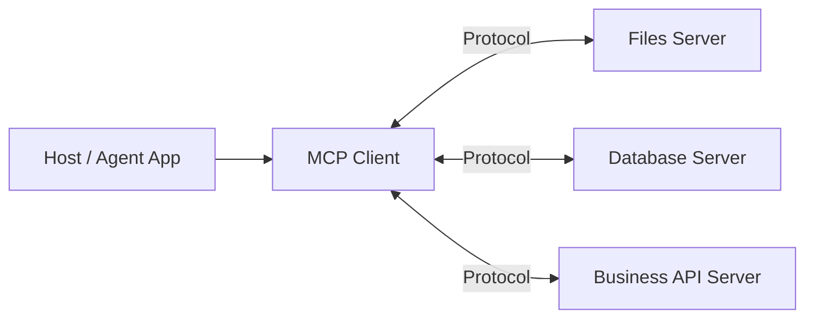

# MCP：模型上下文协议

MCP 用统一协议连接 AI 应用与工具、资源、提示模板。它降低集成耦合，但不会自动解决权限、信任与业务语义。

## 角色

- **Host**：承载用户体验、策略与 Agent Runtime。
- **Client**：与某个 Server 建立会话、协商能力。
- **Server**：暴露 tools、resources 或 prompts。

Server 返回的数据仍是不可信输入；Host 必须执行权限判断、用户确认、输出过滤与审计。
