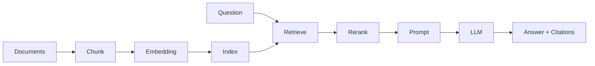

# RAG

Retrieval-Augmented Generation 在生成前检索外部证据，让答案更及时、可追溯，并把知识权限保留在业务系统中。

```mermaid
flowchart LR
  D[Documents] --> C[Chunk]
  C --> E[Embedding]
  E --> I[Index]
  Q[Question] --> R[Retrieve]
  I --> R
  R --> RR[Rerank]
  RR --> P[Prompt]
  P --> L[LLM]
  L --> A[Answer + Citations]
```

RAG 不是“接上向量数据库”就结束。文档质量、切分、召回、排序、上下文组织和答案评测组成一条链路。
