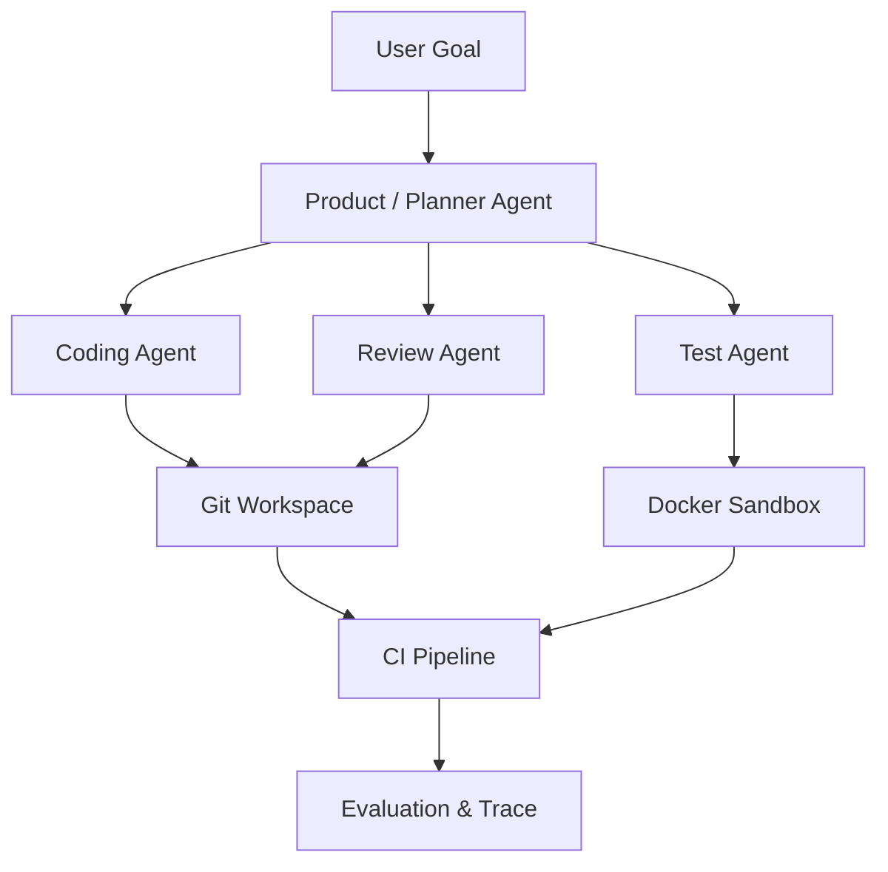

# 作品项目：AI Software Engineer Agent Platform

最终项目不是 ChatGPT Clone，而是一套可演示生产能力的工程平台。

## 必做能力

- Go 或 Java 网关与任务调度，Python 模型 / Agent 层。
- Git 工作区、Docker 沙箱、MCP 工具接入。
- PostgreSQL 事件状态、Redis 队列、向量检索。
- Checkpoint、幂等、重试、人工审批。
- OpenTelemetry Trace、token 成本和任务成功率。
- Prompt Injection 测试与最小权限策略。

## 展示方式

README 先放架构图与 3 分钟演示，再给一键启动、评测结果和关键取舍。指标与失败案例比“支持十种模型”更有说服力。
