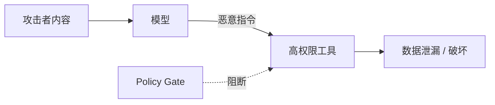

# Agent 安全威胁模型

Agent 既读取不可信内容，又能调用有副作用的工具，因此提示注入会从“回答错误”升级为真实系统风险。

## 主要威胁

- 直接或间接 Prompt Injection。
- 工具参数越权、路径穿越、命令注入。
- 检索与记忆投毒。
- 密钥从日志、错误或模型上下文泄漏。
- 自动化循环造成资源与费用失控。

把模型视作不可信决策源。安全边界必须存在于确定性代码、身份系统和隔离环境中。
